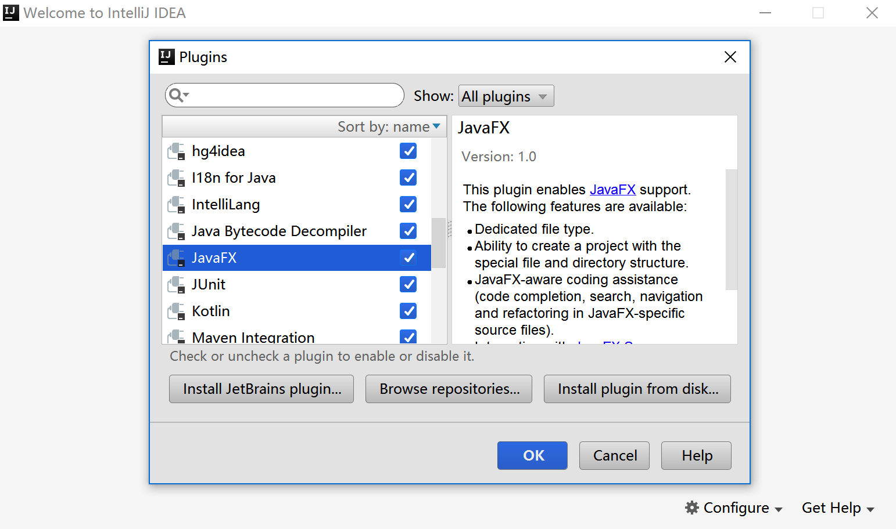

# 实验一. IntelliJ IDEA for JavaFX环境搭建

-------

## 实验目的

- 掌握在Windows下，IntelliJ IDEA集成开发环境的搭建;
- 熟悉集成开发环境;

## 实验环境

- 硬件：CBT-IOT-CTP 实验平台,PC机;
- 软件： IntelliJ IDEA ,JDK,Scene Builder;

## 实验内容

- JDK安装;
- Scene Builder界面设计软件安装；
- IntelliJ IEDA开发环境安装及配置;
- JavaFX项目工程介绍；

**帮助链接**   

你可能会想收藏下面的链接：

[Java 8 API](http://docs.oracle.com/javase/8/docs/api/) - Java 标准类的文档。

[JavaFX 8 API](http://docs.oracle.com/javase/8/javafx/api/) - JavaFX 类的文档。

[IDEA JavaFX](https://www.jetbrains.com/help/idea/2016.3/javafx.html) - 在IntelliJ IDEA环境下开发JavaFX的文档。

[Oracle's JavaFX Tutorials](http://docs.oracle.com/javase/8/javafx/get-started-tutorial/get_start_apps.htm) - Oracle 的 JavaFX 官方教程。   

一切就绪，让我们开始吧！

## 实验步骤

&emsp;&emsp;**本地安装包路径：**`光盘\tools\Windows环境搭建\`。

```
├── jdk-8u121-windows-x64.exe
├── ideaIC-2016.3.4.exe
└── SceneBuilder-8.3.0.exe
```

### Java开发环境安装
- 启动`jdk-*.exe`，根据安装向导指示安装。
- 配置环境变量。选择**“Start”菜单 \> 电脑 \> 属性 \> 高级系统选项**。然后打开**“高级”选项卡 \> 环境变量**进行配置。
    + 在“系统变量”新建一个变量名为`JAVA_HOME`的变量，变量值为你本地java的安装目录，这里为：`C:\Program Files\Java\jdk1.8.0_31`，设置这个的目的是作为下面两个环境变量的一个引用
    + 在“系统变量”选项区域中查看PATH变量，如果不存在，则新建变量PATH，否则选中该变量，单击“编辑”按钮，在“变量值”文本框的起始位置添加`“%JAVA_HOME%\bin;%JAVA_HOME%\jre\bin;”` 
    + 在“系统变量”选项区域中查看`CLASSPATH`变量，如果不存在，则新建变量`CLASSPATH`，否则选中该变量，单击“编辑”按钮，在“变量值”文本框的起始位置添加`“.;%JAVA_HOME%\lib\dt.jar;%JAVA_HOME%\lib\tools.jar;”`。<br>
      判断是否安装成功：<br>
      在cmd命令行中输入命令：

```
java -version
```

出现如下打印信息说明配置成功：
​    
```
java version "1.8.0_121"
Java(TM) SE Runtime Environment (build 1.8.0_121-b13)
Java HotSpot(TM) 64-Bit Server VM (build 25.121-b13, mixed mode)
```
### Scene Builder安装

- 运行`SceneBuilder*.exe`文件，默认安装即可。按照完成后勾选取消注册账号按钮进入主界面。


### IntelliJ IEDA开发环境安装

- 运行`idea*.exe`文件，按照安装向导默认安装即可。

- 在Window中运行IntelliJ IDEA

如果你在安装过程中选择在桌面创建快捷方式，直接双击快捷方式即可。
否则，你需要打开<IntelliJ IDEA>\bin目录(例如:`C:\Program Files (x86)\JetBrains\IntelliJ IDEA Community Edition 2016.3.4\bin`)然后运行`idea.exe`或者是`idea.bat`。

首次运行会出现设置向导，选择`Skip All and Set Defaults`默认设置。

### 配置IDEA环境

- 确保JavaFX插件已经启用。（改插件集成在IDE按照包内默认是启用状态）

查看方法：
在上步的欢迎界面右下角中点击`Configure`,选择打开 `Plugins` 确保 `JavaFX`右侧是☑️状态。



### 创建个JavaFX项目

在上步的欢迎界面中选择`Create New Project`,左侧列表选择`Java JavaFX`,点击`Next`,项目名默认，点`Finish`完成创建。


- 点击菜单栏`View`，将`ToolBar`和`Tool Buttons`勾选上。界面入下图：


### 给IntelliJ IDEA设置JDK。

（默认JDK已安装，在IDEA安装过程中会自动检测JDK并配置）

设置方法：

- 在主菜单选择**File | Project Structure**；
- 左侧面板选择**Platform Settings | SDKs**；
- 右侧面板点击`➕`号，打开的对话框中选择本地JDK安装路径，点击`OK`。


### 给IntelliJ IDEA配置Scene Builder 

- 打开`Settings`,左侧面板选择**Languages and Frameworkds | JavaFX**； 

- 右侧点击浏览按钮，定位到本地`SceneBuilder`安装目录，选择`SceneBuilder.exe`;

- 点击下方的`Apply`和`OK`按钮应用。


### 认识JavaFX项目


`src`文件夹存放源代码。在这个文件夹中已经有个`sample`名称的包名，有以下三个文件：


- `Main.java`是主应用程序类，用于启动本示例程序。

- `sample.fxml`是FXML文件用于定义用户界面。 

- `Controller.java`. 这是控制类用于处理上层界面的节目交互。

在IDE界面工具栏中间有个 **run/debug**工具框，工具框列表选项中显示和主应用类相同的名称（`Main`）。


### 运行示例程序

为确保程序没有错误, 点击工具栏里的图标。等待
`IntelliJ IDEA`编译完成后程序会自动运行，界面会显示一个空白的窗体。


点击右上角的关闭按钮关闭应用程序。

