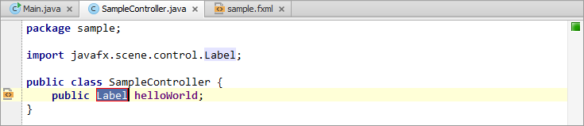

# 实验一. Hello World入门实验

-------

## 实验目的

- 掌握JavaFX应用程序编程流程;
- 掌握通过CSS来美化UI界面的方法;

## 实验环境

- 硬件：CBT-IOT-CTP 实验平台,PC机;
- 软件： IntelliJ IDEA ,JDK,Scene Builder;

## 实验内容

- 创建JavaFX示例应用程序

- 重命名控制类

- 设计用户界面

- 在JavaFX Scene Builder中打开FXML文件

- 编写控制类

- 运行应用程序

- 使用CSS来美化界面

## 实验步骤

### 创建JavaFX示例应用程序

1. 从”File”菜单中选择”New Project”。

2. 在”JavaFX”应用程序分类中，选择”JavaFX Application”，单击”Next”按钮。

3. 将Project命名为”HelloWorld”并单击”Finish”按钮。

IDE将会打开Controller.java文件，点击左侧的Main.java。并使用基本的应用程序代码来填充其内容，如下所示。

```
package sample;

import javafx.application.Application;
import javafx.fxml.FXMLLoader;
import javafx.scene.Parent;
import javafx.scene.Scene;
import javafx.stage.Stage;

public class Main extends Application {

    @Override
    public void start(Stage primaryStage) throws Exception{
        Parent root = FXMLLoader.load(getClass().getResource("sample.fxml"));
        primaryStage.setTitle("Hello World");
        primaryStage.setScene(new Scene(root, 300, 275));
        primaryStage.show();
    }


    public static void main(String[] args) {
        launch(args);
    }
}

```

下面是理解JavaFX应用程序基本结构需要了解的一些重点：

- JavaFX应用程序的主类需要继承自`application.Application`类。`start()`方法是所有JavaFX应用程序的入口。

- JavaFX应用程序将UI容器定义为舞台(`Stage`)与场景(`Scene`)。`Stage`类是JavaFX顶级容器。`Scene`类是所有内容的容器。例4-1中创建了Stage和Scene，然后为Scene设置了大小并使其可见。

- 在JavaFX中，`Scene`中的内容会以由图形节点(`Node)`构成的分层场景图(`Scene Graph`)来展现。
在本例中，root节点是一个`StackPane`对象，它是一个可以调整大小的layout节点。这就意味着在用户改变stage大小时，root节点可以随scene的大小变化而变化。

- root节点中可以是JavaFX界面组件中的任意一个，例如：StackPane,GridPane，BorderPand。

- 当JavaFX应用程序是通过JavaFX Packager工具打包时，main()方法就不是必需的的了，因为JavaFX Package工具会将JavaFX Launcher嵌入到JAR文件中。但是保留main()方法还是很有用的，这样你可以运行不带有JavaFX Launcher的JAR文件，例如在使用某些没有将JavaFX工具完全集成进去的IDE时。另外嵌入了JavaFX代码的Swing应用程序仍需要main()方法。

下图展示了Hello World应用程序的场景图(Scene Graph)。如果想了解关于Scene Graph的信息，请参考文档：《[使用JavaFX Scene Graph(Working with the JavaFX Scene Graph)](http://docs.oracle.com/javase/8/javafx/get-started-tutorial/get_start_apps.htm)》。


### 重命名Controller控制类

将鼠标指针移动到Controller类上，右键选择**Refactor | Rename**将其更改为`SampleController`,
按<kbd>Enter<kbd>键。


现在切换到`sample.fxml`在编辑器中可看到`GridPanel fx:controller`的参数已经变成了 "`sample.SampleController`"。  
(之前为"`sample.Controller`"。)

### 设计用户界面

在用户界面定义一个按键，实现当点击后显示`Hello World!`文本。
打开`sample.fxml`文件，在`<GridPanel>`标签内添加如下代码：

```
<Button text=
      "Say 'Hello World'" onAction=
      "#sayHelloWorld"/>
<Label GridPane.rowIndex=
      "1" fx:id=
      "helloWorld"/>
```
添加完成如下图：


### 在JavaFX Scene Builder中打开FXML文件


可以看到`sayHelloWorld`显示红色，`helloWorld`代码高亮。这意味着IntelliJ IDEA无法识别改参数。
可以通过IntelliJ IDEA的快速修复功能来解决，下面会接受具体实现。

### 编写控制类SamplSampleController

1. 在`sample.fxml`中鼠标指针定位到`helloWorld`,点击左侧出现的黄色灯泡图标或按下
<kbd>Alt</kbd>+<kbd>Enter</kbd>。

2. 选择`Create field 'helloWorld'`

 

 IntelliJ IDEA会跳转到`SampleController.java`，可看到`helloWorld`变量已经被声明。

 

 你可以修改红框内的`Label`名称，按下<kbd>Enter</kbd>生效。

`import javafx.scene.control.Label;`为`Label`的依赖包。
可以点击左侧的导航图标会返回到`sample.fxml`。

3. 将鼠标指针定位到`sayHelloWorld`,点击左侧出现的红色灯泡图标或按下
<kbd>Alt</kbd>+<kbd>Enter</kbd>。

4. 选择`Create Method 'void sayHelloWorld(ActionEvent)'`。


可看到改方法会在`SampleController.java`类中添加。


5. 按下<kbd>Shift</kbd>+<kbd>Enter</kbd>键推出重命名模式并新开始一行。

6. 输入如下代码：

```
helloWorld.setText("Hello World!");
```


这步之后应用程序已经可以运行了。

### 运行应用程序

1. 点击工具栏里的运行按钮，程序启动后窗口界面中会看到里面有个`Say 'Hello World'`按钮。 


2. 点击该按钮会出现`Hello World!`的文本信息。


3. 关闭应用程序窗口。

### 使用CSS来美化界面

1. 在`sample.fxml`文件中添加一个不存在的CSS文件`sample.css`声明。在`<GridPane>`标签内添加如下代码：

```
stylesheets="/sample/sample.css"
```


2. 在此之前，用快速修复创建这个CSS文件。


3. 当CSS文件创建完成后，添加如下代码：

```
.root {
    -fx-background-color: gold;
}
.label {
    -fx-font-size: 20;>
}
```

第一个属性为设置背景颜色，第二个为设置字体大小。


4. 再次运行程序，可看到如下界面：


