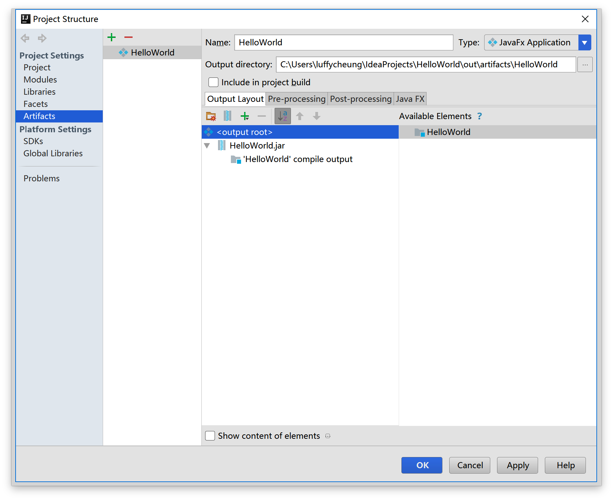
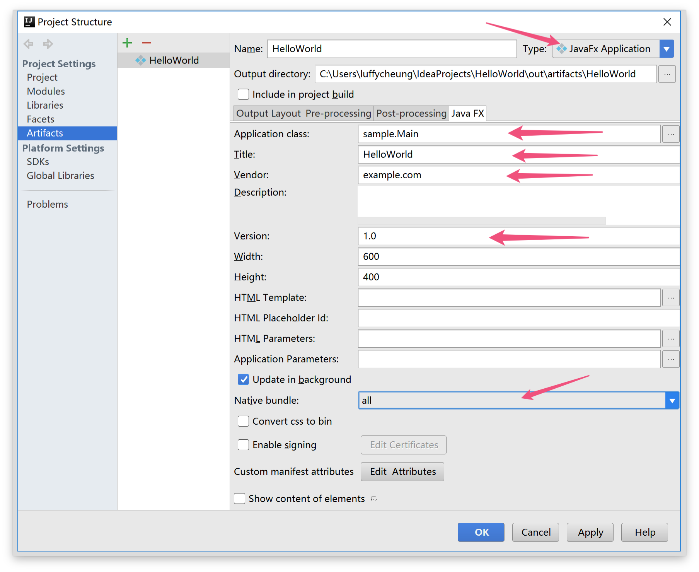
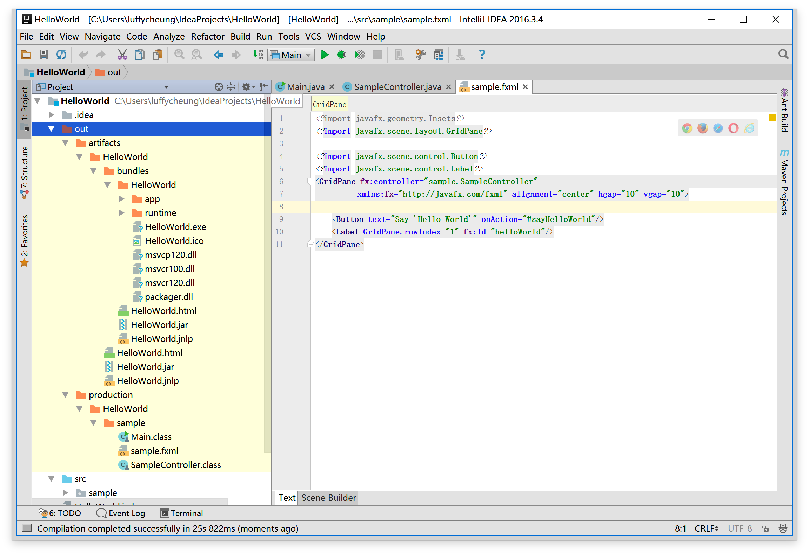
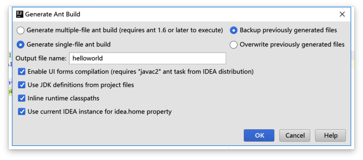
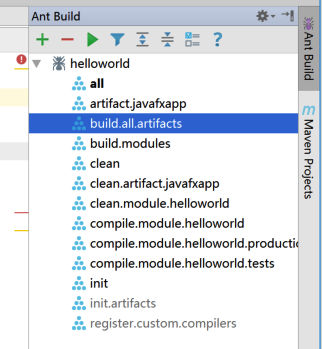

# 实验二. JavaFX应用部署实验

-------

## 实验目的

- 掌握JavaFX应用程序打包的方法;
- 掌握通过Ant来管理Java程序；

## 实验环境

- 硬件：CBT-IOT-CTP 实验平台,PC机;
- 软件： IntelliJ IDEA ,JDK,Scene Builder;

## 实验内容

- 将实验一里的HelloWorld应用程序打包发布。

## 实验步骤

部署是打包和发布软件给用户的过程。这是软件开发的关键部分，因为它是第一次与使用我们软件的用户交流。

Java的广告口号是编写一次，到处运行，这说明Java语言的跨平台好处。理想情况下，
这意味着我们Java应用可以运行在任何装备有JVM的设备上。 
在过去，安装Java应用程序的用户经验不总是平滑的。如果用户在系统中没有要求的Java版本，
它必须首先直接安装它。这导致有些困难，例如，需要管理员权限，Java版本之间的兼容问题等等。 
幸运的是，JavaFX提供新的部署选项称为本地打包（也称为自包含应用程序包）。
一个本地包是一个包含你的应用代码和平台指定的Java运行时的打包程序。
 Oracle提供的官方JavaFx文档包含一个所有JavaFX部署选项的扩展指南。 
 在本章节中，我们教你如何使用IntelliJ IDEA的Ant功能创建本地包。

### 使用Artifact部署软件

1. 点击菜单**File | Project Structure**，点击左侧面板中的`Artifacts`。选择中间的`JavaFXApp`,点击
上方的减号删除，点击`➕`号，选择**JavaFX Applicaton | From module ‘HelloWorld’**

2.  配置Artifacts。在右侧Tab面板中点击
`Java JavaFX`,填写应用程序相关信息。（对于MacOS，应用程序标题中不能使用空格）。
在`Application class`中选择本项目的主程序类。 **Native Bundle**选择`all`，如果系统为Windows会生成`exe`文件。 
点击下方的`Apply`和`OK`按钮应用。

3. 选择菜单**Build | Build Artifacts**,在**Build Artifacts | Action**弹窗中选择**Build**。 
或者，你可以在artifact配置界面中选中`Include in project build`选项。之后当程序被编译后就会自动生成artifact。

artifact默认生成目录为：`<project_folder>\out\artifacts\<artifact_name>`

在`bundles`文件夹下存放部署后的可执行程序运行包，双击`HelloWorld.exe`程序运行。

Artifact具体介绍可参阅：[Working with Artifacts](https://www.jetbrains.com/help/idea/2016.3/working-with-artifacts.html)。

### 生成并使用Ant构建文件

1. 点击菜单**Build | Generate Ant Build**生成Ant构建文件。
更多信息可查看：[Generating Ant Build File](https://www.jetbrains.com/help/idea/2016.3/generating-ant-build-file.html)。

2. 在`Generate Ant Build`弹窗中勾选后两项，上面的`Generate *** ant build`可根据自己喜好选择。如图：

之后弹出会提升生成了两个文件。

3. 点击菜单**View | Tool Windows | Ant Build**会在IDE右侧弹出`Ant Build`窗口。
点击`➕`号，定位到本地项目目录下的`hellowold.xml`文件。

之后便可以点击运行按钮来构建本项目或点击下方的单个任务来执行相应功能。

