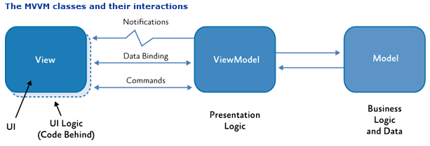

# 实验四. 基于MVVM架构的JavaFX HelloWorld入门使用实验

-------

## 实验目的
- 熟悉MVVM架构概念;
- 掌握mvvmfx库的使用方法;
- 掌握通过maven管理JavaFX应用的方法；

## 实验环境
* 硬件：CBT-IOT-CTP实训台,PC机;
* 软件： Maven，JDK version 8或以上，IntelliJ IDEA，Scene Builder;
·
## 实验内容

- 通过创建maven项目，依赖mvvmfx第三方库实现Hello World入门软件开发。

## 实验原理

### MVC与MVVM介绍

#### MVC

> MVC，全称是 Model View Controller，是模型 (model)－视图 (view)－控制器 (controller) 的缩写。它表示的是一种常见的客户端软件开发框架。

现在，MVC 已经成为主流的客户端编程框架,在JavaFX开发中，系统为我们实现好了公共的视图类：UIView，和控制器类：UIViewController。大多数时候，我们都需要继承这些类来实现我们的程序逻辑，因此，我们几乎逃避不开 MVC 这种设计模式。

但是，MVC 这种分层方式虽然清楚，但是如果使用不当，很可能让大量代码都集中在 Controller 之中，让 MVC 模式变成了 Massive View Controller 模式。

Controller的臃肿可在[实验一. 基于MVC架构的传感器SensorDemo串口处理软件开发实验#编写Controllers控制器类](../../chapter2/experiment01/sensordemo.md#编写controllers控制器类)中体会到。

为解决其臃肿问题可采用MVVM将ViewController进一步拆分,分离视图（View）和模型（Model）的耦合。


#### MVVM

Model–view–viewmodel (MVVM)是由微软WPF 和 Silverlight 的架构师Ken Cooper 和 Ted Peters开发，是一种简化用户界面的事件驱动编程方式。

MVVM源自于 model–view–controller 模式（MVC）。MVVM 促进了 GUI 开发与业务逻辑或者后端逻辑的分离，MVVM 中的 viewmodel 是一个转值器（value converter）；这意味着 viewmodel 负责暴露（转换）model 中的数据对象来让对象变得更容易管理和使用。从这方面来说，viewmodel 更像一个 model 而不是 view，并且处理了大多数 view 的显示逻辑。viewmodel 也可以实现一个中介者模式来组织访问围绕 view 支持下用例集的后端逻辑。
结构如图所示:



##### Model

Model 是指任何一个领域模型(domain model)，它代表了真实情况的内容（一个面向对象的方法），或表示内容（以数据为中心的方法）的数据访问层。

##### View

用户界面（UI）。

##### ViewModel

ViewModel 是一个公开公共属性和命令的抽象的view。取代了 MVC 模式的 controller，或 MVP 模式的任命者(presenter)，MVVM 有一个驱动。在 viewmodel 中，这种驱动传达视图和数据绑定的通信。此 viewmodel 已被描述为该 model 中的数据的状态。

##### Data Binding

MVVM 模式中包含了说明性数据和命令绑定机制。绑定使得开发人员不需要去编写样板化的代码来同步视图模型和视图。

##### 基本原理

MVVM 设计中充分利用了 WPF 中数据绑定功能，通过从 view 层消除几乎所有的 GUI 代码（“代码后置”），以更好地促进将视图层从其它模式中分离出来开发。开发人员不再需要具有用户体验才能来编写GUI代码，他们可以用由应用开发人员开发和维护的框架中的标记语言（如 XAML），来创建数据和 viewmodel 绑定。这种角色的分离使得UX设计师专注于UX的需求而不是编程的逻辑。因此应用程序层可在多个工作流开发以提高生产率。即使代码库只有一个开发人员，对 view 和 model 的适当分离都会更有效率，因为用户界面通常变化频繁，而且在开发周期期间，终端用户的反馈时间也会比较迟。

## 实验步骤

### 通过IDEA创建一个新的 maven项目

1. 从”File”菜单中选择”New Project”。

2. 在左侧应用程序分类中，选择”Maven”，单击”Next”按钮。填写GroupId、ArtifactId、Version。示例：

    - GroupId：   `com.example`
    - ArtifactId: `mvvmfx-helloworld`
    - Version:    `1.0.0`

3. 将Project命名为”mvvmfx-helloworld”并单击”Finish”按钮。

### 通过maven引入mvvfx第三方库依赖

1. 修改项目根目录下的`POM.xml`配置文件，增加`mvvmX`依赖。

具体**Maven**语法及使用请查阅官方网站：[https://maven.apache.org](https://maven.apache.org/)。

**POM.xml**

```xml
<?xml version="1.0" encoding="UTF-8"?>
<project xmlns="http://maven.apache.org/POM/4.0.0"
         xmlns:xsi="http://www.w3.org/2001/XMLSchema-instance"
         xsi:schemaLocation="http://maven.apache.org/POM/4.0.0 http://maven.apache.org/xsd/maven-4.0.0.xsd">
    <modelVersion>4.0.0</modelVersion>

    <groupId>com.example</groupId>
    <artifactId>mvvmfx-helloworld</artifactId>
    <version>1.0.0</version>

    <properties>
        <project.build.sourceEncoding>UTF-8</project.build.sourceEncoding>
        <maven.compiler.source>1.8</maven.compiler.source>
        <maven.compiler.target>1.8</maven.compiler.target>
    </properties>

    <dependencies>
        <dependency>
            <groupId>de.saxsys</groupId>
            <artifactId>mvvmfx</artifactId>
            <version>1.6.0</version>
        </dependency>
    </dependencies>

</project>
```

2. 在IDEA工作区右侧打开Maven Projects，点击`Reimport`按钮，将mvvmFX库依赖进本项目中，如下图所示：


### JavaFX主运行类编写

编写一个java类来运行应用程序。本例中创建包`com.example.helloworld`.将新建的类命名为`Starter`并继承`javafx.application.Application`来定义JavaFX程序入口。

1. 在IDEA下方的**Terminal**中执行如下命令创建包：
```bash
cd src\main\java
mkdir com\example\helloworld
```

2. 新建`Starter`类

**Starter.java**
```java
package com.example.helloworld;

import javafx.application.Application;
import javafx.stage.Stage;

public class Starter extends Application {
    
    public void start(Stage primaryStage) throws Exception {
        primaryStage.setTitle("Hello World Application");
        primaryStage.show();
    }
}

```

运行改项目后显示一个标题栏为“Hello World Application“的空窗体。

### 创建UI界面

有两种方式来创建JavaFX界面：使用代码实现、使用FXML。本例中采用通过Scene Builder创建FXML来实现。

在使用MvvmFX来创建FXML文件时需注意遵守其**命名约定**：所有FXML文件和View类文件必须使用相同的名称（文件扩展名除外）且文件夹／包名的路径相同。

#### ViewModel

在创建View文件前首相创建ViewModel类。对其命名为`HelloWorldViewModel`并实现`de.saxsys.mvvmfx.ViewModel`接口。
```java
public class HelloWorldViewModel implements ViewModel {
}
```

#### View

现在创建view类`HelloWorldView`。改类实现接口`de.saxsys.mvvmfx.FxmlView`,另外需要提供ViewModel类。还需要实现JavaFX中的`Initializable`接口，以便重载`initialize`方法。

```java
public class HelloWorldView implements FxmlView<HelloWorldViewModel>, Initializable {
    @Override
    public void initialize(URL url, ResourceBundle resourceBundle) {
    }
}
```

#### FXML

依照上述命名规约创建`HelloWorldView.fxml`。

1. 在`src/main/resources`下创建和View类相同的包／文件夹结构。

本例中FXML文件路径为`src/main/resources/com/example/helloworld/`，因为View类路径为：`com.example.helloworld.HelloWorldView`。可在Terminal中执行如下命令创建：
```bash
cd src\main\resources
mkdir com\example\helloworld
```

2. 使用SceneBuilder设计界面并另存为`HelloWorldView.fxml`至`src/main/resources/com/example/helloworld/`路径下。
```
<?xml version="1.0" encoding="UTF-8"?>

<?import javafx.geometry.*?>
<?import javafx.scene.control.*?>
<?import javafx.scene.layout.*?>

<VBox xmlns:fx="http://javafx.com/fxml" alignment="CENTER"
	fx:controller="com.example.helloworld.HelloWorldView">
  <children>
    <Label text="Hello World" />
  </children>
  <padding>
    <Insets bottom="10.0" left="10.0" right="10.0" top="10.0" />
  </padding>
</VBox>
```

### 编辑Starter并加载mvvmFX界面

为确保界面可见需将其加载进应用程序的场景视图中。此时需要使用到mvvmFX里的fluent api接口。

```java
 public void start(Stage primaryStage) throws Exception {
    primaryStage.setTitle("Hello World Application");

    ViewTuple<HelloWorldView, HelloWorldViewModel> viewTuple = FluentViewLoader.fxmlView(HelloWorldView.class).load();

    Parent root = viewTuple.getView();
    primaryStage.setScene(new Scene(root));
    primaryStage.show();
}
```

### 编辑ViewModel

此时的文本信息是直接写在FXML文件里的。但是MVVM设计模式中强调View的状态需放置到ViewModel中。

在这个ViewModel中增加一个名为“helloMessage”的**StringProperty**，并赋予初始值“Hello World”。
之后添加改变量的geters和setters方法，

```java
public class HelloWorldViewModel implements ViewModel {

    private StringProperty helloMessage = new SimpleStringProperty("Hello World");

    public StringProperty helloMessageProperty(){
        return helloMessage;
    }

    public String getHelloMessage(){
        return helloMessage.get();
    }

    public void setHelloMessage(String message){
        helloMessage.set(message);
    }
}
```

FXML文件中的label元素和ViewModel中的StringProperty的连接是在View类中实现的。为此我们需要在FXML文件的label组件中添加**fx:id**属性。
```xml
<Label fx:id="helloLabel"/>
```
鼠标指针定位到“helloLabel”，使用IDEA的神器自动创建field至View类中。如下图：


在View类的`initialize`方法中可以将空的label组件和ViewModel进行连接。

为在View类中获取一个ViewModel的实例需要添加一个ViewModel类型的变量（本例中为`HelloWorldViewModel`)并且添加上mvvmFX中提供的注解`de.saxsys.mvvmfx.InjectViewModel`。

```java
public class HelloWorldView implements FxmlView<HelloWorldViewModel>, Initializable  {

    @FXML
    private Label helloLabel;

    @InjectViewModel
    private HelloWorldViewModel viewModel;

    @Override
    public void initialize(URL url, ResourceBundle resourceBundle) {
        helloLabel.textProperty().bind(viewModel.helloMessageProperty());
    }
}
```

在`initialize`方法中，我们使用**Data-Binding**连接lable和ViewModel：该行`helloLabel.textProperty().bind(viewModel.helloMessageProperty());`意味着我们将该label的text属性绑定到ViewModel的“helloMessage”StringProperty。这样标签将始终显示ViewModel中此属性的确切值。我们会更改ViewModel中的值，它将在UI中自动立即更改。ViewModel中的属性的初始值为“Hello World”，因此此值将在UI中显示。

例如在ViewModel中更改初始值为“Change Hello World”，运行程序后窗口组件文本信息也会变化，如下图：

