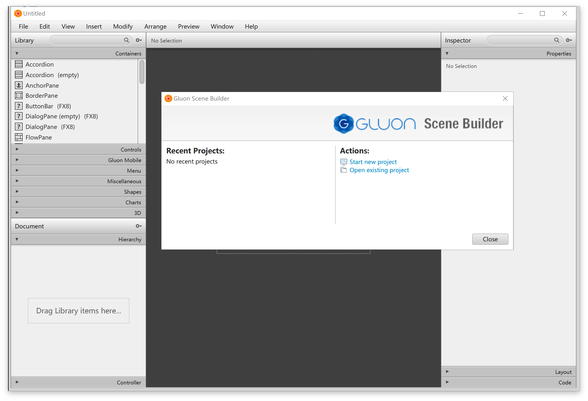
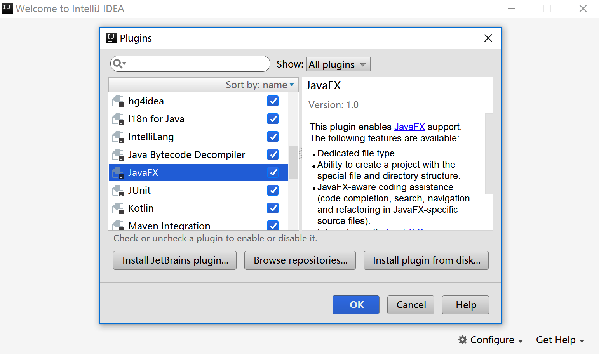
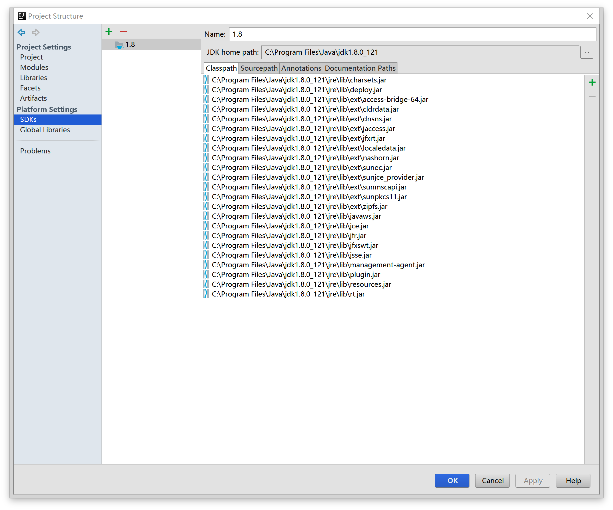
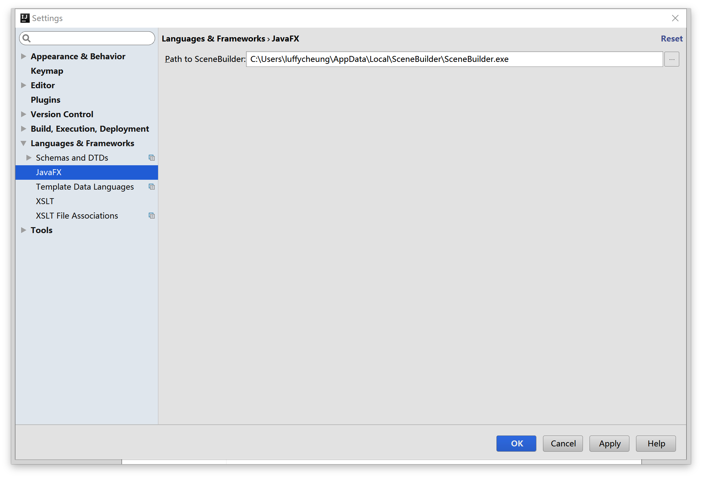

# 实验一. IntelliJ IDEA for JavaFX环境搭建

-------

## 实验目的

- 掌握在Windows下，IntelliJ IDEA集成开发环境的搭建;
- 熟悉集成开发环境;

## 实验环境

- 硬件：CBT-IOT-CTP 实验平台,PC机;
- 软件： IntelliJ IDEA ,JDK,Scene Builder;

## 实验内容

- JDK安装;
- Scene Builder界面设计软件安装；
- IntelliJ IEDA开发环境安装及配置;
- JavaFX项目工程介绍；

**帮助链接**   

你可能会想收藏下面的链接：

[Java 8 API](http://docs.oracle.com/javase/8/docs/api/) - Java 标准类的文档。

[JavaFX 8 API](http://docs.oracle.com/javase/8/javafx/api/) - JavaFX 类的文档。

[IDEA JavaFX](https://www.jetbrains.com/help/idea/2016.3/javafx.html) - 在IntelliJ IDEA环境下开发JavaFX的文档。

[Oracle's JavaFX Tutorials](http://docs.oracle.com/javase/8/javafx/get-started-tutorial/get_start_apps.htm) - Oracle 的 JavaFX 官方教程。   

一切就绪，让我们开始吧！

## 实验步骤

&emsp;&emsp;**本地安装包路径：**`光盘\tools\Windows环境搭建\`。

```
├── jdk-8u121-windows-x64.exe
├── ideaIC-2016.3.4.exe
└── SceneBuilder-8.3.0.exe
```

### Java开发环境安装
- 启动`jdk-*.exe`，根据安装向导指示安装。
- 配置环境变量。选择**“Start”菜单 \> 电脑 \> 属性 \> 高级系统选项**。然后打开**“高级”选项卡 \> 环境变量**进行配置。
    + 在“系统变量”新建一个变量名为`JAVA_HOME`的变量，变量值为你本地java的安装目录，这里为：`C:\Program Files\Java\jdk1.8.0_31`，设置这个的目的是作为下面两个环境变量的一个引用
    + 在“系统变量”选项区域中查看PATH变量，如果不存在，则新建变量PATH，否则选中该变量，单击“编辑”按钮，在“变量值”文本框的起始位置添加`“%JAVA_HOME%\bin;%JAVA_HOME%\jre\bin;”` 
    + 在“系统变量”选项区域中查看`CLASSPATH`变量，如果不存在，则新建变量`CLASSPATH`，否则选中该变量，单击“编辑”按钮，在“变量值”文本框的起始位置添加`“.;%JAVA_HOME%\lib\dt.jar;%JAVA_HOME%\lib\tools.jar;”`。<br>
      判断是否安装成功：<br>
      在cmd命令行中输入命令：

```
java -version
```

出现如下打印信息说明配置成功：
​    
```
java version "1.8.0_121"
Java(TM) SE Runtime Environment (build 1.8.0_121-b13)
Java HotSpot(TM) 64-Bit Server VM (build 25.121-b13, mixed mode)
```
### Scene Builder安装

- 运行`SceneBuilder*.exe`文件，默认安装即可。按照完成后勾选取消注册账号按钮进入主界面。



### IntelliJ IEDA开发环境安装

- 运行`idea*.exe`文件，按照安装向导默认安装即可。

- 在Window中运行IntelliJ IDEA

如果你在安装过程中选择在桌面创建快捷方式，直接双击快捷方式即可。
否则，你需要打开<IntelliJ IDEA>\bin目录(例如:`C:\Program Files (x86)\JetBrains\IntelliJ IDEA Community Edition 2016.3.4\bin`)然后运行`idea.exe`或者是`idea.bat`。

首次运行会出现设置向导，选择`Skip All and Set Defaults`默认设置。

### 配置IDEA环境

- 确保JavaFX插件已经启用。（改插件集成在IDE按照包内默认是启用状态）

查看方法：
在上步的欢迎界面右下角中点击`Configure`,选择打开 `Plugins` 确保 `JavaFX`右侧是☑️状态。



### 创建个JavaFX项目

在上步的欢迎界面中选择`Create New Project`,左侧列表选择`Java JavaFX`,点击`Next`,项目名默认，点`Finish`完成创建。


- 点击菜单栏`View`，将`ToolBar`和`Tool Buttons`勾选上。界面入下图：


### 给IntelliJ IDEA设置JDK。

（默认JDK已安装，在IDEA安装过程中会自动检测JDK并配置）

设置方法：

- 在主菜单选择**File | Project Structure**；
- 左侧面板选择**Platform Settings | SDKs**；
- 右侧面板点击`➕`号，打开的对话框中选择本地JDK安装路径，点击`OK`。



### 给IntelliJ IDEA配置Scene Builder 

- 打开`Settings`,左侧面板选择**Languages and Frameworkds | JavaFX**； 

- 右侧点击浏览按钮，定位到本地`SceneBuilder`安装目录，选择`SceneBuilder.exe`;

- 点击下方的`Apply`和`OK`按钮应用。



### 认识JavaFX项目


/help/img/idea/2016.3/NewProjectJavaFXInitialStructure.png
The folder src is for your source code. In this folder, there is already a package called sample containing three files:

Main.java. This is the main application class for starting the sample application.
sample.fxml. This is the FXML file for defining the user interface.
Controller.java. This is the controller class intended to handle user interactions with the UI.
In addition to the sample application source code, there is a run/debug configuration for running or debugging the application. The run configuration has the same name as the main application class (Main) and is shown in the run configuration selector on the toolbar.

/help/img/idea/2016.3/JavaFXRunConfig.png
There is also an artifact configuration intended for packaging your application. (This artifact configuration is not visible at the moment). We'll discuss this configuration later (see Packaging JavaFX Applications).

Running the sample application

To make sure that everything is fine with the project, let's run the sample application straight away:

Click /help/img/idea/2016.3/run.png on the toolbar.
IntelliJ IDEA compiles the source code and then starts the application. The application window appears which, at the moment, is empty.

/help/img/idea/2016.3/JavaFX01AppWindow01.png
Close the application window.
