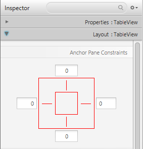
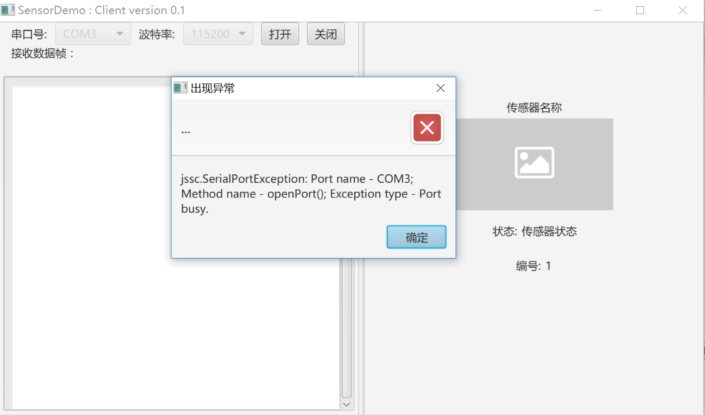

# 实验一. 基于MVC架构的传感器SensorDemo串口处理软件开发实验

----------
<!-- TOC -->

- [实验一. 基于MVC架构的传感器SensorDemo串口处理软件开发实验](#实验一-基于mvc架构的传感器sensordemo串口处理软件开发实验)
    - [实验目的](#实验目的)
    - [实验环境](#实验环境)
    - [实验内容](#实验内容)
    - [实验步骤](#实验步骤)
        - [创建一个新的 JavaFX 项目](#创建一个新的-javafx-项目)
        - [创建包](#创建包)
        - [创建FXML布局文件](#创建fxml布局文件)
        - [用Scene Builder来设计你的界面](#用scene-builder来设计你的界面)
        - [创建主应用程序](#创建主应用程序)
            - [创建一个**main java class**用来加载**MainOverview.fxml**,作为这个应用程序的入口。](#创建一个main-java-class用来加载mainoverviewfxml作为这个应用程序的入口)
            - [打开**MainLauncher.java**,将已有的代码替换成下面的代码：](#打开mainlauncherjava将已有的代码替换成下面的代码)
            - [可能遇见的问题](#可能遇见的问题)
        - [创建传感器模型类](#创建传感器模型类)
            - [创建一个传感器模型类](#创建一个传感器模型类)
            - [创建传感器全局常量声明类](#创建传感器全局常量声明类)
            - [创建传感器协议数据处理类](#创建传感器协议数据处理类)
        - [创建串口操作类](#创建串口操作类)
            - [导入第三方串口库](#导入第三方串口库)
            - [创建串口回调接口类](#创建串口回调接口类)
            - [创建串口操作类](#创建串口操作类-1)
        - [编写Controllers控制器类](#编写controllers控制器类)
            - [创建控制器类](#创建控制器类)
            - [在控制器类中编写用户交互相关业务逻辑](#在控制器类中编写用户交互相关业务逻辑)
        - [运行演示](#运行演示)

<!-- /TOC -->

## 实验目的
- 属性JavaFX软件开发流程;
- 掌握Scene Builder设计FXML界面布局流程;
- 熟悉模型 - 视图 - 控制器（MVC）模式构造应用的架构；

## 实验环境
* 硬件：CBT-IOT-CTP实训台,PC机;
* 软件： IntelliJ IDEA，Scene Builder;

## 实验内容

- 设计传感器串口处理界面及功能，实现对实训台传感器设备的数据采集及解析。


## 实验步骤

### 创建一个新的 JavaFX 项目

在IDEA中点击**File | New |Project** 并选择**JavaFX Application**。指定这个项目的名称(**e.g. SensorDemo**)并点击**Finish**。   

之后将sample包删除。

### 创建包

Model-View-Controller (MVC)是一个非常重要的软件设计原则。按照MVC模式可以将我们的应用程序划分成3个部分，
然后为这每一部分建立自己的包 (在源代码文件夹上右键， 选择 新建 | 包):

  - edu.iot.sensordemo - 放置所有的控制器类(也就是应用程序的业务逻辑)
  - edu.iot.sensordemo.model - 放置所有的模型类
  - resources.view - 放置所有界面和控件类   

- 将resources文件夹设置为资源根目录，方法：右键**resources | Make Directory as | Resources Root**。

注意: **view**包里可能会包含一些控制器类，它可以直接被单个的**view**引用，我们叫它**视图-控制器**。


### 创建FXML布局文件   

有两种方式来创建用户界面，一种是通过FXML文件来定义，另外一种就是直接通过java代码来创建. 这两种方式你都可以在网上搜到.
 我们这里将使用FFFXML的方式来创建大部分的界面。因为这种方式将会更好的将你的业务逻辑和你的界面开来，以保持代码的简洁。
 在接下来的内容里，我们将会介绍使用Scene Builder(所见即所得)来编辑我们的XML布局文件，它可以避免我们直接去修改XML文件。

打开**Scene Builder**软，点击**File | New**新建空白FXML文件；


点击**File | Save as**，保存到本地SensorDemo软件工程的view包目录下，把它命名为MainOverview。

### 用Scene Builder来设计你的界面   

> 注意: 你可以下载这部分教程的源码，它里面已经包含了设计好的布局文件。


1. 在左侧**Library**栏中拖拽一个**_ArchorPane_**到中间的工作区域。在左下方的**Hierarchy**选中该组件（或在中间工作区选择），就可以在右边
的属性设置栏中对它的尺寸进行修改：


2. 从**Scene Builder**的左边控件栏中拖拽一个 **_Splite Pane(Horizontal Flow)_** 到界面设计区域，在Builder的右边视图结构中选择刚添加的**Pane**，
在弹出的右键菜单中选择 **_Fit to Parent_** 。


3. 选中**Split Pane**组件，在右侧**Properties**中将**Divider Positions**属性设置为0.5，使该组件左右两侧比例平分。


4. 同样从左边的控件栏中拖拽一个 **VBox** 到 **SplitPane** 的左边，选择这个**VBox**(而不是它的列)对它的布局进行设置，
你可以在 **AnchorPane** 中对这个**VBox**四个边的外边距进行调节。
([more information on Layouts][javafx layout api])。




5. 设计串口操作框，同上方法拖拽**HBox**到**VBox**下，将**Layout**设置栏中的**Spacing**属性设置为**10**(表示在**HBox**
组件下的子组件间的间隙值)。
**tips**：可用鼠标点击该属性名称会跳转到该属性的API具体介绍网页界面。继续设计该串口框中的其他组件，如下图所示：


6. 基于上述UI组件设置方法设计其他组件，**Hierarchy**框架如下图所示。完成界面设置后，可以通过**_Preview_**来预览该界面，并检查各控件是否设计正确。


### 创建主应用程序

#### 创建一个**main java class**用来加载**MainOverview.fxml**,作为这个应用程序的入口。

鼠标右键**edu.iot.sensordemo**包，**New | Java Class**,命名为**MainLauncher**。

继承**Application**方法，按下<kbd>Alt<kbd>+<kbd>Enter<kbd>键，自动补全实现的方法。：


这里最重要的方法是 **start(Stage primaryStage)** ，它将会在应用程序运行时通过内部的 main 方法自动调用。

正如你所看到的，这个**start(...)** 方法会接收一个 **Stage** 类型的参数，下面的图向你展示了一个JavaFX应用程序的基本结构。


Image Source: [http://www.oracle.com][oracle]


一切看起来象是剧场里表演: 这里的 **Stage** 是一个主容器，它就是我们通常所认为的窗口（有边，高和宽，还有关闭按钮）。在这个**Stage** 里面，你可以放置一个 **Scene**，
当然你可以切换别的 **Scene**，而在这个 **Scene** 里面，我们就可以放置各种各样的控件。

更详细的信息，你可以参考 [Working with the JavaFX Scene Graph][JavaFX Scene Graph]。

#### 打开**MainLauncher.java**,将已有的代码替换成下面的代码：


```java
 package edu.iot.sensordemo;

import javafx.application.Application;
import javafx.application.Platform;
import javafx.fxml.FXMLLoader;
import javafx.scene.Parent;
import javafx.scene.Scene;
import javafx.scene.image.Image;
import javafx.stage.Stage;
import javafx.stage.StageStyle;

/**
 * Created by LuffyCheung on 2017/2/17.
 */
public class MainLauncher extends Application{

    private static Stage windows;

    @Override
    public void start(Stage primaryStage) throws Exception {
        windows = primaryStage;
        Parent root = FXMLLoader.load(getClass().getClassLoader().getResource("views/MainOverview.fxml"));
        primaryStage.setTitle("SensorDemo : Client version 0.1");

        Scene mainScene = new Scene(root);
        mainScene.setRoot(root);

        primaryStage.setScene(mainScene);
        primaryStage.show();
        
        primaryStage.setOnCloseRequest(e -> Platform.exit());

    }

    public static void main(String[] args) {
        launch(args);
    }

    public static Stage getPrimaryStage() {
        return windows;
    }

}

```

#### 可能遇见的问题

- 如果你的应用程序找不到你所指定的 fxml 布局文件，那么系统会提示以下的错误：   
 
```
java.lang.IllegalStateException: Location is not set.
```

**解决方法**：检查一下你的 fxml 文件名是否拼写错误。
> `如果还是不能工作，请下载这篇教程所对应的源代码，然后将源代码中的fxml文件替换掉你的`

- 如果找不到资源目录，那么系统会提示以下错误：

```
Caused by: java.lang.NullPointerException: Location is required.
```

**解决方法**：右键**resources | Make Directory as | Resources Root**。
若无此选项可打开`Project Structure`设置界面，选择**Modules | SensorDemo | Resources**。
定位到`src`目录下的`resources`文件夹，右键选择`Resources`,点击下方的`Apply`和`OK`按键应用。


### 创建传感器模型类

>- 创建一个模型类SensorBean。
>- 创建传感器全局常量声明类SensorCommon。
>- 创建传感器协议数据处理类SensorProcess。


#### 创建一个传感器模型类

我们需要一个模型类来保存传感器信息。在模型包中(`edu.iot.sensordemo.model`) 添加一个叫`SensorBean`的类。


**SensorBean.java**

```

package edu.iot.sensordemo.model.sensor;

public class SensorBean {
    private boolean ctlFlag;
    private boolean specialFlag;
    private String sensorType;
    private String sensorIndex;
    private String sensorValue;
    private int typeId;
    private int indexId;
    private String imagePath;


    private byte[] bytesData;
    private byte[] dataOn, dataOff, dataUpper;

    public SensorBean() {
    }

    public SensorBean(int typeId, String sensorType, String imagePath, boolean ctlFlag, boolean specialFlag) {
        this.ctlFlag = ctlFlag;
        this.specialFlag = specialFlag;
        this.sensorType = sensorType;
        this.typeId = typeId;
        this.imagePath = imagePath;
    }

    public SensorBean(boolean ctlFlag, boolean specialFlag, String sensorType, String sensorIndex, String sensorValue, int typeId, int indexId, String imagePath, byte[] bytesData, byte[] dataOn, byte[] dataOff, byte[] dataUpper) {
        this.ctlFlag = ctlFlag;
        this.specialFlag = specialFlag;
        this.sensorType = sensorType;
        this.sensorIndex = sensorIndex;
        this.sensorValue = sensorValue;
        this.typeId = typeId;
        this.indexId = indexId;
        this.imagePath = imagePath;
        this.bytesData = bytesData;
        this.dataOn = dataOn;
        this.dataOff = dataOff;
        this.dataUpper = dataUpper;
    }

    public boolean isSpecialFlag() {
        return specialFlag;
    }

    public void setSpecialFlag(boolean specialFlag) {
        this.specialFlag = specialFlag;
    }

    public int getTypeId() {
        return typeId;
    }

    public void setTypeId(int typeId) {
        this.typeId = typeId;
    }

    public int getIndexId() {
        return indexId;
    }

    public void setIndexId(int indexId) {
        this.indexId = indexId;
    }

    public boolean isCtlFlag() {
        return ctlFlag;
    }

    public void setCtlFlag(boolean ctlFlag) {
        this.ctlFlag = ctlFlag;
    }

    public String getSensorType() {
        return sensorType;
    }

    public void setSensorType(String sensorType) {
        this.sensorType = sensorType;
    }

    public String getSensorIndex() {
        return sensorIndex;
    }

    public void setSensorIndex(String sensorIndex) {
        this.sensorIndex = sensorIndex;
    }

    public String getSensorValue() {
        return sensorValue;
    }

    public void setSensorValue(String sensorValue) {
        this.sensorValue = sensorValue;
    }

    public byte[] getBytesData() {
        return bytesData;
    }

    public void setBytesData(byte[] bytesData) {
        this.bytesData = bytesData;
    }

    public byte[] getDataOn() {
        return dataOn;
    }

    public void setDataOn(byte[] dataOn) {
        this.dataOn = dataOn;
    }

    public byte[] getDataOff() {
        return dataOff;
    }

    public void setDataOff(byte[] dataOff) {
        this.dataOff = dataOff;
    }

    public byte[] getDataUpper() {
        return dataUpper;
    }

    public void setDataUpper(byte[] dataUpper) {
        this.dataUpper = dataUpper;
    }

    public String getImagePath() {
        return imagePath;
    }

    public void setImagePath(String imagePath) {
        this.imagePath = imagePath;
    }
}

```
#### 创建传感器全局常量声明类

**SensorCommon.java**

```
    /**
    * 温湿度 10
    */
    public final static String S_HUMITURE = "温湿度";
    public final static String I_HUMITURE = "images/img_s_humiture.png";
    public final static int HUMITURE = 0x0A & 0xFF;

...省略

   public static final SensorBean[] sensorBundle = {
            new SensorBean(HUMITURE, S_HUMITURE, I_HUMITURE, false, false),

            ...省略
   }


```

**代码说明：**

- S_XXX -传感器名称
- I_XXX -传感器资源图片路径
- XXX   -传感器协议类型（具体数值参见光盘协议文档）
- sensorBundle -传感器常量实例化模型类数组

#### 创建传感器协议数据处理类

光盘协议文档中关于传感器模块部分协议定义如下：

**传感器发送串口数据包：**

<table border = "1">
<tr>
    <th>SOF</th>
    <th>Sensor type</th>
    <th>Sensor Index</th>
    <th>Cmd Id</th>
    <th>Data</th>
    <th>Extend Data</th>
    <th>End</th>
</tr>
<tr>
    <td>2 Byte</td>
    <td>1 Byte</td>
    <td>1 Byte</td>
    <td>1 Byte</td>
    <td>6 Byte</td>
    <td>2 Byte</td>
    <td>1 Byte</td>
</tr>
</table>

**说明：**

- SOF：			固定为0xEE 0xCC，标志一帧的开始。
- Sensor type：	见附表一传感器说明。
- Sensor index：	固定为0x01。
- Cmd id：		固定为0x01。
- Data：			为6Byte传感器数据域，见附表一传感器说明。
- Extend Data：		为2Byte扩展数据域
- END：			固定为0xFF，标志一帧的结束。

**附表一：传感器说明**

<table border="1">
<tr>
    <th>传感器名称</th>
    <th>类型编号</th>
    <th>传感器输出数据</th>
</tr>
<tr>
    <td rowspan="2">光照传感器</th>
    <td rowspan="2">0x02</th>
    <td>00 00 00 00 00 00:无光照</td>
</tr>
<tr>
     <td>00 00 00 00 00 01:有光照</td>
</tr>
<tr>
    <td>...</td>
    <td>...</td>
    <td>...</td>
</tr>
<tr>
    <td>温湿度传感器</td>
    <td>0x0A</td>
    <td>00 00 HH, HL, TH, TL:</td>
</tr>
</table>

**SensorProcess.java**

```
    /**
     * 判断是否为传感器数据帧
     *
     * @param iBytes
     * @return 校验结果
     */
    public static boolean isSensorFrame(byte[] iBytes) {
        int len = iBytes.length;
        if ((0xEE == (iBytes[0] & 0xff)) && len == 14 && (0xFF == (iBytes[len - 1] & 0xff))) {
            return true;
        } else {
            return false;
        }
    }

    /**
     * 获取传感器设备名称
     *
     * @param type
     * @return
     */
    public static String getSensorName(byte type) {
        String name = "未知设备：" + type;
        for (SensorBean sensorBean : sensorBundle) {
            if (sensorBean.getTypeId() == type) {
                name = sensorBean.getSensorType();
                break;
            }
        }
//        System.out.println("设备名为: " + name);
        return name;
    }

    ...省略
    public static String getImagePath(byte type) {
        String path = "images/img_default.jpg";
        for (SensorBean sensorBean : sensorBundle) {
            if (sensorBean.getTypeId() == type) {
                path = sensorBean.getImagePath();
                break;
            }
        }
        return path;
    }
```

### 创建串口操作类

>- 导入第三方串口库。
>- 创建串口回调接口类。
>- 创建串口操作类。

#### 导入第三方串口库

使用第三方串口库：**jSSC (Java Simple Serial Connector)**

可在本章节实验文件夹中找到- _**jssc-2.8.0.jar**_ 。将该jar库拷贝到本工程的**lib**文件夹中，并右键选择_**Add as Library...**_ 选项，加入到项目库依赖中。

#### 创建串口回调接口类

**UartConnectorDelegate.java**
```
public interface UartConnectorDelegate {
    //接收的Hex协议帧数据转字符串
    void OnOriginMessageReceived(String message);
    //解析后生成的传感器模型类
    void OnSensorFramePackage(SensorBean sensorBean);
    //异常错误信息返回
    void OnErrorException(String s);
}
```

#### 创建串口操作类

**UartConnector.java**

```
package edu.iot.lib.model.uart;


import edu.iot.lib.utils.Convert;
import edu.iot.lib.model.sensor.SensorBean;
import edu.iot.lib.model.sensor.SensorProcess;
import jssc.SerialPort;
import jssc.SerialPortEvent;
import jssc.SerialPortEventListener;
import jssc.SerialPortException;
import org.slf4j.Logger;
import org.slf4j.LoggerFactory;


import java.util.Arrays;

public class UartConnector {
    private static final Logger log = LoggerFactory.getLogger(UartConnector.class);
    private SerialPort serialPort;
    private UartConnectorDelegate delegate;

    public void setDelegate(UartConnectorDelegate iDelegate) {
        delegate = iDelegate;
    }


    public boolean isDebug = false;

    public UartConnector() {
    }

    public UartConnector(UartConnectorDelegate delegate) {
        this.delegate = delegate;
    }

    public void uartInit(String uartName) {
        serialPort = new SerialPort(uartName);
    }

    public boolean isConnected() {
        return serialPort.isOpened();
    }

    public boolean Connect(String baudRate) {
        if (serialPort == null || baudRate.isEmpty()) {
            return false;
        } else {
            try {
                serialPort.openPort();
                int defaultBaudRate = SerialPort.BAUDRATE_115200;
                switch (baudRate) {
                    case "9600":
                        defaultBaudRate = SerialPort.BAUDRATE_9600;
                        break;
                    case "57600":
                        defaultBaudRate = SerialPort.BAUDRATE_57600;
                        break;
                    case "115200":
                        defaultBaudRate = SerialPort.BAUDRATE_115200;
                        break;
                }
                serialPort.setParams(defaultBaudRate, SerialPort.DATABITS_8, SerialPort.STOPBITS_1,
                        SerialPort.PARITY_NONE);

//                serialPort.setFlowControlMode(SerialPort.FLOWCONTROL_RTSCTS_IN | SerialPort.FLOWCONTROL_RTSCTS_OUT);
                //流控制模式改为NONE-解决不能发送控制指令的问题
                serialPort.setFlowControlMode(SerialPort.FLOWCONTROL_NONE);
                serialPort.addEventListener(new UartReader(), SerialPort.MASK_RXCHAR);
                return true;
            } catch (SerialPortException e) {
                e.printStackTrace();
                if(null != delegate){
                    delegate.OnErrorException(e.toString());
                }
                return false;
            }
        }
    }

    public boolean disConnect() {
        if (serialPort.isOpened()) {
            try {
                serialPort.closePort();
            } catch (SerialPortException e) {
                e.printStackTrace();
                return false;
            }
        }
        return true;
    }

    public void sendBytes(final byte[] bytes) {
        new Thread(new Runnable() {
            @Override
            public void run() {
                try {
                    serialPort.writeBytes(bytes);
                    System.out.println("sendCommand:"+ Convert.ByteArrToHex(bytes));
                } catch (SerialPortException e) {
                    e.printStackTrace();
                    System.out.println("String wrote to port, waiting for response..");
                }
            }
        }).start();
    }


    private class UartReader implements SerialPortEventListener {
        @Override
        public void serialEvent(SerialPortEvent serialPortEvent) {
            if (serialPortEvent.isRXCHAR() && serialPortEvent.getEventValue() > 0) {
                try {
                    byte[] tmp = serialPort.readBytes();
                    byte[] iBytes = Arrays.copyOf(tmp, tmp.length);
                    if (delegate != null && iBytes.length > 0) {
                        String rcv = Convert.ByteArrToHex(iBytes);
//                        System.out.println(rcv);
                        delegate.OnOriginMessageReceived(rcv);
                        UartConnector.this.processUartData(iBytes);
                    }


                } catch (SerialPortException e) {
                    e.printStackTrace();
                    log.error("SerialPortException", e);
                }
            }
        }
    }

    private SensorBean sensorBean = null;

    private void processUartData(byte[] iBytes) {
        if (SensorProcess.isSensorFrame(iBytes)) {
            sensorBean = new SensorBean();
            sensorBean.setBytesData(iBytes);
            sensorBean.setSensorType(SensorProcess.getSensorName(iBytes[2]));
            sensorBean.setSensorIndex(SensorProcess.getSensorIndex(iBytes[3]));
            sensorBean.setSensorValue(SensorProcess.getSensorValue(iBytes[2], Convert.cutBytes(5, 6, iBytes)));
            boolean ctlFlag = SensorProcess.getCtlFlag(iBytes[2]);
            sensorBean.setCtlFlag(ctlFlag);
            boolean specialFlag =SensorProcess.getSpecialFlag(iBytes[2]);
            sensorBean.setSpecialFlag(specialFlag);
            if(ctlFlag){
                sensorBean.setDataOff(SensorProcess.getCloseData(iBytes));
                sensorBean.setDataOn(SensorProcess.getOnData(iBytes));
                if(specialFlag){
                    sensorBean.setDataUpper(SensorProcess.getUpperData(iBytes));
                }
            }
            sensorBean.setImagePath(SensorProcess.getImagePath(iBytes[2]));
            if (null != sensorBean) {
                delegate.OnSensorFramePackage(sensorBean);
            }

        }
    }
}

```

### 编写Controllers控制器类

#### 创建控制器类

1. 在controller包中创建**MainOverviewController**类，实现**Initializable**方法。

**MainOverviewController.java**

```
import javafx.fxml.Initializable;

public class MainOverviewController implements Initializable {

    @Override
    public void initialize(URL location, ResourceBundle resources) {

    }
}
```

2. 给FXML文件里的组件设置**id**及**Action**。   

示例一：通过修改fxml文件实现  

```
<Button fx:id="connectButton" mnemonicParsing="false"
    onAction="#connectButtonAction" text="打开"/>
<Button fx:id="closeButton" mnemonicParsing="false"
    onAction="#closeButtonAction" text="关闭"/>
```

示例二：通过Sense Builder实现

选中要增加的组件，点击界面右侧的Code工作区。分别在**fx:id**和**On Action**文本框中添加相应属性。如图：


3. 将View与Controller挂钩

告诉 MainOverview.fxml使用的是哪个控制器以及元素与控制器中的属性的对应关系。

- 使用SceneBuilder 打开 PersonOverview.fxml
- 打开左边的 Controller 组，填写MainOverviewConroller类路径


4. 将第二步中新增的id及action在controller中声明。

- 点击Sence Builder菜单中的View选择Show Sample Controller Skeleton，复制弹窗中的内容至MainOverviewConroller类中


**MainOverviewConroller.java**

```
    @FXML
    public ChoiceBox uartPicker;
    @FXML
    public ChoiceBox portPicker;
    @FXML
    public Button connectButton;
    @FXML
    public Button closeButton;

    public TextArea textOriginFrame;
    public ToggleGroup toggleGroup;
    public ToggleButton tgClose;
    public ToggleButton tgOpen;
    public ToggleButton tgUpper;
    public HBox hbSpecial;
    @FXML
    private Label sensorName;
    @FXML
    private ImageView sensorImage;
    @FXML
    private Label sensorStatus;
    @FXML
    private Label sensorIndex;
    @FXML
    private ToggleButton toggleOnOff;

        @FXML
    void closeButtonAction(ActionEvent event) {

    }

    @FXML
    void connectButtonAction(ActionEvent event) {

    }

    @FXML
    void tgCloseAction(ActionEvent event) {

    }

    @FXML
    void tgOpenAction(ActionEvent event) {

    }

    @FXML
    void tgUpperAction(ActionEvent event) {

    }

    @FXML
    void toggleOnOffAction(ActionEvent event) {

    }
```

#### 在控制器类中编写用户交互相关业务逻辑

1. 实现串口接口回调,并更新界面数据

```
public class MainOverviewController implements Initializable, UartConnectorDelegate {

    private UartConnector uartConnector;

    public void setUartConnector(UartConnector uartConnector) {
        this.uartConnector = uartConnector;
        uartConnector.setDelegate(this);
    }
        @Override
    public void OnOriginMessageReceived(String message) {
        Platform.runLater(() -> {
            textOriginFrame.appendText(message);
            textOriginFrame.appendText("\n");
            iRecLines++;
            if (iRecLines > 20) {
                textOriginFrame.clear();
                System.out.println("iRecLines > 20");
                iRecLines = 0;
            }
        });
    }

    @Override
    public void OnSensorFramePackage(SensorBean sensorBean) {
        Platform.runLater(() ->
        {
            sensorName.setText(sensorBean.getSensorType());
            sensorIndex.setText(sensorBean.getSensorIndex());
            sensorStatus.setText(sensorBean.getSensorValue());
            Image image = new Image(getClass().getClassLoader().getResource(sensorBean.getImagePath()).toExternalForm());
            sensorImage.setImage(image);
            if (sensorBean.isCtlFlag()) {
                if(sensorBean.isSpecialFlag()){
                    toggleOnOff.setVisible(false);
                    hbSpecial.setVisible(true);
                    if (null != sensorBean.getDataUpper()) {
                        dataUpper = sensorBean.getDataUpper();
                    }
                }else {
                    hbSpecial.setVisible(false);
                    toggleOnOff.setVisible(true);
                }
                if (sensorBean.getBytesData()[10] == 0) {
                    toggleOnOff.setText("打开");
                    toggleOnOff.setSelected(false);
                } else {
                    toggleOnOff.setText("关闭");
                    toggleOnOff.setSelected(true);
                }
                dataOn = sensorBean.getDataOn();
                dataOff = sensorBean.getDataOff();

            } else {
                toggleOnOff.setVisible(false);
                hbSpecial.setVisible(false);
            }

        });

    }

    @Override
    public void OnErrorException(String s) {
        Platform.runLater(()->{
            Alert alert = new Alert(Alert.AlertType.ERROR);
            alert.setTitle("出现异常");
            alert.setHeaderText("...");
            alert.setContentText(s);
            alert.showAndWait();
        });

    }
}
```

2. 设置串口接口监听

**MainLauncher.java**

```
 private UartConnector uartConnector = null;
  @Override
    public void start(Stage primaryStage) throws Exception {
        uartConnector = new UartConnector();

        MainOverviewController controller = loader.getController();
        controller.setUartConnector(uartConnector);
    }
```

3. 编写组件间用户交互业务逻辑代码

- 初始化默认组件属性

```
    @Override
    public void initialize(URL location, ResourceBundle resources) {
        //为串口列表选项组件设置鼠标监听事件
        uartPicker.setOnMouseClicked(event -> {
            if (event.getButton().equals(MouseButton.PRIMARY)) {
                String[] portNames = SerialPortList.getPortNames();

                if (portNames.length > 0) {
                    uartPicker.setItems(FXCollections.observableArrayList(portNames));
                }
            }
        });
        portPicker.getSelectionModel().selectFirst();
        textOriginFrame.clear();
        textOriginFrame.setEditable(false);
        ／／为文本框设置css美化样式
        textOriginFrame.setStyle("-fx-highlight-fill: lightgray; -fx-highlight-text-fill: firebrick; -fx-font-size: 16px;");
        hbSpecial.setVisible(false);
        Image defaultImg = new Image(getClass().getClassLoader().getResource("images/img_default.jpg").toExternalForm());
        sensorImage.setImage(defaultImg);
        toggleOnOff.setVisible(false);
    }

```

- 实现按键的监听事件

```
    //打开串口按钮监听
    public void connectButtonAction() {
        selectedUart = (String) uartPicker.getSelectionModel().getSelectedItem();
        selectedPort = (String) portPicker.getSelectionModel().getSelectedItem();
        ConnectRunnable connectRunnable = new ConnectRunnable(selectedUart, selectedPort, instance);
        Thread x = new Thread(connectRunnable);
        x.start();

    }
    //关闭串口按钮监听
    public void closeButtonAction(ActionEvent actionEvent) {
        if (uartConnector.isConnected()) {
            if (uartConnector.disConnect()) {
                uartPicker.setDisable(false);
                portPicker.setDisable(false);
            }
        }
    }
    //打开／关闭设备Toggle按钮监听
    public void toggleOnOffAction(ActionEvent actionEvent) {
        if (uartConnector.isConnected()) {
            if (toggleOnOff.isSelected()) {
                uartConnector.sendBytes(dataOn);
            } else {
                uartConnector.sendBytes(dataOff);
            }
        }
    }
    //关闭设备按钮监听
    public void tgCloseAction(ActionEvent actionEvent) {
        if (uartConnector.isConnected()) {
                uartConnector.sendBytes(dataOff);
        }
    }
    //打开设备按钮监听
    public void tgOpenAction(ActionEvent actionEvent) {
        if (uartConnector.isConnected()) {
            uartConnector.sendBytes(dataOn);
        }
    }
    //设备特殊控制按钮监听
    public void tgUpperAction(ActionEvent actionEvent) {
        if (uartConnector.isConnected()) {
            uartConnector.sendBytes(dataUpper);
        }
    }

        private class ConnectRunnable implements Runnable {
        private String uart, port;
        MainOverviewController controller;

        public ConnectRunnable(String selectedUart, String selectedPort, MainOverviewController instance) {
            this.uart = selectedUart;
            this.port = selectedPort;
            this.controller = instance;
        }
        
        @Override
        public void run() {
            uartConnector.uartInit(uart);
            if (uartConnector.Connect(port)) {
                uartPicker.setDisable(true);
                portPicker.setDisable(true);
            }
        }
    }
```

### 运行演示
- 实训台基础区传感器设备上电，使用香蕉线将传感器于USB2UART模块相连接。（TXD／RXD注意交叉相连；USB2UART模块拨码开关拨到Sensor方向）
- 使用miniUSB线将USB2UART模块和电脑相连。（安装好U转串驱动）
- 选择连接到电脑上的U转串模块串口，波特率选择**115200**，点击右侧**打开**按钮

界面左侧显示原始传感器协议帧数据，右侧显示传感器实时数据，若为可控设备显示控制按钮。
点击控制按钮观察设备及数据变化。





[oracle]: http://www.oracle.com

[JavaFX Scene Graph]: http://docs.oracle.com/javase/8/javafx/scene-graph-tutorial/scenegraph.htm

[javafx layout api]: http://docs.oracle.com/javase/8/javafx/layout-tutorial/builtin_layouts.htm

[Using JavaFX Properties and Binding]: http://docs.oracle.com/javase/8/javafx/properties-binding-tutorial/binding.htm