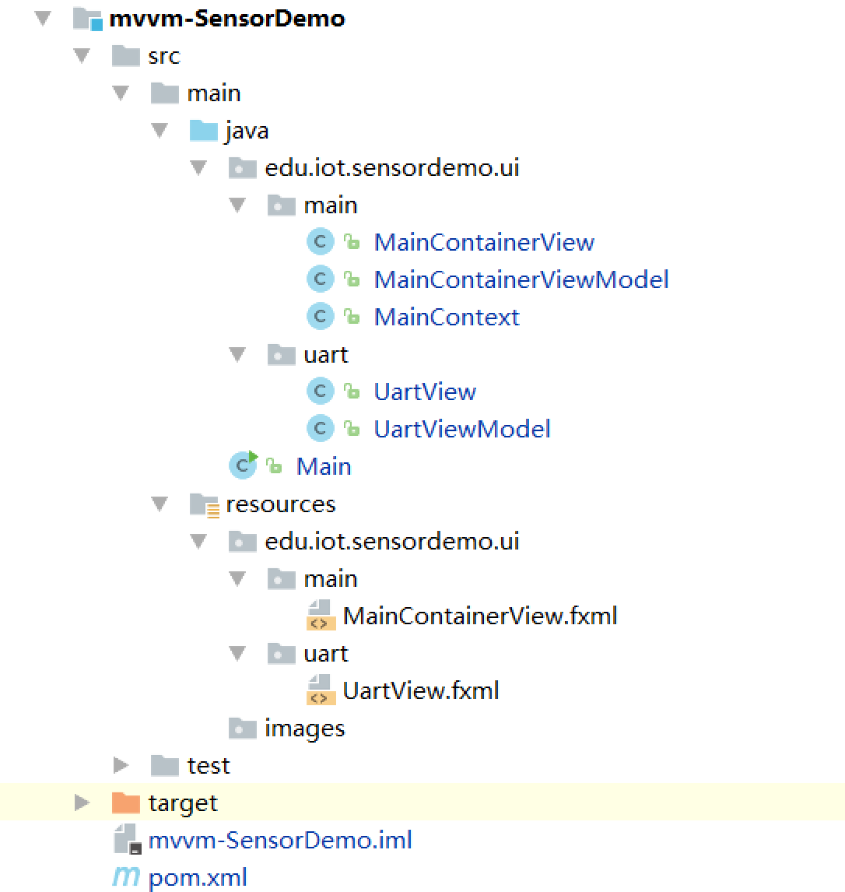

# 实验二. 基于MVVM架构的传感器SensorDemo串口处理软件开发实验

-----

## 实验目的
- 熟悉maven多模块程序的创建及其依赖关系;
- 掌握MVVM框架设计思想;

## 实验环境
* 硬件：CBT-IOT-CTP实训台,PC机;
* 软件： IntelliJ IDEA，Scene Builder;

## 实验内容

- 创建maven多模块（串口库和传感器主程序）工程，通过MVVM框架编程实现传感器实验功能。


## 实验步骤

### 创建maven多模块工程

1. 从”File”菜单中选择”New Project”。

2. 在左侧应用程序分类中，选择”Maven”，单击”Next”按钮。填写GroupId、ArtifactId、Version。示例：

    - GroupId：   `edu.iot.cbt`
    - ArtifactId: `iot-samples`
    - Version:    `1.0.0`

3. 将Project命名为”IOTSamples”并单击”Finish”按钮。
4. 右键“IOTSamples”工程，选择**New**->**Module**，创建maven Module，在ArtifactId框中填写改module名称`mvvm-SensorDemo`，如图：


5. 同第4步创建串口库Module，本例中命名为`uart-model`。

### 配置maven工程

#### 在主maven项目的`pom.xml`中配置全局依赖库及其他属性

在`IOTSamples`根目录下的`pom.xml`文件中添加入下内容：

```xml
<?xml version="1.0" encoding="UTF-8"?>
<project xmlns="http://maven.apache.org/POM/4.0.0"
         xmlns:xsi="http://www.w3.org/2001/XMLSchema-instance"
         xsi:schemaLocation="http://maven.apache.org/POM/4.0.0 http://maven.apache.org/xsd/maven-4.0.0.xsd">
    <modelVersion>4.0.0</modelVersion>

    <groupId>edu.iot.cbt</groupId>
    <artifactId>iot-samples</artifactId>
    <packaging>pom</packaging>
    <version>1.0.0</version>
    <description>IOT Samples</description>

    <modules>
        <module>UartModel</module>
        <module>mvvm-SensorDemo</module>
        <module>mvvm-WsnDemo</module>
        <module>mvvm-IntelligentFarm</module>
        <module>mvvm-SupermarketManagement</module>
    </modules>

    <properties>
        <maven.compiler.source>1.8</maven.compiler.source>
        <maven.compiler.target>1.8</maven.compiler.target>
        <project.build.sourceEncoding>UTF-8</project.build.sourceEncoding>
        <java.version>1.8</java.version>
    </properties>

    <dependencyManagement>
        <dependencies>

            <!-- https://mvnrepository.com/artifact/org.scream3r/jssc -->
            <dependency>
                <groupId>org.scream3r</groupId>
                <artifactId>jssc</artifactId>
                <version>2.8.0</version>
            </dependency>

            <!-- https://mvnrepository.com/artifact/com.fazecast/jSerialComm -->
            <dependency>
                <groupId>com.fazecast</groupId>
                <artifactId>jSerialComm</artifactId>
                <version>1.3.11</version>
            </dependency>


            <!-- https://mvnrepository.com/artifact/org.slf4j/slf4j-log4j12 -->
            <dependency>
                <groupId>org.slf4j</groupId>
                <artifactId>slf4j-log4j12</artifactId>
                <version>1.7.25</version>
            </dependency>
            <!-- https://mvnrepository.com/artifact/org.slf4j/slf4j-simple -->
            <dependency>
                <groupId>org.slf4j</groupId>
                <artifactId>slf4j-simple</artifactId>
                <version>1.7.25</version>
            </dependency>

            <!-- https://mvnrepository.com/artifact/com.google.guava/guava -->
            <dependency>
                <groupId>com.google.guava</groupId>
                <artifactId>guava</artifactId>
                <version>21.0</version>
            </dependency>

            <!-- https://mvnrepository.com/artifact/javax.inject/javax.inject -->
            <dependency>
                <groupId>javax.inject</groupId>
                <artifactId>javax.inject</artifactId>
                <version>1</version>
            </dependency>


            <!-- https://mvnrepository.com/artifact/de.saxsys/mvvmfx -->
            <dependency>
                <groupId>de.saxsys</groupId>
                <artifactId>mvvmfx</artifactId>
                <version>1.6.0</version>
            </dependency>

            <!-- https://mvnrepository.com/artifact/de.saxsys/mvvmfx-guice -->
            <dependency>
                <groupId>de.saxsys</groupId>
                <artifactId>mvvmfx-guice</artifactId>
                <version>1.6.0</version>
            </dependency>

            <!-- https://mvnrepository.com/artifact/org.controlsfx/controlsfx -->
            <dependency>
                <groupId>org.controlsfx</groupId>
                <artifactId>controlsfx</artifactId>
                <version>8.40.12</version>
            </dependency>

            <dependency>
                <groupId>com.jfoenix</groupId>
                <artifactId>jfoenix</artifactId>
                <version>1.3.0</version>
            </dependency>

        </dependencies>
    </dependencyManagement>

    <build>
       <pluginManagement>
           <plugins>
               <plugin>
                   <groupId>org.apache.maven.plugins</groupId>
                   <artifactId>maven-source-plugin</artifactId>
                   <version>3.0.1</version>
                   <!--<configuration>
                       <source>1.8</source>
                       <target>1.8</target>
                   </configuration>-->
               </plugin>
           </plugins>
       </pluginManagement>

    </build>

</project>
```

**代码解释**：使用继承机制以及dependencyManagement元素解决**多模块依赖配置重复**。**dependencyManagement**只会影响现有依赖的配置，但不会引入依赖。

#### 配置子模块`pom.xml`

**mvvm-SensorDemo**子模块需要使用到mvvmfx、jssc等库，根据上步中的全局配置可在pom中简化依赖配置成如下：
```xml
<?xml version="1.0" encoding="UTF-8"?>
<project xmlns="http://maven.apache.org/POM/4.0.0"
         xmlns:xsi="http://www.w3.org/2001/XMLSchema-instance"
         xsi:schemaLocation="http://maven.apache.org/POM/4.0.0 http://maven.apache.org/xsd/maven-4.0.0.xsd">
    <parent>
        <artifactId>iot-samples</artifactId>
        <groupId>edu.iot.cbt</groupId>
        <version>1.0.0</version>
    </parent>
    <modelVersion>4.0.0</modelVersion>

    <artifactId>mvvm-SensorDemo</artifactId>

    <dependencies>
        <dependency>
            <groupId>org.controlsfx</groupId>
            <artifactId>controlsfx</artifactId>
        </dependency>
        <dependency>
            <groupId>de.saxsys</groupId>
            <artifactId>mvvmfx</artifactId>
        </dependency>
        <dependency>
            <groupId>de.saxsys</groupId>
            <artifactId>mvvmfx-guice</artifactId>
        </dependency>
        <dependency>
            <groupId>org.scream3r</groupId>
            <artifactId>jssc</artifactId>
        </dependency>
        <dependency>
            <groupId>org.slf4j</groupId>
            <artifactId>slf4j-simple</artifactId>
        </dependency>

    </dependencies>

</project>
```
同理配置串口库**UartModel**中的`pom.xml`
```xml
<?xml version="1.0" encoding="UTF-8"?>
<project xmlns="http://maven.apache.org/POM/4.0.0"
         xmlns:xsi="http://www.w3.org/2001/XMLSchema-instance"
         xsi:schemaLocation="http://maven.apache.org/POM/4.0.0 http://maven.apache.org/xsd/maven-4.0.0.xsd">
    <parent>
        <groupId>edu.iot.cbt</groupId>
        <artifactId>iot-samples</artifactId>
        <version>1.0.0</version>
    </parent>

    <modelVersion>4.0.0</modelVersion>
    <groupId>iot-library</groupId>
    <artifactId>uart-model</artifactId>
    <version>1.0.0</version>
    <packaging>jar</packaging>

    <dependencies>
        <dependency>
            <groupId>org.scream3r</groupId>
            <artifactId>jssc</artifactId>
        </dependency>
        <dependency>
            <groupId>org.slf4j</groupId>
            <artifactId>slf4j-log4j12</artifactId>
        </dependency>

        <dependency>
            <groupId>javax.inject</groupId>
            <artifactId>javax.inject</artifactId>
        </dependency>
    </dependencies>

    <build>
        <!--在pom.xml文件里显式的配置资源文件目录-->
        <resources>
            <resource>
                <directory>src/main/resources</directory>
            </resource>
            <resource>
                <directory>src/main/java</directory>
                <includes>
                    <include>**/*.xml</include>
                    <include>**/*.properties</include>
                </includes>
            </resource>
        </resources>
    </build>
</project>
```

### 将实验一中有关串口处理的相关类及文件重构到**UartModel**模块中

- `src\main\java`下创建包`edu.iot.lib`，将实验一代码中的`model`包拷贝至该lib包内容。
- `src\main\resources`下将实验一resources中关于传感器到图片拷贝至`images`文件夹下。

最终模块代码框架如下图：


### 通过**Artifacts**将串口库module编译为jar包形式，并加入全局库中

#### 生成JAR包
操作方法可参考[实验三. JavaFX应用打包实验](../../chapter1/experiment03/packing_javafx_app.md)，具体步骤如下：

- 点击**File**->**Project Structure**,左侧窗口选择**Artifacts**;
- 点击➕，在下方列表中选择**JAR**->**From modules wih dependencies...**;
- 在接下来的窗口中Module选择串口库模块`uart-model-1.0.0`，**JAR files from libraries**选择**extract to the target JAR**，之后点击**OK**。
- 在**Project Structure**右上方**Type**类型选择为**JAR**。**Output directory**目录默认，之后点击**OK**。

- 点击IDEA菜单**Build**->**Build Artifacts...**，弹窗Action点击**Build**执行构建；

构建成功后会在输出目录下生成`uart-model-1.0.0.jar`文件。

#### 将串口库jar加入的全局库中

- 定位到`uart-model-1.0.0.jar`文件，右键鼠标选择**Add as Library...**;
- **Level**选择为**Global Library**，**Add to module：**选择**mvvm-SensorDemo**，之后点击**OK**。

加入成功后点开jar包可看到里面内容如下：


### 依照MVVM基础入门实验方法编写**mvvm-SensorDemo**模块

#### 创建mvvm工程框架

1. 依据mvvm类规约，创建工程包，具体如下：
```
├─src
│  ├─main
│  │  ├─java
│  │  │  └─edu
│  │  │      └─iot
│  │  │          └─sensordemo
│  │  │              └─ui
│  │  │                  ├─main
│  │  │                  └─uart
│  │  └─resources
│  │      ├─edu
│  │      │  └─iot
│  │      │      └─sensordemo
│  │      │          └─ui
│  │      │              ├─main
│  │      │              └─uart
│  │      └─images
│  └─test
│      └─java
└─

```
2. 创建View类、ViewModel类及FXML文件

依据MVVM设计思想将串口操作与业务逻辑分类（界面和代码），具体如下：


**类说明：**

 `MainContext`类为`UartViewModel`和`MainContainerViewModel`两个模块类间的桥梁类，也可以理解为全局类供各个子Model间相互调用。

#### 设计界面

1. 将实验一SensorDemo中界面中关于串口的部分拷贝至`UartView.fxml`文件中。
```xml
<?xml version="1.0" encoding="UTF-8"?>

<?import java.lang.*?>
<?import java.util.*?>
<?import javafx.scene.*?>
<?import javafx.scene.control.*?>
<?import javafx.scene.layout.*?>

<?import javafx.geometry.Insets?>
<HBox fx:id="UartBar" alignment="CENTER" maxHeight="-Infinity" maxWidth="-Infinity" spacing="20.0"
      xmlns="http://javafx.com/javafx"
      xmlns:fx="http://javafx.com/fxml"
      fx:controller="edu.iot.sensordemo.ui.uart.UartView"
          >
    <children>
        <Label text="串口号:"/>
        <ComboBox fx:id="uartComboBox" prefWidth="100.0"/>
        <Label text="波特率:"/>
        <ComboBox fx:id="baudrateComboBox" prefWidth="100.0"/>
        <Button fx:id="openUartButton" mnemonicParsing="true" onAction="#onOpenUartAction" text="打开"/>
        <Button fx:id="closeUartButton" mnemonicParsing="true" onAction="#onCloseUartAction" text="关闭"/>
    </children>
    <padding>
        <Insets bottom="10.0" left="10.0" right="10.0" top="10.0"/>
    </padding>
</HBox>

```
2. 同理参考实验一SensorDemo工程设计`MainContainerView.fxml`
```xml
<?xml version="1.0" encoding="UTF-8"?>

<?import javafx.geometry.Insets?>
<?import javafx.scene.control.Label?>
<?import javafx.scene.control.ProgressIndicator?>
<?import javafx.scene.control.ScrollPane?>
<?import javafx.scene.control.TextArea?>
<?import javafx.scene.control.ToggleButton?>
<?import javafx.scene.control.ToggleGroup?>
<?import javafx.scene.image.ImageView?>
<?import javafx.scene.layout.BorderPane?>
<?import javafx.scene.layout.HBox?>
<?import javafx.scene.layout.StackPane?>
<?import javafx.scene.layout.VBox?>

<BorderPane fx:id="borderPane" xmlns="http://javafx.com/javafx/8.0.112" xmlns:fx="http://javafx.com/fxml/1" fx:controller="edu.iot.sensordemo.ui.main.MainContainerView">
    <top>
        <fx:include fx:id="topView" source="../uart/UartView.fxml" />
    </top>
    <center>
        <StackPane fx:id="stackPane" prefHeight="538.0" prefWidth="838.0">
            <children>
                <ProgressIndicator fx:id="progressIndicator" maxHeight="32.0" maxWidth="32.0" prefHeight="32.0" prefWidth="32.0" />
            <HBox prefHeight="542.0" prefWidth="751.0">
               <children>
                  <ScrollPane prefHeight="539.0" prefWidth="427.0" fitToHeight="true" fitToWidth="true" hbarPolicy="NEVER"  vbarPolicy="ALWAYS" vmin="1.0" vvalue="1.0" VBox.vgrow="ALWAYS">
                     <content>
                         <TextArea fx:id="textOriginFrame" prefHeight="537.0" prefWidth="400.0" text="原始数据帧" >
                             <padding>
                                 <Insets left="10.0" top="10.0" />
                             </padding>
                         </TextArea>
                     </content>
                  </ScrollPane>
                  <VBox alignment="CENTER" prefHeight="538.0" prefWidth="419.0" spacing="5.0">
                      <children>
                          <Label fx:id="sensorName" text="传感器名称" />
                          <ImageView fx:id="sensorImage" fitHeight="150.0" fitWidth="200.0" pickOnBounds="true" preserveRatio="true" />
                          <HBox alignment="CENTER" maxHeight="-Infinity" maxWidth="-Infinity" prefHeight="41.0" prefWidth="200.0" spacing="5.0">
                              <children>
                                  <Label text="状态:" />
                                  <Label fx:id="sensorStatus" text="传感器状态" />
                              </children>
                          </HBox>
                          <HBox alignment="CENTER" maxHeight="-Infinity" maxWidth="-Infinity" prefHeight="37.0" prefWidth="200.0" spacing="5.0">
                              <children>
                                  <Label text="编号:" />
                                  <Label fx:id="sensorIndex" text="1" />
                              </children>
                          </HBox>
                          <ToggleButton fx:id="toggleOnOff" mnemonicParsing="false" onAction="#toggleOnOffAction" text="ON/OFF" />
                          <HBox fx:id="hbSpecial" alignment="CENTER" maxHeight="-Infinity" maxWidth="-Infinity" prefHeight="35.0" prefWidth="200.0" spacing="5.0">
                              <children>
                                  <ToggleButton fx:id="tgClose" mnemonicParsing="false" onAction="#tgCloseAction" text="关闭">
                                      <toggleGroup>
                                          <ToggleGroup fx:id="toggleGroup" />
                                      </toggleGroup>
                                  </ToggleButton>
                                  <ToggleButton fx:id="tgOpen" mnemonicParsing="false" onAction="#tgOpenAction" text="一档" toggleGroup="$toggleGroup" />
                                  <ToggleButton fx:id="tgUpper" mnemonicParsing="false" onAction="#tgUpperAction" text="二档" toggleGroup="$toggleGroup" />
                              </children>
                          </HBox>
                      </children>
                  </VBox>
               </children>
            </HBox>
            </children>
        </StackPane>
    </center>

</BorderPane>

```

#### 设计View类和ViewModel类，完成用户交互操作功能

1. **MainContext**类

设计成单例类，供全局调用使用。
```java
package edu.iot.sensordemo.ui.main;

import edu.iot.lib.model.sensor.SensorBean;
import edu.iot.lib.model.uart.UartConnector;
import edu.iot.lib.model.uart.UartConnectorDelegate;
import edu.iot.sensordemo.ui.uart.UartViewModel;

import javax.inject.Singleton;

/**
 * Created by luffycheung on 2017/4/21.
 */
@Singleton
public class MainContext{

    private UartViewModel uartViewModel;
    private MainContainerViewModel mainContainerViewModel;

    public UartViewModel getUartViewModel() {
        return uartViewModel;
    }
    public void setUartViewModel(UartViewModel uartViewModel) {
        this.uartViewModel = uartViewModel;
    }

    public MainContainerViewModel getMainContainerViewModel() {
        return mainContainerViewModel;
    }
    public void setMainContainerViewModel(MainContainerViewModel mainContainerViewModel) {
        this.mainContainerViewModel = mainContainerViewModel;
    }
}

```
**代码说明：**
类名称前使用了`@Singleton`注解方法。具体**注解**的使用细节本文档不做讲解，可查阅Java注解相关资料学习掌握。

2. **UartView**类

- 串口号ComboBox组件鼠标点击->实现获取电脑UART串口设备列表；
- 波特率ComboBox组件实现鼠标点击后弹出常见波特率列表选择相应波特率；
- 打开按钮实现发送打开串口命令；
- 依据串口打开情况设置上述三个组件的使能情况（若打开成功后将改三个组件取消使能，即不允许用户再次操作）；
- 关闭按钮实现发送关闭串口命令；

具体实现如下：
```java
package edu.iot.sensordemo.ui.uart;

import de.saxsys.mvvmfx.FxmlView;
import de.saxsys.mvvmfx.InjectViewModel;
import edu.iot.lib.model.uart.BaudRate;
import edu.iot.lib.model.uart.StringBaudRateConverter;
import javafx.collections.FXCollections;
import javafx.event.ActionEvent;
import javafx.fxml.FXML;
import javafx.fxml.Initializable;
import javafx.scene.control.Button;
import javafx.scene.control.ComboBox;
import javafx.scene.input.MouseButton;
import jssc.SerialPortList;

import java.net.URL;
import java.util.ResourceBundle;

/**
 * Created by luffycheung on 2017/4/21.
 */
public class UartView implements FxmlView<UartViewModel>, Initializable {
    @FXML
    public ComboBox uartComboBox;
    @FXML
    public ComboBox baudrateComboBox;
    @FXML
    public Button openUartButton;
    @FXML
    public Button closeUartButton;

    @InjectViewModel
    private UartViewModel viewModel;

    @Override
    public void initialize(URL location, ResourceBundle resources) {
        uartComboBox.setOnMouseClicked(event -> {
            if(event.getButton().equals(MouseButton.PRIMARY)){
                viewModel.searchCommand().execute();
            }
        });
        openUartButton.disableProperty().bindBidirectional(viewModel.openButtonDisableProperty());
        uartComboBox.itemsProperty().bindBidirectional(viewModel.uartItemsProperty());
        if(viewModel.uartItemsProperty().getSize()>0){
            uartComboBox.getSelectionModel().select(0);
            viewModel.uartProperty().bind(uartComboBox.getSelectionModel().selectedItemProperty());
        }
        baudrateComboBox.itemsProperty().bind(viewModel.baudRateItemsProperty());
        baudrateComboBox.setConverter(StringBaudRateConverter.INSTANCE);
        baudrateComboBox.getSelectionModel().select(BaudRate.BAUDRATE_115200);
        viewModel.baudRateProperty().bind(baudrateComboBox.getSelectionModel().selectedItemProperty());
        uartComboBox.disableProperty().bindBidirectional(viewModel.comboBoxDisableProperty());
        baudrateComboBox.disableProperty().bindBidirectional(viewModel.comboBoxDisableProperty());

    }

    @FXML
    public void onOpenUartAction(ActionEvent actionEvent) {
        viewModel.openCommand().execute();

    }

    @FXML
    public void onCloseUartAction(ActionEvent actionEvent) {
        viewModel.closeCommand().execute();

    }
}

```
3. **UartViewModel**类

声明并初始化**UartView**类中调用的方法及成员。

```java
private ListProperty<String> uartItems = new SimpleListProperty<>(FXCollections.observableArrayList());
    private final ListProperty<BaudRate> baudRateItems = new SimpleListProperty<>(FXCollections.observableArrayList(BaudRate.values()));
    private final ObjectProperty<BaudRate> baudRate = new SimpleObjectProperty<>();
    private final StringProperty uartName = new SimpleStringProperty();
    private final Command openCommand;
    private final Command searchCommand;
    private final Command closeCommand;

    private final BooleanProperty comboBoxDisableFlag = new SimpleBooleanProperty();
    private final BooleanProperty openButtonDisableFlag = new SimpleBooleanProperty();

        public Command openCommand() {
        return openCommand;
    }
    public Command searchCommand() {
        return searchCommand;
    }
    public Command closeCommand() {
        return closeCommand;
    }
    public ListProperty<String> uartItemsProperty() {
        return uartItems;
    }
    public ListProperty<BaudRate> baudRateItemsProperty() {
        return baudRateItems;
    }
    public ObjectProperty<BaudRate> baudRateProperty() {
        return baudRate;
    }
    public StringProperty uartProperty() {
        return uartName;
    }
    public Property<Boolean> comboBoxDisableProperty() {
        return comboBoxDisableFlag;
    }
    public Property<Boolean> openButtonDisableProperty() {
        return openButtonDisableFlag;
    }
```
4. **MainContainerView**类

- 左侧文本框实现显示接收到的传感器原始协议数据帧；
- 右侧显示当前传感器的详细信息；
- 根据是否为可控类传感器显示／隐藏控制按钮组件；

代码实现如下：
```java
package edu.iot.sensordemo.ui.main;

import de.saxsys.mvvmfx.FxmlView;
import de.saxsys.mvvmfx.InjectViewModel;
import edu.iot.lib.model.uart.UartConnector;
import javafx.event.ActionEvent;
import javafx.fxml.FXML;
import javafx.fxml.Initializable;
import javafx.scene.control.*;
import javafx.scene.image.ImageView;
import javafx.scene.layout.HBox;

import java.net.URL;
import java.util.ResourceBundle;

/**
 * Created by luffycheung on 2017/4/21.
 */
public class MainContainerView implements FxmlView<MainContainerViewModel>, Initializable {
    @FXML
    public ProgressIndicator progressIndicator;
    public TextArea textOriginFrame;
    public Label sensorName;
    public ImageView sensorImage;
    public Label sensorStatus;
    public Label sensorIndex;
    public ToggleButton toggleOnOff;
    public ToggleButton tgClose;
    public ToggleGroup toggleGroup;
    public ToggleButton tgOpen;
    public ToggleButton tgUpper;
    public HBox hbSpecial;

    @InjectViewModel
    private MainContainerViewModel viewModel;
    @Override
    public void initialize(URL location, ResourceBundle resources) {
        hbSpecial.setVisible(false);
        toggleOnOff.setVisible(false);
        textOriginFrame.setEditable(false);
        //自适应组件宽度
        textOriginFrame.setWrapText(true);
        textOriginFrame.setStyle("-fx-highlight-fill: lightgray; -fx-highlight-text-fill: firebrick; -fx-font-size: 16px;");
        progressIndicator.visibleProperty().bind(viewModel.searchCommandRunningProperty());
        textOriginFrame.textProperty().bindBidirectional(viewModel.textOriginProperty());
        sensorName.textProperty().bindBidirectional(viewModel.sensorNameProperty());
        sensorIndex.textProperty().bindBidirectional(viewModel.sensorIndexProperty());
        sensorStatus.textProperty().bindBidirectional(viewModel.sensorStatusProperty());
        sensorImage.imageProperty().bindBidirectional(viewModel.sensorImageProperty());
        toggleOnOff.visibleProperty().bindBidirectional(viewModel.ctlNormalProperty());
        toggleOnOff.selectedProperty().bindBidirectional(viewModel.onoffSelectedProperty());
        hbSpecial.visibleProperty().bindBidirectional(viewModel.ctlSpecialProperty());
    }

    public void toggleOnOffAction(ActionEvent actionEvent) {
        viewModel.getOnoffCommand().execute();
    }

    public void tgCloseAction(ActionEvent actionEvent) {
        viewModel.getCloseCommand().execute();
    }

    public void tgOpenAction(ActionEvent actionEvent) {
        viewModel.getOpenCommand().execute();
    }

    public void tgUpperAction(ActionEvent actionEvent) {
        viewModel.getUpperCommand().execute();
    }
}

```

5. **MainContainerViewModel**类

声明并初始化**MainContainerView**类中调用的方法及成员。

```java
 private final StringProperty textOrigin= new SimpleStringProperty();
    private final StringProperty sensorName= new SimpleStringProperty();
    private final StringProperty sensorIndex= new SimpleStringProperty();
    private final StringProperty sensorStatus= new SimpleStringProperty();
    private Image image = new Image("images/img_default.jpg");
    private final ObjectProperty<Image> sensorImage = new SimpleObjectProperty<>(image);
    private final BooleanProperty normalFlag = new SimpleBooleanProperty();
    private final BooleanProperty specialFlag = new SimpleBooleanProperty();
    private final BooleanProperty onoffSelected = new SimpleBooleanProperty();

    private final Command onoffCommand;
    private final Command openCommand;
    private final Command closeCommand;
    private final Command upperCommand;

    public Command getOnoffCommand() {
        return onoffCommand;
    }

    public Command getOpenCommand() {
        return openCommand;
    }

    public Command getCloseCommand() {
        return closeCommand;
    }

    public Command getUpperCommand() {
        return upperCommand;
    }

    public Property<String> textOriginProperty() {
        return textOrigin;
    }
    public Property<String> sensorNameProperty() {
        return sensorName;
    }
    public Property<String> sensorIndexProperty() {
        return sensorIndex;
    }
    public Property<String> sensorStatusProperty() {
        return sensorStatus;
    }
    public ObjectProperty<Image> sensorImageProperty(){
        return sensorImage;
    }
    public Property<Boolean> ctlNormalProperty() {
        return normalFlag;
    }
    public Property<Boolean> ctlSpecialProperty() {
        return specialFlag;
    }
    public Property<Boolean> onoffSelectedProperty() {
        return onoffSelected;
    }
```

#### 实现业务逻辑，完善ViewModel类

1. **UartViewModel**类

- 初始化串口连接类`UartConnector`；
```java
UartConnector uartConnector = UartConnector.getInstance();
```
- 构造函数初始化，并在其中初始化final声明的变量；
```java
  @Inject
    public UartViewModel(MainContext context) {
        context.setUartViewModel(this);
        uartListInit();//串口列表获取初始化
        searchCommand = null;
        openCommand = null;
        closeCommand = null;
    }

    private void uartListInit() {
        String[] portNames = SerialPortList.getPortNames();
        System.out.println("UartViewModel-getPortNames size:"+portNames.length);
        if (portNames.length > 0) {
            uartItems = new SimpleListProperty<>(FXCollections.observableArrayList(portNames));
            searchFlag.setValue(false);
            openButtonDisableFlag.setValue(false);
        }else {
            searchFlag.setValue(true);
            openButtonDisableFlag.setValue(true);
        }
    }
```
- 实现各Command命令，将上面各Command的null改为如下内容：
```java
        searchCommand = new DelegateCommand(()->new Action() {
            @Override
            protected void action() throws Exception {
                uartListInit();
                searchFlag.setValue(false);
            }
        },true);
        
        openCommand = new DelegateCommand(() -> new Action() {
            @Override
            protected void action() throws Exception {
                uartConnector.OpenUart(uartName.get(),baudRate.getValue().getValue());
                if(uartConnector.isConnected()){

                    comboBoxDisableFlag.setValue(true);
                    openButtonDisableFlag.setValue(true);
                }else {
                    comboBoxDisableFlag.setValue(false);
                    openButtonDisableFlag.setValue(false);
                }
            }
        }, true);

        closeCommand = new DelegateCommand(()->new Action() {
            @Override
            protected void action() throws Exception {
                if(uartConnector.isConnected()){
                    if(uartConnector.disConnect()){
                        comboBoxDisableFlag.setValue(false);
                        openButtonDisableFlag.setValue(false);
                    }
                }
            }
        });
```

2. **MainContainerViewModel类**

- 声明／初始化变量；
```java
private MainContext context;
StringBuilder stringBuilder;
protected int iRecLines = 0;//原始数据帧接收行数计数
byte[] dataOn, dataOff, dataUpper;
UartConnector uartConnector = UartConnector.getInstance();
```

- 构造函数初始化，并在其中初始化final声明的变量；
```java
  @Inject
    public MainContainerViewModel(MainContext context){
        this.context = context;
        this.context.setMainContainerViewModel(this);
          onoffCommand = new DelegateCommand(()->new Action() {
            @Override
            protected void action() throws Exception {
                if(uartConnector.isConnected()){
                    if(onoffSelected.getValue()){
                        uartConnector.sendBytes(dataOn);
                    }else {
                        uartConnector.sendBytes(dataOff);
                    }
                }
            }
        });
        openCommand = new DelegateCommand(()-> new Action() {
            @Override
            protected void action() throws Exception {
                if(uartConnector.isConnected()){
                    uartConnector.sendBytes(dataOn);
                }
            }
        });
        closeCommand =  new DelegateCommand(()-> new Action() {
            @Override
            protected void action() throws Exception {
                if(uartConnector.isConnected()){
                    uartConnector.sendBytes(dataOff);
                }
            }
        });
        upperCommand =  new DelegateCommand(()-> new Action() {
            @Override
            protected void action() throws Exception {
                if(uartConnector.isConnected()){
                    uartConnector.sendBytes(dataUpper);
                }
            }
        });
    }
```

- 类实现串口库接口方法，并设置接口回调,根据回调返回数据更新界面数据；
```java
public class MainContainerViewModel implements ViewModel,UartConnectorDelegate{

        public void initialize(){
        System.out.println("init-setUartConnector");
        stringBuilder = new StringBuilder();
        uartConnector.setDelegate(MainContainerViewModel.this);
    }

    @Override
    public void OnCharStringMessageReceived(String message) {
    }

    @Override
    public void OnHexStringMessageReceived(String message) {
        iRecLines++;
        stringBuilder.append(message);
        textOrigin.set(stringBuilder.toString());
        if(iRecLines>25){
            stringBuilder = new StringBuilder();
            textOrigin.setValue("");
            iRecLines = 0;
        }
    }

    @Override
    public void OnSensorFramePackage(SensorBean sensorBean) {
        Platform.runLater(()->{
            sensorName.setValue(sensorBean.getSensorType());
            sensorIndex.setValue(sensorBean.getSensorIndex());
            sensorStatus.setValue(sensorBean.getSensorValue());
            image = new Image(sensorBean.getImagePath());
            sensorImage.setValue(image);
        });
        if(sensorBean.isCtlFlag()){
            if(sensorBean.isSpecialFlag()){
                normalFlag.setValue(false);
                specialFlag.setValue(true);
              if(null != sensorBean.getDataUpper()){
                  dataUpper = sensorBean.getDataUpper();
              }
            }else {
                normalFlag.setValue(true);
                specialFlag.setValue(false);
            }
            dataOn = sensorBean.getDataOn();
            dataOff = sensorBean.getDataOff();

        }else {
            normalFlag.setValue(false);
        }
    }

    @Override
    public void OnErrorException(String s) {
    }

    @Override
    public void OnSensorListPackage(List<SensorBean> sensorBeanList) {
    }

}
```

### 运行`mvvm-SensorDemo`主函数

界面操作同实验一。

