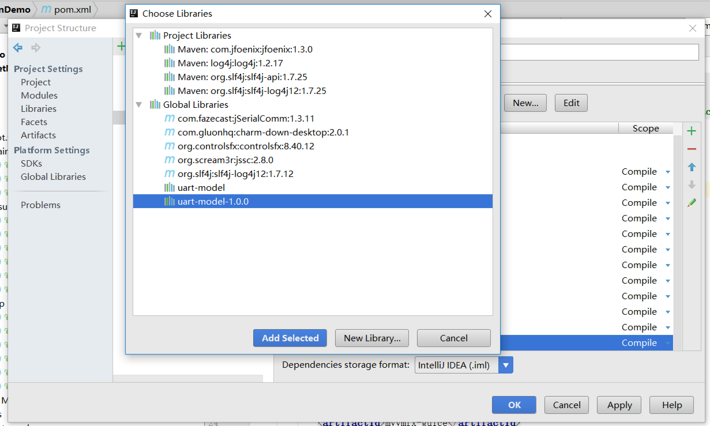
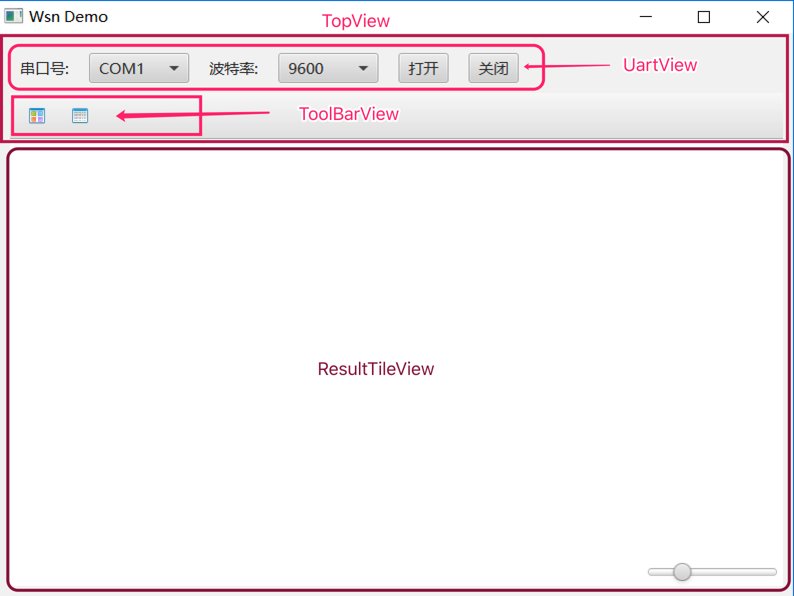
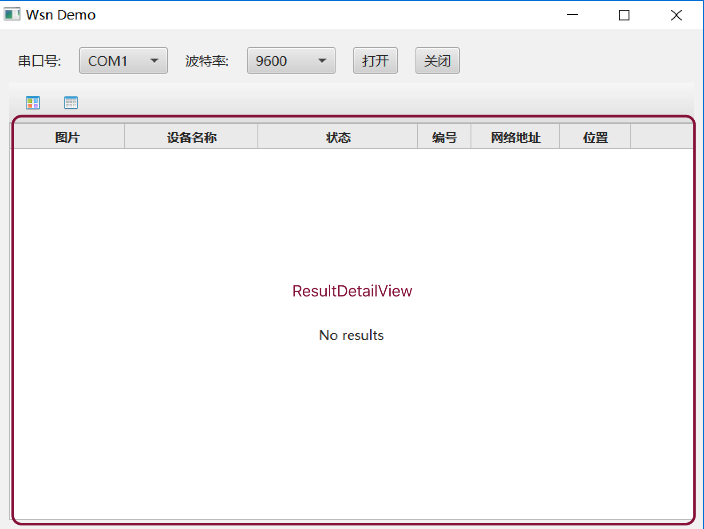
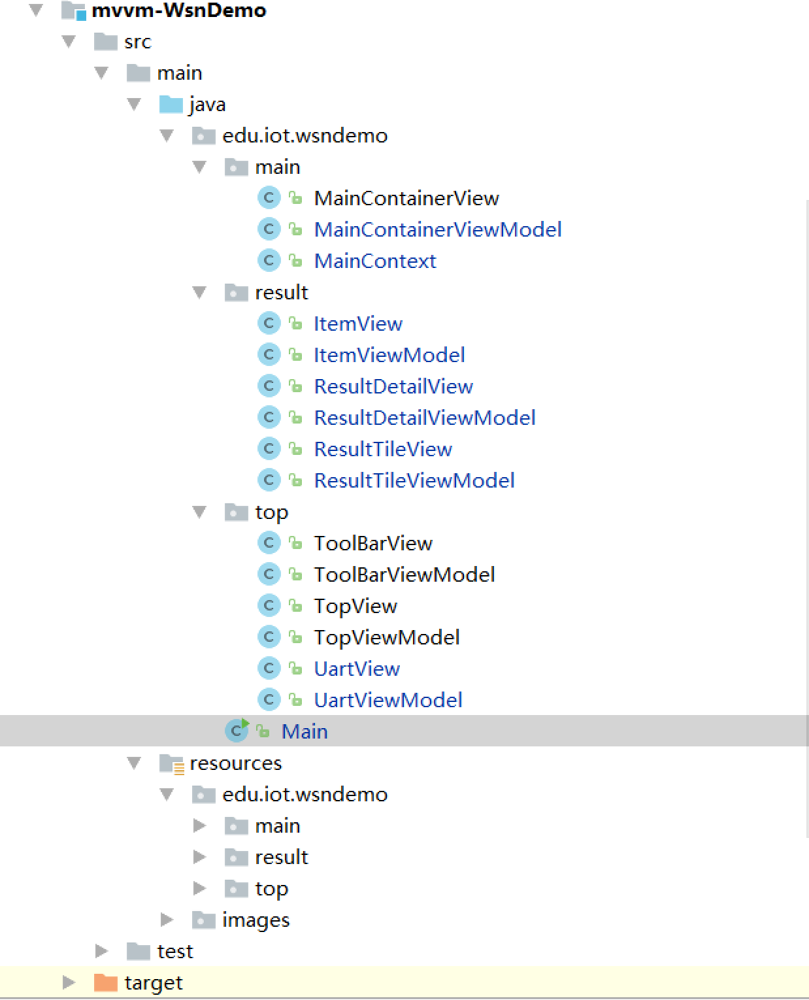
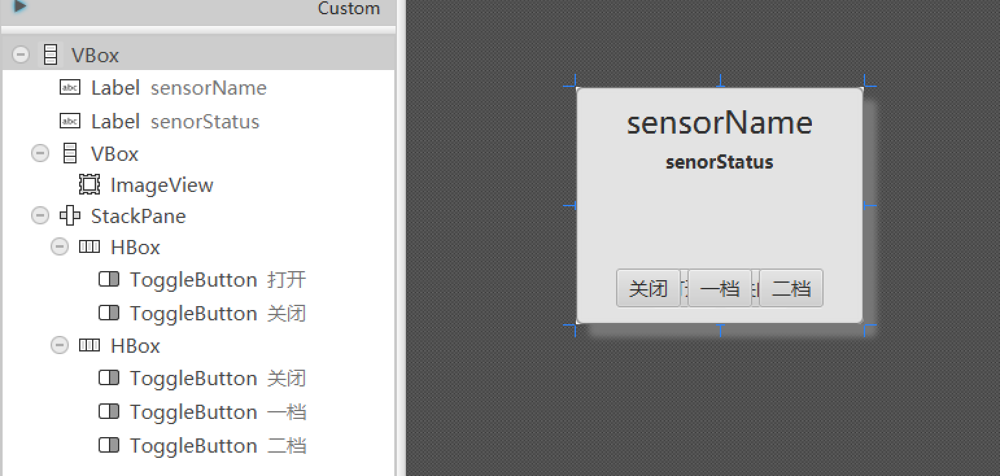
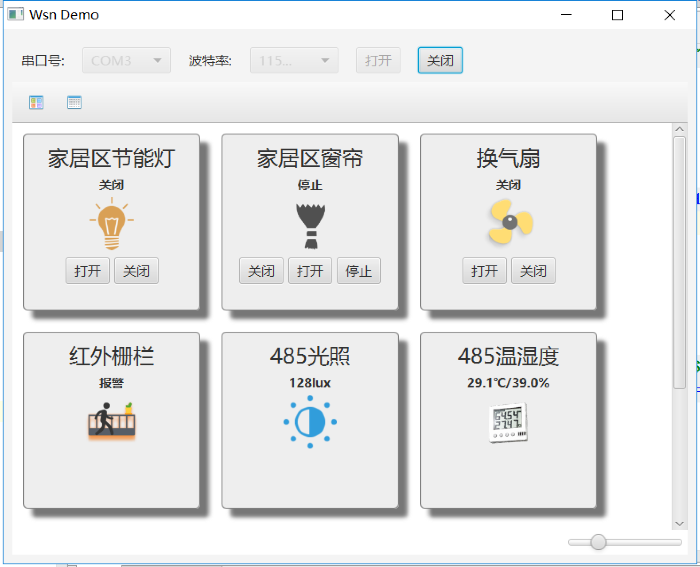
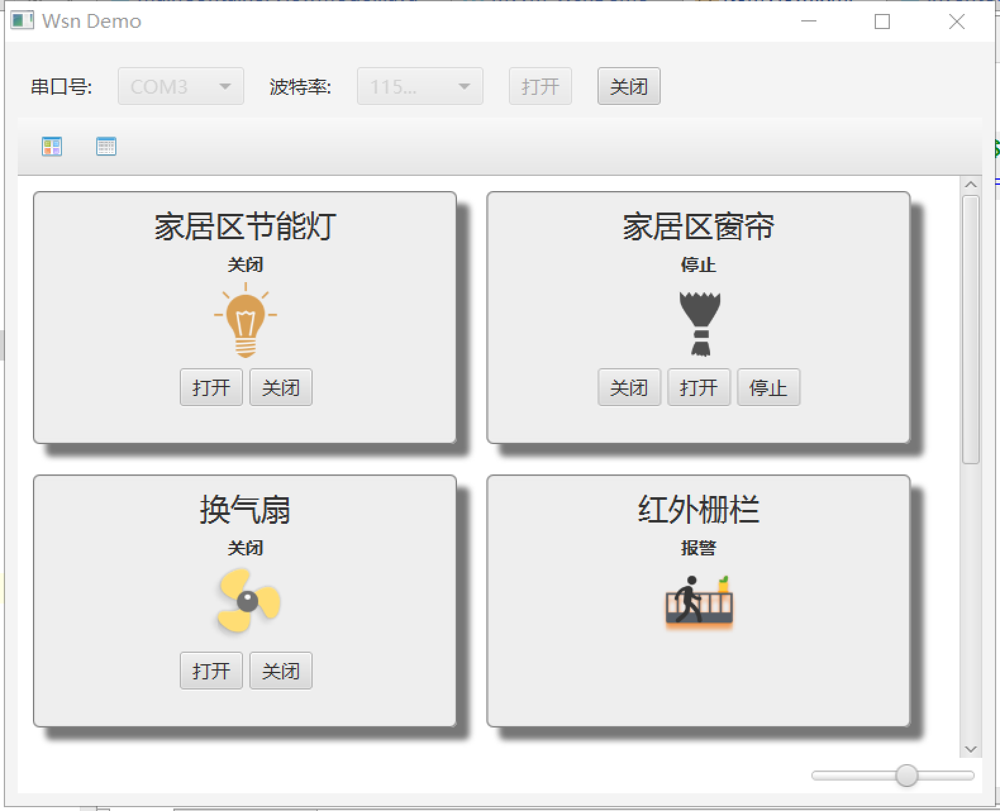
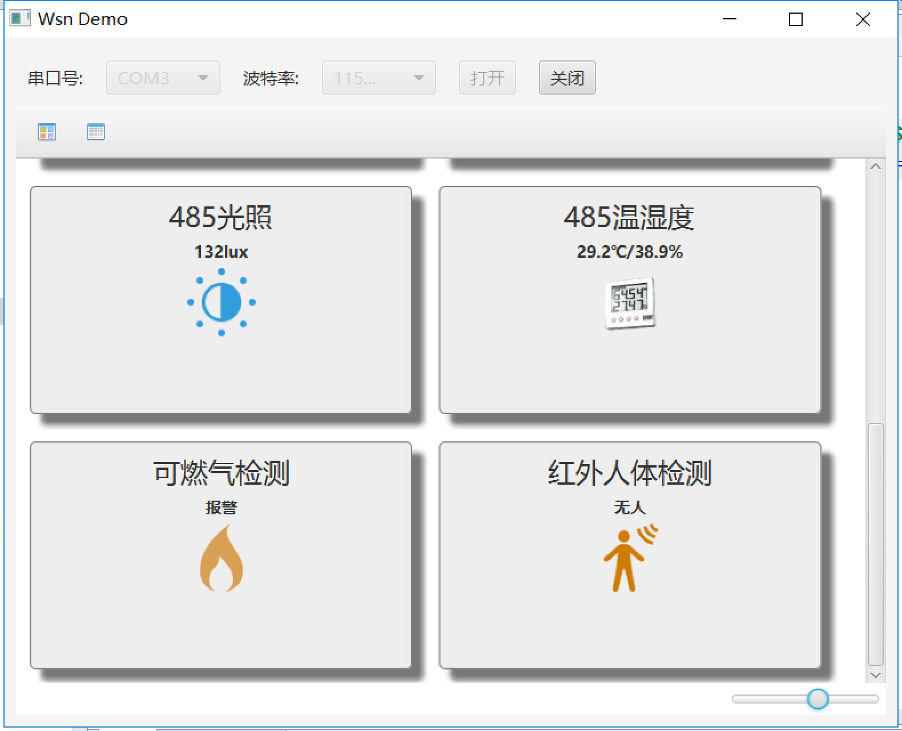
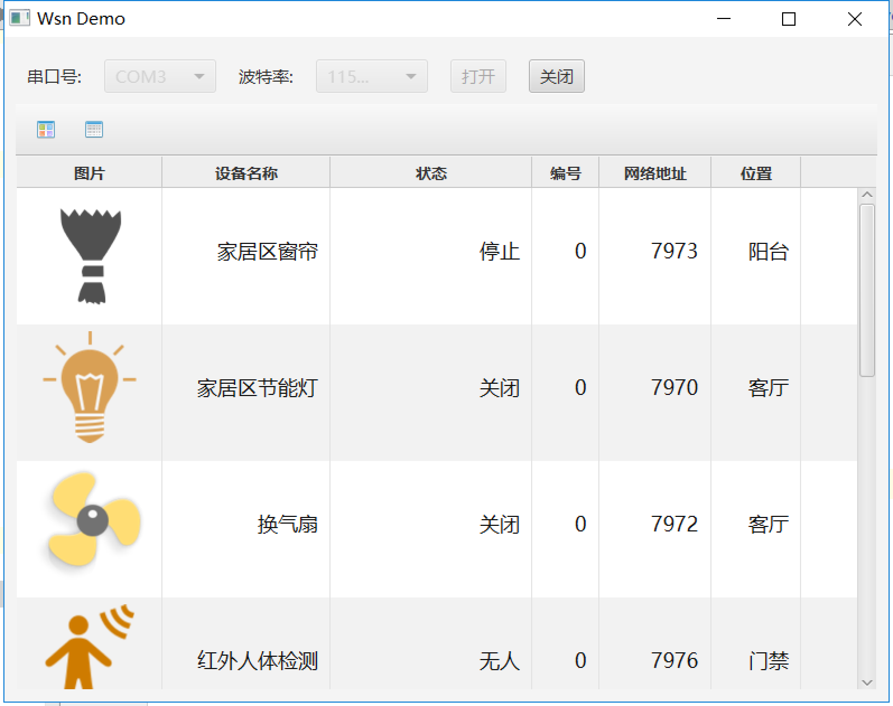
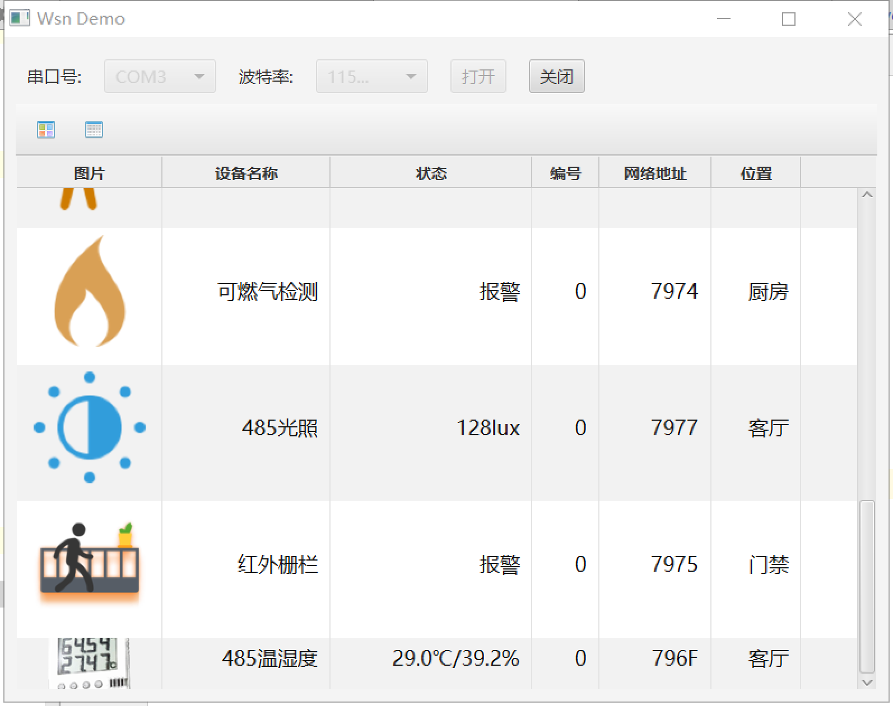

# 实验三. 基于WSN无线传感器网络的智能家居信息采集与控制实验

----

<!-- TOC -->

- [实验三. 基于WSN无线传感器网络的智能家居信息采集与控制实验](#实验三-基于wsn无线传感器网络的智能家居信息采集与控制实验)
    - [实验目的](#实验目的)
    - [实验环境](#实验环境)
    - [实验内容](#实验内容)
    - [实验步骤](#实验步骤)
        - [MVVM框架工程搭建](#mvvm框架工程搭建)
            - [创建子模块maven工程mvvm-WsnDemo](#创建子模块maven工程mvvm-wsndemo)
            - [配置pom.xml文件](#配置pomxml文件)
            - [将全局串口库添加进本模块依赖中](#将全局串口库添加进本模块依赖中)
            - [搭建MVVM框架](#搭建mvvm框架)
            - [编程设计实现程序功能](#编程设计实现程序功能)
                - [串口模块部分](#串口模块部分)
                - [ToolBar及TopView部分](#toolbar及topview部分)
                - [TopView部分](#topview部分)
                - [单个传感器ItemView部分](#单个传感器itemview部分)
                - [传感器数据展示部分](#传感器数据展示部分)
                - [主界面部分](#主界面部分)
            - [运行演示](#运行演示)

<!-- /TOC -->

## 实验目的
- 掌握controlsfx组件库及TableVie组件的使用方法;
- 掌握JavaFX数据绑定方法；
- 掌握MVVM框架设计思想;

## 实验环境
* 硬件：CBT-IOT-CTP实训台,PC机;
* 软件： IntelliJ IDEA，Scene Builder;

## 实验内容

- 通过MVVM框架编程实现基于ZigBee无线传感器网络的智能家居环境检测于控制实验功能。


## 实验步骤

### MVVM框架工程搭建

#### 创建子模块maven工程mvvm-WsnDemo

- 创建项目包，框架如下：

```
├─src
│  ├─main
│  │  ├─java
│  │  │  └─edu
│  │  │      └─iot
│  │  │          └─wsndemo
│  │  │              ├─main
│  │  │              ├─result
│  │  │              └─top
│  │  └─resources
│  │      ├─edu
│  │      │  └─iot
│  │      │      └─wsndemo
│  │      │          ├─main
│  │      │          ├─result
│  │      │          └─top
│  │      └─images
│  └─test
│      └─java
└─target

```

#### 配置pom.xml文件

添加本模块需要用到的依赖库

```xml
<?xml version="1.0" encoding="UTF-8"?>
<project xmlns="http://maven.apache.org/POM/4.0.0"
         xmlns:xsi="http://www.w3.org/2001/XMLSchema-instance"
         xsi:schemaLocation="http://maven.apache.org/POM/4.0.0 http://maven.apache.org/xsd/maven-4.0.0.xsd">
    <parent>
        <artifactId>iot-samples</artifactId>
        <groupId>edu.iot.cbt</groupId>
        <version>1.0.0</version>
    </parent>
    <modelVersion>4.0.0</modelVersion>

    <artifactId>mvvm-WsnDemo</artifactId>
    <dependencies>
        <dependency>
            <groupId>org.controlsfx</groupId>
            <artifactId>controlsfx</artifactId>
        </dependency>
        <dependency>
            <groupId>de.saxsys</groupId>
            <artifactId>mvvmfx</artifactId>
        </dependency>
        <dependency>
            <groupId>de.saxsys</groupId>
            <artifactId>mvvmfx-guice</artifactId>
        </dependency>
        <dependency>
            <groupId>org.scream3r</groupId>
            <artifactId>jssc</artifactId>
        </dependency>
        <dependency>
            <groupId>org.slf4j</groupId>
            <artifactId>slf4j-simple</artifactId>
        </dependency>
    </dependencies>
</project>
```
#### 将全局串口库添加进本模块依赖中

- 点击菜单**File**->**Project Structrue...**；
- 选择**Modules**->**mvvm-WsnDemo**->**Dependencies**；
- 点击右侧➕，选择**2 Library...**，在弹出的选择窗口中选中**uart-model-1.0.0**,点击下方的**Add Selected**按钮；



- 点击**OK**完成串口库的添加。

#### 搭建MVVM框架

1. 在wsndemo包下编写主函数类`Main.java`。

```java
public class Main extends MvvmfxGuiceApplication {
    @Override
    public void startMvvmfx(Stage stage) throws Exception {
        ViewTuple<MainContainerView,MainContainerViewModel> tuple = FluentViewLoader.fxmlView(MainContainerView.class).load();
        Scene scene = new Scene(tuple.getView());
        stage.setScene(scene);
        stage.setWidth(800);
        stage.setHeight(600);
        stage.setTitle("Wsn Demo");
        stage.show();
    }
}
```

2. 根据程序界面原型编写mvvm具体实现类及文件；

程序界面原型如图：





最终mvvm程序框架结构如下图：



**类文件说明：**

- `MainContext`类：各ViewModel的桥梁类；
- `ItemView`类：单独传感器视图类；
- `ResultDetailView`类：以TableView列表形式展示多个传感器信息类；
- `ResultTileView`类：以GridView网格形式展示多个传感器信息类；
- `ToolBarView`类：显示网格和列表两个图标，实现点击事件监听；

#### 编程设计实现程序功能

编写分为以下三块，且可单独编写完成之间没有耦合：
- FXML界面文件
- View试图类
- ViewModel模型类

以下功能模块部分设计无顺序要求。

##### 串口模块部分

直接**复用实验二中的相关文件**，不再次重现设计实现。
需复用拷贝如下内容：

- UartView.java (路径：src\main\java\edu\iot\wsndemo\top\)
- UartViewModel.java (路径同上)
- UartView.fxml (路径：src\main\resources\edu\iot\wsndemo\top\)

##### ToolBar及TopView部分

- 设计实现ToolBar

**ToolBar.fxml**
```xml
<?xml version="1.0" encoding="UTF-8"?>

<?import javafx.scene.control.*?>
<?import javafx.scene.image.Image?>
<?import javafx.scene.image.ImageView?>
<ToolBar id="toolBar" fx:id="toolBar" xmlns="http://javafx.com/javafx/8.0.40" xmlns:fx="http://javafx.com/fxml/1"
         stylesheets="@ToolBar.css" fx:controller="edu.iot.wsndemo.top.ToolBarView">
    <items>
        <Button fx:id="tileViewButton" mnemonicParsing="false" onAction="#tileViewButtonClick">
            <tooltip>
                <Tooltip text="Tile View"/>
            </tooltip>
            <graphic>
                <ImageView accessibleText="Tile View" pickOnBounds="true" preserveRatio="true">
                    <image>
                        <Image url="@../../../../images/tile_16x16.png"/>
                    </image>
                </ImageView>
            </graphic>
        </Button>
        <Button fx:id="detailViewButton" mnemonicParsing="false" onAction="#detailViewButtonClick">
            <tooltip>
                <Tooltip text="Detail View"/>
            </tooltip>
            <graphic>
                <ImageView pickOnBounds="true" preserveRatio="true">
                    <image>
                        <Image url="@../../../../images/detail_16x16.png"/>
                    </image>
                </ImageView>
            </graphic>
        </Button>
    </items>
</ToolBar>
```

- **ToolBarView.java**实现两个图片的监听方法

```java

	@FXML
	private void tileViewButtonClick(ActionEvent event) {
		viewModel.showTileViewCommand()
				.execute();
	}
	@FXML
	private void detailViewButtonClick(ActionEvent event) {
		viewModel.showDetailViewCommand()
				.execute();
	}
```

- **ToolBarViewModel.java**类中实现具体的页面跳转业务逻辑

```java
package edu.iot.wsndemo.top;

import de.saxsys.mvvmfx.ViewModel;
import de.saxsys.mvvmfx.utils.commands.Action;
import de.saxsys.mvvmfx.utils.commands.Command;
import de.saxsys.mvvmfx.utils.commands.DelegateCommand;
import edu.iot.wsndemo.main.MainContext;

import javax.inject.Inject;

public class ToolBarViewModel implements ViewModel {

	private Command showDetailViewCommand;

	private Command showTileViewCommand;

	private MainContext context;

	@Inject
	public ToolBarViewModel(MainContext context) {
		this.context = context;

		showTileViewCommand = new DelegateCommand(() -> new Action() {

			@Override
			protected void action() throws Exception {
				showTileView();
			}
		});

		showDetailViewCommand = new DelegateCommand(() -> new Action() {

			@Override
			protected void action() throws Exception {
				showDetailView();
			}
		});
	}

	public Command showDetailViewCommand() {
		return showDetailViewCommand;
	}

	public Command showTileViewCommand() {
		return showTileViewCommand;
	}

	private void showTileView() {
		context.getMainContainerViewModel()
				.showTileView();
	}

	private void showDetailView() {
		context.getMainContainerViewModel()
				.showDetailView();
	}
}

```
##### TopView部分

该部分只实现了将UartView和Toolbar两个组件进行整合显示，具体业务逻辑还是在这两个组件对应的View中实现。因此TopView和TopViewModel类只需实现mvvmfx框架中的相关接口即可。

- **TopView.fxml**

```xml
<?xml version="1.0" encoding="UTF-8"?>

<?import javafx.scene.layout.VBox?>
<VBox stylesheets="@TopView.css" xmlns="http://javafx.com/javafx/8.0.40" xmlns:fx="http://javafx.com/fxml/1" fx:controller="edu.iot.wsndemo.top.TopView">
    <children>
        <fx:include fx:id="searchBar" source="../top/UartView.fxml"/>
        <fx:include fx:id="toolBar" source="../top/Toolbar.fxml"/>
    </children>
</VBox>
```

- **TopView.java**

```java
public class TopView implements FxmlView<TopViewModel>, Initializable {
	@InjectViewModel
	private TopViewModel viewModel;
	public void initialize(URL location, ResourceBundle resources) {
	}
}
```

- **TopViewModel.java**

```java
public class TopViewModel implements ViewModel {
}
```

##### 单个传感器ItemView部分

- 使用SceneBuilder设计界面如图所示：



具体代码如下：

**ItemView.fxml**

```xml
<?xml version="1.0" encoding="UTF-8"?>

<?import java.net.URL?>
<?import javafx.geometry.Insets?>
<?import javafx.scene.control.Label?>
<?import javafx.scene.control.ToggleButton?>
<?import javafx.scene.control.ToggleGroup?>
<?import javafx.scene.image.ImageView?>
<?import javafx.scene.layout.HBox?>
<?import javafx.scene.layout.StackPane?>
<?import javafx.scene.layout.VBox?>

<VBox id="mainContainer" fx:id="mainContainer" alignment="TOP_CENTER" spacing="5.0" xmlns="http://javafx.com/javafx/8.0.111" xmlns:fx="http://javafx.com/fxml/1" fx:controller="edu.iot.wsndemo.result.ItemView">
    <children>
        <Label id="artistName" fx:id="sensorName" text="sensorName" />
        <Label id="trackName" fx:id="senorStatus" text="senorStatus" />
        <VBox id="imageContainer" alignment="CENTER" maxHeight="100" maxWidth="100">
            <children>
                <ImageView fx:id="sensorImage" fitHeight="60" fitWidth="60" pickOnBounds="true" preserveRatio="true">
                </ImageView>
            </children>
        </VBox>
        <StackPane id="stackPane">
            <children>
            <HBox  fx:id="hbNormal" alignment="CENTER" maxHeight="-Infinity" maxWidth="-Infinity" prefHeight="35.0" prefWidth="200.0" spacing="5.0">
               <children>
                   <ToggleButton fx:id="toggleOn" mnemonicParsing="false" onAction="#toggleOnAction" text="打开" />
                      <ToggleButton fx:id="toggleOff" mnemonicParsing="false" onAction="#toggleOffAction" text="关闭" />
               </children>
            </HBox>
                <HBox fx:id="hbSpecial" alignment="CENTER" maxHeight="-Infinity" maxWidth="-Infinity" prefHeight="35.0" prefWidth="200.0" spacing="5.0">
                    <children>
                        <ToggleButton fx:id="tgClose" mnemonicParsing="false" onAction="#tgCloseAction" text="关闭">
                            <toggleGroup>
                                <ToggleGroup fx:id="toggleGroup" />
                            </toggleGroup>
                        </ToggleButton>
                        <ToggleButton fx:id="tgOpen" mnemonicParsing="false" onAction="#tgOpenAction" text="一档" toggleGroup="$toggleGroup" />
                        <ToggleButton fx:id="tgUpper" mnemonicParsing="false" onAction="#tgUpperAction" text="二档" toggleGroup="$toggleGroup" />
                    </children>
                </HBox></children>
        </StackPane>
    </children>
    <stylesheets>
        <URL value="@ItemView.css" />
    </stylesheets>
    <padding>
        <Insets bottom="10.0" left="10.0" right="10.0" top="10.0" />
    </padding>
</VBox>

```

- 根据FXML定义的组件id及action实现View类

**ItemView.java**

```java
public class ItemView implements FxmlView<ItemViewModel>,Initializable {
    public ToggleButton tgClose;
    public ToggleButton tgOpen;
    public ToggleButton tgUpper;
    public ToggleGroup toggleGroup;
    public HBox hbSpecial;
    public ToggleButton toggleOn;
    public ToggleButton toggleOff;
    public HBox hbNormal;
    @FXML
    private Label sensorName;
    @FXML
    private Label senorStatus;
    @FXML
    private ImageView sensorImage;

    @InjectViewModel
    private ItemViewModel viewModel;
    @Override
    public void initialize(URL location, ResourceBundle resources) {
        hbNormal.setVisible(false);
        hbSpecial.setVisible(false);
        sensorName.textProperty()
                .bind(viewModel.sensorNameProperty());
        senorStatus.textProperty()
                .bind(viewModel.sensorStatusProperty());
        sensorImage.imageProperty()
                .bind(viewModel.sensorSmallImageProperty());
       hbNormal.visibleProperty().bindBidirectional(viewModel.ctlNormalProperty());
       hbSpecial.visibleProperty().bindBidirectional(viewModel.ctlSpecialProperty());
    }

    public void tgCloseAction(ActionEvent actionEvent) {
        viewModel.getCloseCommand().execute();
    }

    public void tgOpenAction(ActionEvent actionEvent) {
        viewModel.getOpenCommand().execute();
    }

    public void tgUpperAction(ActionEvent actionEvent) {
        viewModel.getUpperCommand().execute();
    }

    public void toggleOnAction(ActionEvent actionEvent) {
        viewModel.getOpenCommand().execute();
    }

    public void toggleOffAction(ActionEvent actionEvent) {
        viewModel.getCloseCommand().execute();
    }
}

```

- 在ViewModel类中实现具体的业务逻辑功能

**ItemViewModel.java**

```java
package edu.iot.wsndemo.result;

import de.saxsys.mvvmfx.ViewModel;
import de.saxsys.mvvmfx.utils.commands.Action;
import de.saxsys.mvvmfx.utils.commands.Command;
import de.saxsys.mvvmfx.utils.commands.DelegateCommand;
import edu.iot.lib.model.sensor.SensorBean;
import edu.iot.lib.model.uart.UartConnector;
import javafx.application.Platform;
import javafx.beans.property.*;
import javafx.scene.image.Image;

import java.util.concurrent.CompletableFuture;

/**
 * Created by luffycheung on 2017/4/25.
 */
public class ItemViewModel implements ViewModel {

    private StringProperty sensorName = new SimpleStringProperty();
    private StringProperty sensorAddr = new SimpleStringProperty();
    private StringProperty sensorPostion = new SimpleStringProperty();
    private StringProperty sensorIndex = new SimpleStringProperty();
    private StringProperty sensorStatus = new SimpleStringProperty();
    private ObjectProperty<Image> sensorSmallImage = new SimpleObjectProperty<>();
    private Image dummySmallImage = new Image("images/ic_s_unknown.png");
    private final BooleanProperty onoffSelected = new SimpleBooleanProperty();
    private final BooleanProperty normalFlag = new SimpleBooleanProperty();
    private final BooleanProperty specialFlag = new SimpleBooleanProperty();

    byte[] dataOn, dataOff, dataUpper;

    private  Command openCommand;
    private  Command closeCommand;
    private  Command upperCommand;

    UartConnector uartConnector = UartConnector.getInstance();

    public ItemViewModel(SensorBean item){
        uartConnector = UartConnector.getInstance();
        sensorName.setValue(item.getSensorType());
        sensorIndex.setValue(item.getSensorIndex());
        sensorAddr.setValue(item.getSensorAddr());
        sensorPostion.setValue(item.getSensorPos());
        sensorStatus.setValue(item.getSensorValue());
        CompletableFuture.supplyAsync(() -> new Image(item.getImagePath())).thenAccept((image) -> {
            Platform.runLater(() -> sensorSmallImage.setValue(image));
        });
        if(item.isCtlFlag()){
            if(item.isSpecialFlag()){
                normalFlag.setValue(false);
                specialFlag.setValue(true);
                if(null != item.getDataUpper()){
                    dataUpper = item.getDataUpper();
                }
            }else {
                normalFlag.setValue(true);
                specialFlag.setValue(false);
            }
            dataOn = item.getDataOn();
            dataOff = item.getDataOff();

        }else {
            normalFlag.setValue(false);
        }

        openCommand = new DelegateCommand(()->new Action() {
            @Override
            protected void action() throws Exception {
                if(uartConnector !=null && uartConnector.isConnected()){
                    uartConnector.sendBytes(dataOn);
                }
            }
        });
        closeCommand = new DelegateCommand(()->new Action() {
            @Override
            protected void action() throws Exception {
                if(uartConnector !=null && uartConnector.isConnected()){
                    uartConnector.sendBytes(dataOff);
                }
            }
        });
        upperCommand = new DelegateCommand(()->new Action() {
            @Override
            protected void action() throws Exception {
                if(uartConnector !=null && uartConnector.isConnected()){
                    uartConnector.sendBytes(dataUpper);
                }
            }
        });
    }

    public StringProperty sensorNameProperty() {
        return sensorName;
    }
    public StringProperty sensorIndexProperty() {
        return sensorIndex;
    }
    public StringProperty sensorPostionProperty() {
        return sensorPostion;
    }
    public StringProperty sensorAddrProperty() {
        return sensorAddr;
    }
    public StringProperty sensorStatusProperty() {
        return sensorStatus;
    }
    public ObjectProperty<Image> sensorSmallImageProperty() {
        return sensorSmallImage;
    }
    public Command getOpenCommand() {
        return openCommand;
    }
    public Command getCloseCommand() {
        return closeCommand;
    }
    public Command getUpperCommand() {
        return upperCommand;
    }
    public Property<Boolean> ctlNormalProperty() {
        return normalFlag;
    }
    public Property<Boolean> ctlSpecialProperty() {
        return specialFlag;
    }
    public Property<Boolean> onoffSelectedProperty() {
        return onoffSelected;
    }

}
```

##### 传感器数据展示部分

本部分包含两块：GridView网格样式和TableView列表样式展示多个传感器数据。

网格布局ResultTileView内子Item根据ItemView样式填充显示。 

列表布局ResultDetailView那子Item数据根据SensorBean数据类型绑定对应填充实现。

- ResultTile布局

由第三方组件GridView和Slider滑动条组成

```xml
<?xml version="1.0" encoding="UTF-8"?>
<?import java.net.URL?>
<?import org.controlsfx.control.GridView?>
<?import javafx.geometry.Insets?>
<?import javafx.scene.control.Slider?>
<?import javafx.scene.layout.BorderPane?>
<?import javafx.scene.layout.HBox?>
<BorderPane id="outerPane" xmlns="http://javafx.com/javafx/8.0.40" xmlns:fx="http://javafx.com/fxml/1" fx:controller="edu.iot.wsndemo.result.ResultTileView">
    <center>
        <GridView id="containerPane" fx:id="containerPane"/>
    </center>
    <bottom>
        <HBox alignment="CENTER_RIGHT">
            <children>
                <Slider fx:id="slider" max="500.0" min="100.0" value="200.0"/>
            </children>
            <padding>
                <Insets bottom="5.0" top="5.0"/>
            </padding>
        </HBox>
    </bottom>
    <stylesheets>
        <URL value="@ResultTileView.css"/>
    </stylesheets>
</BorderPane>
```

- ResultTileView与ViewModel

**ResultTileView.java**

初始化GridView，将滑动条数值与网格宽度等比例绑定。

```java
public class ResultTileView implements FxmlView<ResultTileViewModel>, Initializable {

    @InjectViewModel
    private ResultTileViewModel viewModel;

    @FXML
    private GridView<Node> containerPane;

    @FXML
    private Slider slider;

    @Override
    public void initialize(URL location, ResourceBundle resources) {
        containerPane.setCellFactory(new Callback<GridView<Node>, GridCell<Node>>() {

            @Override
            public GridCell<Node> call(GridView<Node> param) {
                return new GridCell<Node>() {

                    @Override
                    protected void updateItem(Node item, boolean empty) {
                        super.updateItem(item, empty);
                        if (item != null && !empty) {
                            this.setGraphic(item);
                        }
                    }
                };
            }
        });
        containerPane.itemsProperty()
                .bind(viewModel.itemsProperty());
        containerPane.cellWidthProperty()
                .bind(slider.valueProperty());
        containerPane.cellHeightProperty().bind(viewModel.itemHeightProperty());
    }
}
```

- **ResultTileViewModel.java**实现View类数据绑定

```java
public class ResultTileViewModel implements ViewModel {
	private DoubleProperty itemHeight = new SimpleDoubleProperty(200);
	private MainContext context;

	@Inject
	public ResultTileViewModel(MainContext context) {
		this.context = context;
		this.context.setResultTileViewModel(this);
	}

	public ListProperty<Node> itemsProperty() {
		return context.getMainContainerViewModel().tileItemsProperty();
	}
	public DoubleProperty itemHeightProperty() {
		return itemHeight;
	}
}
```

- **ResultDetailView.fxml**

```xml
<?xml version="1.0" encoding="UTF-8"?>
<?import java.lang.*?>
<?import javafx.scene.control.*?>

<TableView id="tableView" fx:id="tableView" stylesheets="@ResultDetailView.css" xmlns="http://javafx.com/javafx/8.0.40" xmlns:fx="http://javafx.com/fxml/1" fx:controller="edu.iot.wsndemo.result.ResultDetailView">
  <columns>
    <TableColumn fx:id="sensorImgColumn" prefWidth="130.0"  resizable="false" text="图片" />
    <TableColumn fx:id="sensorNameColumn" prefWidth="150.0" text="设备名称" />
    <TableColumn fx:id="sensorStatusColumn" prefWidth="180.0" text="状态" />
    <TableColumn fx:id="sensorIndexColumn" prefWidth="60.0" text="编号" />
    <TableColumn fx:id="netAddrColumn" prefWidth="100.0" text="网络地址" />
    <TableColumn fx:id="sensorPosColumn" prefWidth="80.0" text="位置" />
  </columns>
  <placeholder>
    <Label>No results</Label>
  </placeholder>
</TableView>

```

- **ResultDetailView.java**

根据SensorBean数据模型及单元格工厂来填充表格数据。
```java
public class ResultDetailView implements FxmlView<ResultDetailViewModel>, Initializable {

	public TableColumn sensorStatusColumn;
	public TableColumn sensorImgColumn;
	public TableColumn sensorPosColumn;
	public TableColumn sensorIndexColumn;
	@FXML
	private TableView<ItemViewModel> tableView;
	@FXML
	private TableColumn<ItemViewModel, String> sensorNameColumn;
	@FXML
	private TableColumn<ItemViewModel, String> netAddrColumn;

	@InjectViewModel
	private ResultDetailViewModel viewModel;

	@Override
	public void initialize(URL location, ResourceBundle resources) {
		sensorImgColumn.setCellValueFactory(new PropertyValueFactory<>("sensorSmallImage"));
		sensorImgColumn.setCellFactory(param -> new ImageTableCell());
		sensorImgColumn.getStyleClass().add("artworkThumbnailImage");
		sensorStatusColumn.setCellValueFactory(new PropertyValueFactory<>("sensorStatus"));
		sensorNameColumn.setCellValueFactory(new PropertyValueFactory<>("sensorName"));
		sensorIndexColumn.setCellValueFactory(new PropertyValueFactory<>("sensorIndex"));
		netAddrColumn.setCellValueFactory(new PropertyValueFactory<>("sensorAddr"));
		sensorPosColumn.setCellValueFactory(new PropertyValueFactory<>("sensorPostion"));
		tableView.itemsProperty()
				.bind(viewModel.itemsProperty());
	}
	private static class ImageTableCell extends TableCell<ItemViewModel, Image> {

		@Override
		protected void updateItem(Image item, boolean empty) {
			super.updateItem(item, empty);
			this.setGraphic(null);
			this.setText(null);
			if (item != null && !empty) {
				ImageView imageView = new ImageView(item);
				this.setGraphic(imageView);
			}
		}
	}
}

```

- **ResultDetailViewModel.java**

提供View表格Items数据。

```java
public class ResultDetailViewModel implements ViewModel {
	private MainContext context;

	@Inject
	public ResultDetailViewModel(MainContext context) {
		this.context = context;
		context.setResultDetailViewModel(this);
	}

	public ListProperty<ItemViewModel> itemsProperty() {
		return context.getMainContainerViewModel().detailItemsProperty();
	}
}
```


##### 主界面部分

- 界面由Top部分、ResultTileView和ResultDetailView三部分组成。在FXML中使用`fx:include`引入。

**MainContainerView.fxml**

```xml
<?xml version="1.0" encoding="UTF-8"?>
<?import java.lang.*?>
<?import java.util.*?>
<?import javafx.scene.*?>
<?import javafx.scene.control.*?>
<?import javafx.scene.layout.*?>

<?import javafx.geometry.Insets?>
<?import org.controlsfx.control.GridView?>
<BorderPane xmlns="http://javafx.com/javafx"
            xmlns:fx="http://javafx.com/fxml"
            fx:controller="edu.iot.wsndemo.main.MainContainerView"
            prefHeight="400.0" prefWidth="600.0">
    <top>
        <fx:include fx:id="topView" source="../top/TopView.fxml"/>
    </top>
    <center>
        <StackPane id="stackPane">
            <children>
                <fx:include fx:id="resultTileView" source="../result/ResultTileView.fxml"/>
                <fx:include fx:id="resultDetailView" source="../result/ResultDetailView.fxml" />
                <ProgressIndicator fx:id="progressIndicator" maxHeight="32.0" maxWidth="32.0" prefHeight="32.0" prefWidth="32.0" />
            </children>
        </StackPane>
    </center>
    <padding>
        <Insets left="10.0" right="10.0" top="10.0" bottom="10.0"/>
    </padding>
    <bottom>
    </bottom>
</BorderPane>
```

- View类和ViewModel类

**MainContainerView.java**

```java
public class MainContainerView implements FxmlView<MainContainerViewModel>, Initializable {

    @FXML
    private ProgressIndicator progressIndicator;
    @FXML
    private TableView<?> resultDetailView;

    @FXML
    private BorderPane resultTileView;
    
    @InjectViewModel
    private MainContainerViewModel viewModel;

    @Override
    public void initialize(URL location, ResourceBundle resources) {
        progressIndicator.visibleProperty().bind(viewModel.searchCommandRunningProperty());
        resultDetailView.visibleProperty().bind(viewModel.resultDetailViewVisibleProperty());
        resultTileView.visibleProperty().bind(viewModel.resultTileViewVisibleProperty());

    }
}
```

**MainContainerViewModel.java**

ViewModel类除了实现View类组件状态的数据绑定外还实现串口回调接口方法，并填充数据更新相应界面组件的数据。

```java
/**
 * Created by luffycheung on 2017/4/25.
 */
public class MainContainerViewModel implements ViewModel ,UartConnectorDelegate{
    private MainContext context;
    private BooleanProperty resultDetailViewVisible = new SimpleBooleanProperty(false);
    private BooleanProperty resultTileViewVisible = new SimpleBooleanProperty(true);
    private ListProperty<Node> tileItems = new SimpleListProperty<>(FXCollections.observableArrayList());
    private ListProperty<ItemViewModel> detailItems = new SimpleListProperty<>(FXCollections.observableArrayList());

    List<SensorBean> beanList;
//    @Inject
    UartConnector uartConnector = UartConnector.getInstance();
    @Inject
    public MainContainerViewModel(MainContext context) {
        this.context = context;
        this.context.setMainContainerViewModel(this);
    }
    public void initialize(){
        System.out.println("MainContainerViewModel initialize");
        uartConnector.setDelegate(this);
    }
    public ReadOnlyBooleanProperty searchCommandRunningProperty() {
        return context.getUartViewModel().searchCommand().runningProperty();
    }
    public BooleanProperty resultDetailViewVisibleProperty() {
        return resultDetailViewVisible;
    }
    public BooleanProperty resultTileViewVisibleProperty() {
        return resultTileViewVisible;
    }
    public ListProperty<Node> tileItemsProperty() {
        return tileItems;
    }
    public ListProperty<ItemViewModel> detailItemsProperty() {
        return detailItems;
    }

    public void showTileView() {
        resultDetailViewVisible.setValue(false);
        resultTileViewVisible.setValue(true);
    }

    public void showDetailView() {
        resultDetailViewVisible.setValue(true);
        resultTileViewVisible.setValue(false);
    }

    @Override
    public void OnCharStringMessageReceived(String message) {
    }
    @Override
    public void OnHexStringMessageReceived(String message) {
    }
    @Override
    public void OnSensorFramePackage(SensorBean sensorBean) {
    }
    @Override
    public void OnErrorException(String s) {
    }
    @Override
    public void OnSensorListPackage(List<SensorBean> sensorBeanList) {
        beanList = sensorBeanList;
        retrieveData();
    }

    private void retrieveData() {
        System.out.println("retrieveData");
        List<Node> resultTileItems =beanList
                .stream()
                .map(ItemViewModel::new)
                .map(this::createItemView)
                .collect(Collectors.toList());

        if(resultTileItems == null || resultTileItems.size()==0) return;
        Platform.runLater(() -> {
            tileItems.getValue().clear();
            tileItems.getValue().addAll(resultTileItems);
        });
//--------------------------------------------------------------//
        List<ItemViewModel> resultDetailItems =beanList
                .stream()
                .map(ItemViewModel::new)
                .collect(Collectors.toList());

        if(resultDetailItems == null || resultDetailItems.size()==0) return;
        Platform.runLater(() -> {
            detailItems.getValue().clear();
            detailItems.getValue().addAll(resultDetailItems);
        });
    }

    private Node createItemView(ItemViewModel itemViewModel) {
        ViewTuple<ItemView, ItemViewModel> tuple = FluentViewLoader.fxmlView(ItemView.class)
                .viewModel(itemViewModel)
                .load();
        return tuple.getView();
    }
}

```

#### 运行演示

- 实训台设备上电，使用香蕉线将网关区的ZigBee协调器模块串口于USB2UART模块相连。
  （TXD／RXD注意交叉相连；USB2UART模块拨码开关拨到Node方向）
- 使用miniUSB线将USB2UART模块和电脑相连。（安装好U转串驱动）
- 运行mvvm-WsnDemo工程的主程序`Main.java`。
- 选择连接到电脑上的U转串模块串口，波特率选择115200，点击右侧打开按钮。

1. 打开成功后主界面会以网格形式显示家居各个设备信息，若为可控类设备可点击下方的控制按钮对其进行控制。滑动右下方的滚动条可调节显示大小。







2. 点击Toolbar中的表格图标会切换为表格视图。



