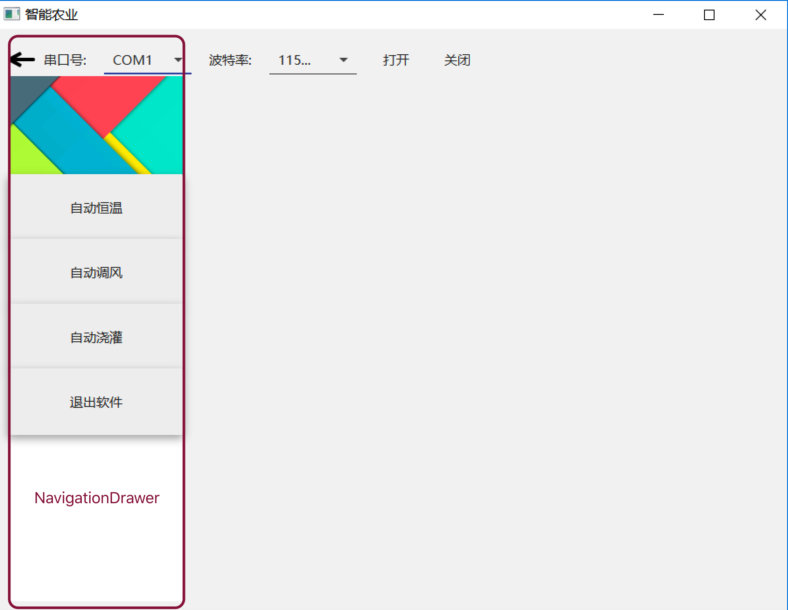
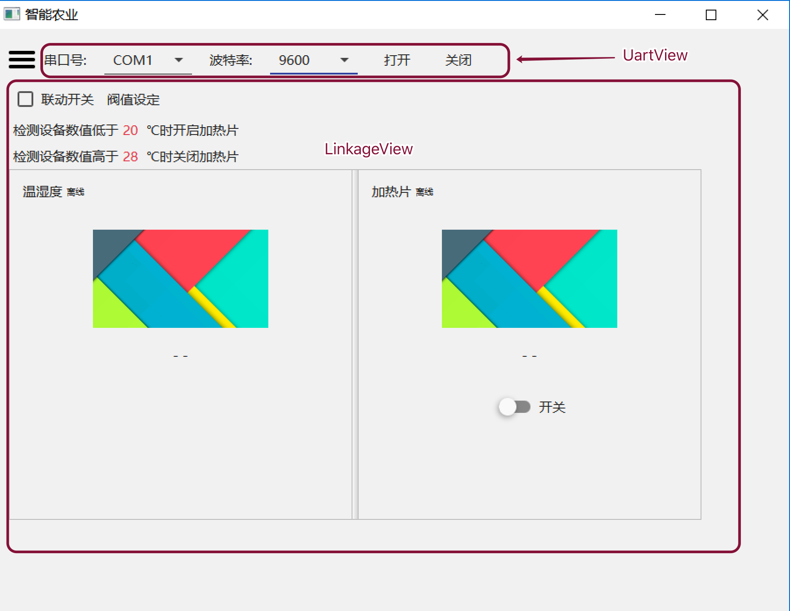
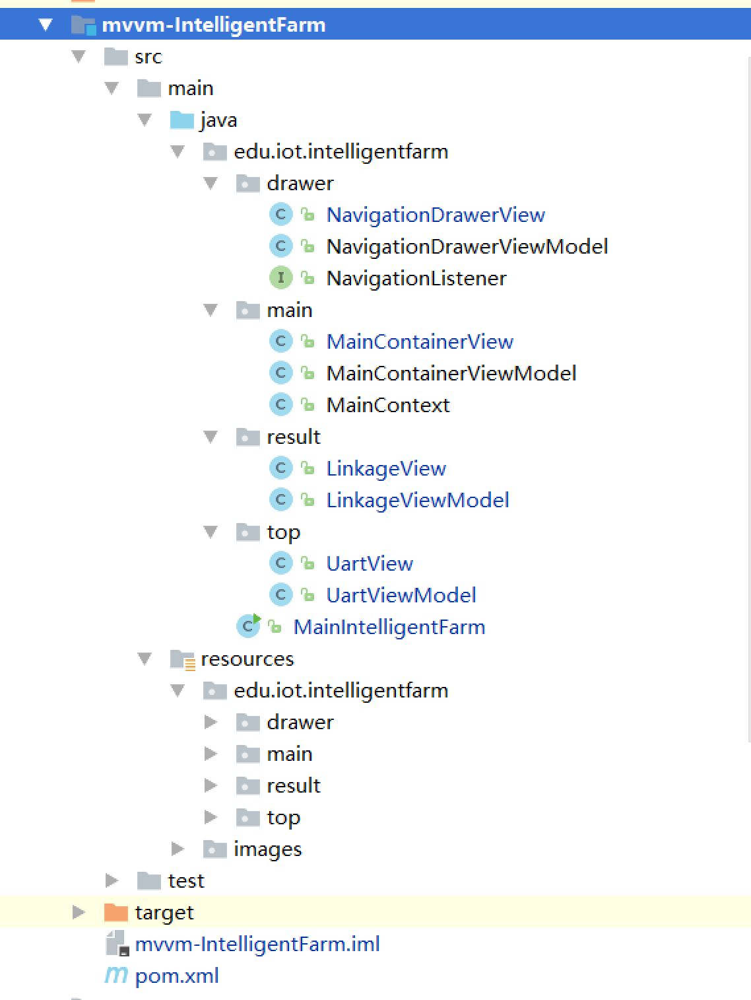

# 实验四. 基于MVVM架构的智慧农业联动控制系统实验

------

## 实验目的
- 掌握Material Design组件库的使用方法;
- 掌握接口的使用方法；
- 掌握MVVM框架设计思想;

## 实验环境
* 硬件：CBT-IOT-CTP实训台,PC机;
* 软件： IntelliJ IDEA，Scene Builder;

## 实验内容

- 通过MVVM框架编程实现基于ZigBee无线传感器网络的智能农业**自动恒温**、**自动通风**、**自动浇灌**系统的功能。

## 实验步骤

### MVVM框架工程搭建

#### 创建子模块maven工程mvvm-IntelligentFarm

- 创建项目包，框架如下：

```
├─src
│  ├─main
│  │  ├─java
│  │  │  └─edu
│  │  │      └─iot
│  │  │          └─intelligentfarm
│  │  │              ├─drawer
│  │  │              ├─main
│  │  │              ├─result
│  │  │              └─top
│  │  └─resources
│  │      ├─edu
│  │      │  └─iot
│  │      │      └─intelligentfarm
│  │      │          ├─drawer
│  │      │          ├─main
│  │      │          ├─result
│  │      │          └─top
│  │      └─images
│  └─test
│      └─java
└─target

```

#### 配置pom.xml文件

添加本模块需要用到的依赖库

```xml
<?xml version="1.0" encoding="UTF-8"?>
<project xmlns="http://maven.apache.org/POM/4.0.0"
         xmlns:xsi="http://www.w3.org/2001/XMLSchema-instance"
         xsi:schemaLocation="http://maven.apache.org/POM/4.0.0 http://maven.apache.org/xsd/maven-4.0.0.xsd">
    <parent>
        <artifactId>iot-samples</artifactId>
        <groupId>edu.iot.cbt</groupId>
        <version>1.0.0</version>
    </parent>
    <modelVersion>4.0.0</modelVersion>

    <artifactId>mvvm-IntelligentFarm</artifactId>
    <dependencies>
        <dependency>
            <groupId>org.controlsfx</groupId>
            <artifactId>controlsfx</artifactId>
        </dependency>
        <dependency>
            <groupId>de.saxsys</groupId>
            <artifactId>mvvmfx</artifactId>
        </dependency>
        <dependency>
            <groupId>de.saxsys</groupId>
            <artifactId>mvvmfx-guice</artifactId>
        </dependency>
        <dependency>
            <groupId>org.scream3r</groupId>
            <artifactId>jssc</artifactId>
        </dependency>

        <dependency>
            <groupId>com.jfoenix</groupId>
            <artifactId>jfoenix</artifactId>
        </dependency>

    </dependencies>

</project>
```

**代码说明：**

jfoenix库为JavaFX第三方Material Design库。

官网：<http://www.jfoenix.com/>

GitHub：<https://github.com/jfoenixadmin/JFoenix>

#### 将全局串口库添加进本模块依赖中

- 点击菜单**File**->**Project Structrue...**；
- 选择**Modules**->**mvvm-IntelligentFarm**->**Dependencies**；
- 点击右侧➕，选择**2 Library...**，在弹出的选择窗口中选中**uart-model-1.0.0**,点击下方的**Add Selected**按钮；
- 点击**OK**完成串口库的添加。

#### 搭建MVVM框架

1. 在intelligentfarm包下编写主函数类`MainIntelligentFarm.java`。

```java
public class MainIntelligentFarm extends MvvmfxGuiceApplication {
    @Override
    public void startMvvmfx(Stage stage) throws Exception {
        ViewTuple<MainContainerView,MainContainerViewModel> tuple = FluentViewLoader.fxmlView(MainContainerView.class).load();
        Scene scene = new Scene(tuple.getView());
        stage.setScene(scene);
        stage.setTitle("智能农业");
        stage.show();
    }
}
```

2. 根据程序界面原型编写mvvm具体实现类及文件；

程序界面原型如图：





最终mvvm程序框架结构如下图：



**类文件说明：**

- `MainContext`类：各ViewModel的桥梁类；
- `NavigationDrawerView`类：界面左侧抽屉视图类；
- `LinkageView`类：联动视图类；

#### 编程设计实现程序功能

编写分为以下三块，且可单独编写完成之间没有耦合：
- FXML界面文件
- View试图类
- ViewModel模型类

以下功能模块部分设计无顺序要求。

##### 串口模块部分

直接**复用实验二中的相关文件**，为程序UI风格统一需将其组建替换为Material Design库中对应的组件。

1. 需复用拷贝如下内容至响应路径：

- UartView.java (路径：src\main\java\edu\iot\intelligentfarm\top\)
- UartViewModel.java (路径同上)
- UartView.fxml (路径：src\main\resources\edu\iot\intelligentfarm\top\)

2. 修改fxml文件替换为Material Design库中对应的组件

`ComboBox`替换为`JFXComboBox`

`Button`替换为`JFXButton`

##### NavigationDrawer抽屉部分

**NavigationDrawerView.fxml**

采用VBox垂直视图，由1个图片和4个按钮组成。

```xml
<VBox maxHeight="-Infinity" maxWidth="-Infinity" minHeight="-Infinity" minWidth="-Infinity" prefHeight="600.0" prefWidth="199.0" xmlns="http://javafx.com/javafx/8.0.112" xmlns:fx="http://javafx.com/fxml/1" fx:controller="edu.iot.intelligentfarm.drawer.NavigationDrawerView">
   <children>
      <ImageView fitHeight="127.0" fitWidth="200.0" pickOnBounds="true" preserveRatio="true">
         <image>
            <Image url="@../../../../images/back.jpg" />
         </image>
      </ImageView>
      <JFXButton fx:id="menuThermostat" buttonType="RAISED" onAction="#changeContent" prefHeight="74.0" prefWidth="213.0" ripplerFill="#fc0000" style="-fx-background-color: #f1f1f1;" text="自动恒温" />
      <JFXButton fx:id="menuExhaust" buttonType="RAISED" layoutX="10.0" layoutY="123.0" onAction="#changeContent" prefHeight="74.0" prefWidth="213.0" ripplerFill="#fc0000" style="-fx-background-color: #f1f1f1;" text="自动调风" />
      <JFXButton fx:id="menuIrrigation" buttonType="RAISED" layoutX="10.0" layoutY="197.0" onAction="#changeContent" prefHeight="74.0" prefWidth="213.0" ripplerFill="#fc0000" style="-fx-background-color: #f1f1f1;" text="自动浇灌" />
      <JFXButton fx:id="exit" buttonType="RAISED" layoutX="10.0" layoutY="271.0" onAction="#exit" prefHeight="74.0" prefWidth="213.0" ripplerFill="#fc0000" style="-fx-background-color: #f1f1f1;" text="退出软件" />
   </children>
</VBox>
```

**NavigationDrawerView.java**

由fxml定义的action可知自动恒温、通风、灌溉三个按钮使用同一个事件监听。完成的使命为点击后将改被点击按钮的文本信息传递到主界面供其判断使用。

```java
/**
 * Created by luffycheung on 2017/4/27.
 */
public class NavigationDrawerView implements FxmlView<NavigationDrawerViewModel>,Initializable {
    @FXML
    private JFXButton menuThermostat;
    @FXML
    private JFXButton menuExhaust;
    @FXML
    private JFXButton menuIrrigation;
    @FXML
    private JFXButton exit;
    @InjectViewModel
    NavigationDrawerViewModel viewModel;
    @Inject
    MainContext context; //使用注解声明

    @Override
    public void initialize(URL location, ResourceBundle resources) {
    }
    
    @FXML
    public void changeContent(ActionEvent actionEvent) {
        JFXButton button = (JFXButton)actionEvent.getSource();
        //将被点击按钮文本信息赋值到context类中
        context.setSceneInfo(button.getText());
        //实现主视图抽屉组件点击后状态反转
        MainContainerView.drawerToggle();

    }
    @FXML
    void exit(ActionEvent event) {
        System.exit(0); //退出软件
    }
}

```

**NavigationDrawerViewModel.java**

为mvvm框架默认值。

```java
public class NavigationDrawerViewModel implements ViewModel {
}
```

##### 导航点击事件接口使用

1. 定义导航抽屉栏3个按钮的点击事件统计接口方法。

```java
public interface NavigationListener {
    void NavigationTo(String dest);
}
```
2. 在MainContxt类中调用接口方法。

```java
/**
 * Created by luffycheung on 2017/4/27.
 */
@Singleton
public class MainContext {

    private StringProperty sceneInfo = new SimpleStringProperty("自动恒温");
    private UartViewModel uartViewModel;
    private MainContainerViewModel mainContainerViewModel;
    private NavigationDrawerViewModel navigationDrawerViewModel;
    private LinkageViewModel linkageViewModel;

    private NavigationListener listener;

    public void setListener(NavigationListener listener){
        this.listener = listener;
    }
    public String getSceneInfo() {
        return sceneInfo.get();
    }
    public StringProperty sceneInfoProperty() {
        return sceneInfo;
    }

    public void setSceneInfo(String sceneInfo) {
        this.sceneInfo.set(sceneInfo);
        if(null != listener){
            listener.NavigationTo(sceneInfo);
        }
    }
    public LinkageViewModel getLinkageViewModel() {
        return linkageViewModel;
    }
    public void setLinkageViewModel(LinkageViewModel linkageViewModel) {
        this.linkageViewModel = linkageViewModel;
    }
    public NavigationDrawerViewModel getNavigationDrawerViewModel() {
        return navigationDrawerViewModel;
    }
    public void setNavigationDrawerViewModel(NavigationDrawerViewModel navigationDrawerViewModel) {
        this.navigationDrawerViewModel = navigationDrawerViewModel;
    }
    public UartViewModel getUartViewModel() {
        return uartViewModel;
    }
    public void setUartViewModel(UartViewModel uartViewModel) {
        this.uartViewModel = uartViewModel;
    }
    public MainContainerViewModel getMainContainerViewModel() {
        return mainContainerViewModel;
    }
    public void setMainContainerViewModel(MainContainerViewModel mainContainerViewModel) {
        this.mainContainerViewModel = mainContainerViewModel;
    }
}
```
3. 在其他类中实现改接口，接收其返回值

```java
public class LinkageViewModel implements ViewModel ,NavigationListener{

        @Override
    public void NavigationTo(String dest) {
        System.out.println("Linkage callback:"+dest);
        //do something ...
    }
}
```

##### 联动控制部分

* 自动恒温、自动通风、自动灌溉三个子系统采用同一个界面展示。
* 通过导航抽屉点击返回值来更新界面显示内容。
* 软件启动默认显示自动恒温系统内容。

1. **LinkageView.fxml**

* 界面布局上方为设置及提示信息，左侧为检测设备，右侧为执行设备。
* 点击`阀值设定`按钮弹出Dialog设置对话框。

```xml
<?xml version="1.0" encoding="UTF-8"?>

<StackPane fx:id="stackPane" xmlns="http://javafx.com/javafx/8.0.112" xmlns:fx="http://javafx.com/fxml/1" fx:controller="edu.iot.intelligentfarm.result.LinkageView">

<BorderPane id="archorPane" fx:id="borderPane" minWidth="-Infinity" prefHeight="500.0" prefWidth="790.0"
            >
      <top>
         <VBox>
            <children>
               <HBox alignment="CENTER_LEFT" spacing="5.0" VBox.vgrow="ALWAYS">
                  <children>
                     <JFXCheckBox fx:id="checkboxThreshold" text="联动开关" />
                     <JFXButton fx:id="thresholdSet" onAction="#thresholdSetAction" text="阀值设定" textAlignment="CENTER" />
                  </children>
                  <padding>
                     <Insets bottom="5.0" top="5.0" />
                  </padding>
               </HBox>
               <HBox prefHeight="0.0" prefWidth="610.0" spacing="5.0" VBox.vgrow="ALWAYS">
                  <children>
                     <Label text="检测设备数值低于">
                        <HBox.margin>
                           <Insets left="5.0" />
                        </HBox.margin>
                     </Label>
                     <Label fx:id="minValue" text="20" textFill="#da5959" />
                     <Label fx:id="unitMinInfo" text="时开启执行器" />
                  </children>
                  <padding>
                     <Insets bottom="5.0" top="5.0" />
                  </padding>
               </HBox>
               <HBox spacing="5.0" VBox.vgrow="ALWAYS">
                  <children>
                     <Label text="检测设备数值高于" />
                     <Label fx:id="maxValue" text="28" textFill="#da5959" />
                     <Label fx:id="unitMaxInfo" text="时关闭执行器" />
                  </children>
                  <padding>
                     <Insets bottom="5.0" left="5.0" top="5.0" />
                  </padding>
               </HBox>
            </children>
         </VBox>
      </top>
   <center>


         <SplitPane fx:id="splitPane" dividerPositions="0.5" orientation="HORIZONTAL">
            <items>
               <VBox fx:id="leftPane" alignment="TOP_CENTER" prefHeight="309.0" prefWidth="300.0" spacing="20.0">
                  <children>
                     <HBox alignment="CENTER_LEFT" prefHeight="48.0" prefWidth="300.0" spacing="5.0">
                        <children>
                           <Label fx:id="detectorName" text="检测设备" />
                           <Label fx:id="detectorStatus" text="离线">
                              <font>
                                 <Font size="10.0" />
                              </font>
                           </Label>
                        </children>
                        <padding>
                           <Insets left="15.0" />
                        </padding>
                     </HBox>
                     <ImageView fx:id="detectorImage" fitHeight="150.0" fitWidth="200.0" pickOnBounds="true" preserveRatio="true">
                        <image>
                           <Image url="@../../../../images/back.jpg" />
                        </image>
                     </ImageView>
                     <Label fx:id="detectorValue" text="- -" />

                  </children>
               </VBox>
               <VBox  fx:id="rightPane" alignment="TOP_CENTER" prefHeight="309.0" prefWidth="300.0" spacing="20.0">
                  <children>
                     <HBox alignment="CENTER_LEFT" prefHeight="48.0" prefWidth="300.0" spacing="5.0">
                        <children>
                           <Label fx:id="actuatorName" text="检测设备" />
                           <Label fx:id="actuatorStatus" text="离线">
                              <font>
                                 <Font size="10.0" />
                              </font>
                           </Label>
                        </children>
                        <padding>
                           <Insets left="15.0" />
                        </padding>
                     </HBox>
                     <ImageView fx:id="actuatorImage" fitHeight="150.0" fitWidth="200.0" pickOnBounds="true" preserveRatio="true">
                        <image>
                           <Image url="@../../../../images/back.jpg" />
                        </image>
                     </ImageView>
                     <Label fx:id="actuatorValue" text="- -" />
                     <JFXToggleButton fx:id="toggleButton" onAction="#toggleButtonAction" prefHeight="35.0" prefWidth="154.0" text="ToggleButton" />
                  </children>
               </VBox>
            </items>
         </SplitPane>
   </center>
     <bottom>

     </bottom>
   </BorderPane>

   <JFXDialog fx:id="dialog" prefHeight="100.0" prefWidth="100.0"
              >
      <JFXDialogLayout>
         <heading>
            <Label fx:id="dialogHeader">JFoenix Dialog</Label>
         </heading>
         <body>
            <VBox prefWidth="100.0">
               <HBox alignment="BOTTOM_LEFT" >
                  <Label prefHeight="17.0" prefWidth="60.0">最小值：</Label>
                  <JFXTextField fx:id="dialogMinValue" prefHeight="35.0" prefWidth="70.0" />
               </HBox>
               <HBox alignment="BOTTOM_LEFT">
                  <Label prefHeight="17.0" prefWidth="60.0">最大值：</Label>
                  <JFXTextField fx:id="dialogMaxValue" prefHeight="35.0" prefWidth="70.0" />
               </HBox>
            </VBox>
         </body>
         <actions>
            <JFXButton fx:id="acceptButton" styleClass="dialog-accept">确定</JFXButton>
            <JFXButton fx:id="cancelButton" styleClass="dialog-accept">取消</JFXButton>
         </actions>
      </JFXDialogLayout>

   </JFXDialog>
</StackPane>
```

2. **LinkageView.java**

* 完成fxml组件id变量声明及action事件方法初始化。
* 完成组件属性同ViewModel进行数据绑定。

```java
/**
 * Created by luffycheung on 2017/4/28.
 */
public class LinkageView implements FxmlView<LinkageViewModel>,Initializable {

    public BorderPane borderPane;
    public SplitPane splitPane;
    public VBox leftPane;
    public VBox rightPane;
    public StackPane stackPane;
    public Label dialogHeader;
    public JFXTextField dialogMinValue;
    public JFXTextField dialogMaxValue;
    public Label unitMinInfo;
    public Label unitMaxInfo;
    @FXML
    private JFXButton acceptButton;
    @FXML
    private JFXButton cancelButton;
    @FXML
    private JFXDialog dialog;
    @FXML
    private JFXCheckBox checkboxThreshold;
    @FXML
    private JFXButton thresholdSet;
    @FXML
    private Label minValue;
    @FXML
    private Label maxValue;
    @FXML
    private Label detectorName;
    @FXML
    private Label detectorStatus;
    @FXML
    private ImageView detectorImage;
    @FXML
    private Label detectorValue;
    @FXML
    private Label actuatorName;
    @FXML
    private Label actuatorStatus;
    @FXML
    private ImageView actuatorImage;
    @FXML
    private Label actuatorValue;
    @FXML
    private JFXToggleButton toggleButton;

    @InjectViewModel
    LinkageViewModel viewModel;

    @Override
    public void initialize(URL location, ResourceBundle resources) {
        //约束左右宽度
        leftPane.maxWidthProperty().bind(splitPane.widthProperty().multiply(0.5));
        rightPane.maxWidthProperty().bind(splitPane.widthProperty().multiply(0.5));

        checkboxThreshold.selectedProperty().bindBidirectional(viewModel.checkboxProperty());
        minValue.textProperty().bindBidirectional(viewModel.minValueProperty());
        maxValue.textProperty().bindBidirectional(viewModel.maxValueProperty());
        unitMinInfo.textProperty().bindBidirectional(viewModel.unitMinInfoProperty());
        unitMaxInfo.textProperty().bindBidirectional(viewModel.unitMaxInfoProperty());
        detectorName.textProperty().bindBidirectional( viewModel.detectorNameProperty());
        detectorStatus.textProperty().bindBidirectional(viewModel.detectorStatusProperty());
        detectorImage.imageProperty().bindBidirectional(viewModel.detectorImageProperty());
        detectorValue.textProperty().bindBidirectional(viewModel.detectorValueProperty());

        actuatorName.textProperty().bindBidirectional( viewModel.actuatorNameProperty());
        actuatorStatus.textProperty().bindBidirectional(viewModel.actuatorStatusProperty());
        actuatorImage.imageProperty().bindBidirectional(viewModel.actuatorImageProperty());
        actuatorValue.textProperty().bindBidirectional(viewModel.actuatorValueProperty());
        toggleButton.textProperty().bindBidirectional(viewModel.toggleTextProperty());
        toggleButton.selectedProperty().bindBidirectional(viewModel.onoffSelectedProperty());
        toggleButton.disableProperty().bindBidirectional(viewModel.checkboxProperty());

        dialogHeader.textProperty().bindBidirectional(viewModel.dialogHeaderProperty());
        dialogMinValue.textProperty().bindBidirectional(viewModel.dialogMinValueProperty());
        dialogMaxValue.textProperty().bindBidirectional(viewModel.dialogMaxValueProperty());
        acceptButton.setOnMouseClicked((e)->{
            viewModel.getSetDialog().execute();
            dialog.close();
        });
        cancelButton.setOnMouseClicked((e)->{
            dialog.close();
        });
    }
    @FXML
    void toggleButtonAction(ActionEvent event) {
        viewModel.getOnoffCommand().execute();
    }

    public void thresholdSetAction(ActionEvent actionEvent) {
        dialog.setTransitionType(JFXDialog.DialogTransition.CENTER);
        dialog.show(stackPane);
    }
}
```

3. **LinkageViewModel.java**

* 实现串口回调接口，根据返回数据更新界面。
* 完成联动控制核心业务逻辑。

```java
package edu.iot.intelligentfarm.result;
/**
 * Created by luffycheung on 2017/4/28.
 */
public class LinkageViewModel implements ViewModel ,NavigationListener,UartConnectorDelegate{
    private StringProperty navName = new SimpleStringProperty();
    private Image dummyImage = new Image("images/back.jpg");
    private Property<String> minValue = new SimpleStringProperty("20");
    private Property<String> maxValue = new SimpleStringProperty("28");
    private Property<String> thermostaMinValue = new SimpleStringProperty("20");
    private Property<String> thermostaMaxValue = new SimpleStringProperty("28");
    private Property<String> exhaustMinValue = new SimpleStringProperty("500");
    private Property<String> exhaustMaxValue = new SimpleStringProperty("650");
    private Property<String> irrigationMinValue = new SimpleStringProperty("3");
    private Property<String> irrigationMaxValue = new SimpleStringProperty("40");

    private Property<String> detectorName = new SimpleStringProperty("检测设备");
    private Property<String> detectorStatus = new SimpleStringProperty("离线");
    private Property<String> detectorValue = new SimpleStringProperty("- -");
    private Property<Image> detectorImage = new SimpleObjectProperty<>(dummyImage);
    private Property<String> actuatorName = new SimpleStringProperty("执行器");
    private Property<String> actuatorStatus = new SimpleStringProperty("离线");
    private Property<Image> actuatorImage = new SimpleObjectProperty<>(dummyImage);
    private Property<String> actuatorValue = new SimpleStringProperty("- -");
    private Property<String> toggleText = new SimpleStringProperty("开关");

    private final BooleanProperty onoffSelected = new SimpleBooleanProperty();
    private final BooleanProperty checkboxSelected = new SimpleBooleanProperty();
    byte[] dataOn, dataOff;
    private final Command onoffCommand;
    private final Command setDialog;
    private Property<String> dialogHeader = new SimpleStringProperty("阀值设定");
    private Property<String> dialogMinValue = new SimpleStringProperty();
    private Property<String> dialogMaxValue = new SimpleStringProperty();
    private Property<String> unitMinInfo = new SimpleStringProperty("时开启执行器");
    private Property<String> unitMaxInfo = new SimpleStringProperty("时关闭执行器");

    public Command getSetDialog() {
        return setDialog;
    }

    public Command getOnoffCommand() {
        return onoffCommand;
    }

    UartConnector uartConnector = UartConnector.getInstance();
    List<SensorBean> beanList;
    @Inject
    MainContext context;

    public void initialize(){
    }
    
    @Inject
    LinkageViewModel(MainContext context){
        this.context =context;
        this.context.setLinkageViewModel(this);
        context.setListener(this);
        uartConnector.setDelegate(this);
        onoffCommand = new DelegateCommand(()->new Action() {
            @Override
            protected void action() throws Exception {
                System.out.println("actuatorStatus:"+actuatorStatus.getValue());
                if(uartConnector.isConnected() && !actuatorStatus.getValue().equals("离线")){
                    if(onoffSelected.getValue()){
                        uartConnector.sendBytes(dataOn);
                    }else {
                        uartConnector.sendBytes(dataOff);
                    }
                }
            }
        });
        navName = context.sceneInfoProperty();
        dialogHeader.setValue(navName.getValue()+" 阀值设定");
        setDefaultView(navName.getValue());

        setDialog = new DelegateCommand(()-> new Action() {
            @Override
            protected void action() throws Exception {
                System.out.println(dialogMinValue.getValue()+"~"+dialogMaxValue.getValue());
                minValue.setValue(dialogMinValue.getValue());
                maxValue.setValue(dialogMaxValue.getValue());
                switch (navName.get()){
                    case "自动恒温":
                        thermostaMinValue.setValue(dialogMinValue.getValue());
                        thermostaMaxValue.setValue(dialogMaxValue.getValue());
                        break;
                    case "自动调风":
                        exhaustMinValue.setValue(dialogMinValue.getValue());
                        exhaustMaxValue.setValue(dialogMaxValue.getValue());
                        break;
                    case "自动浇灌":
                        irrigationMinValue.setValue(dialogMinValue.getValue());
                        irrigationMaxValue.setValue(dialogMaxValue.getValue());
                        break;
                }
            }
        });

    }

    public Property<String> minValueProperty() {
        return minValue;
    }
    public Property<String> maxValueProperty() {
        return maxValue;
    }
    public Property<String> thermostaMinValueProperty() {
        return thermostaMinValue;
    }
    public Property<String> thermostaMaxValueProperty() {
        return thermostaMaxValue;
    }
    public Property<String> exhaustMinValueProperty() {
        return exhaustMinValue;
    }
    public Property<String> exhaustMaxValueProperty() {
        return exhaustMaxValue;
    }
    public Property<String> irrigationMinValueProperty() {
        return irrigationMinValue;
    }
    public Property<String> irrigationMaxValueProperty() {
        return irrigationMaxValue;
    }
    public Property<String> detectorNameProperty() {
        return detectorName;
    }
    public Property<String> detectorStatusProperty() {
        return detectorStatus;
    }
    public Property<String> detectorValueProperty() {
        return detectorValue;
    }
    public Property<Image> detectorImageProperty() {
        return detectorImage;
    }
    public Property<String> actuatorNameProperty() {
        return actuatorName;
    }
    public Property<String> actuatorStatusProperty() {
        return actuatorStatus;
    }
    public Property<Image> actuatorImageProperty() {
        return actuatorImage;
    }
    public Property<String> actuatorValueProperty() {
        return actuatorValue;
    }
    public Property<String> toggleTextProperty() {
        return toggleText;
    }
    public Property<Boolean> onoffSelectedProperty() {
        return onoffSelected;
    }
    public Property<Boolean> checkboxProperty() {
        return checkboxSelected;
    }
    public Property<String> dialogHeaderProperty() {
        return dialogHeader;
    }
    public Property<String> dialogMinValueProperty() {
        return dialogMinValue;
    }
    public Property<String> dialogMaxValueProperty() {
        return dialogMaxValue;
    }

    @Override
    public void NavigationTo(String dest) {
        System.out.println("Linkage callback:"+dest);
        navName.setValue(dest);


        setDefaultView(dest);
        if(null == beanList||beanList.isEmpty()) return;
        Platform.runLater(()->{
            retrieveData();
        });
    }

    private void setDefaultView(String dest) {
        Platform.runLater(()->{
            dialogHeader.setValue(dest + " 阀值设定");
            checkboxSelected.setValue(false);
            switch (navName.get()) {
                case "自动恒温":
                    detectorName.setValue("温湿度");
                    actuatorName.setValue("加热片");
                    minValue.setValue(thermostaMinValue.getValue());
                    maxValue.setValue(thermostaMaxValue.getValue());
                    unitMinInfo.setValue(" ℃时开启加热片");
                    unitMaxInfo.setValue(" ℃时关闭加热片");
                    break;
                case "自动调风":
                    detectorName.setValue("二氧化碳");
                    actuatorName.setValue("风扇");
                    minValue.setValue(exhaustMinValue.getValue());
                    maxValue.setValue(exhaustMaxValue.getValue());
                    unitMinInfo.setValue(" ppm时关闭风扇");
                    unitMaxInfo.setValue(" ppm时打开风扇");
                    break;
                case "自动浇灌":
                    detectorName.setValue("土壤湿度");
                    actuatorName.setValue("水泵");
                    minValue.setValue(irrigationMinValue.getValue());
                    maxValue.setValue(irrigationMaxValue.getValue());
                    unitMinInfo.setValue(" %时开启水泵");
                    unitMaxInfo.setValue(" %时关闭水泵");
                    break;
            }
            dialogMinValue.setValue(minValue.getValue());
            dialogMaxValue.setValue(maxValue.getValue());
            detectorImage.setValue(dummyImage);
            actuatorImage.setValue(dummyImage);
            detectorStatus.setValue("离线");
            detectorValue.setValue("- -");
            actuatorStatus.setValue("离线");
            actuatorValue.setValue("- -");
            onoffSelected.setValue(false);
        });

    }

    @Override
    public void OnCharStringMessageReceived(String message) {

    }

    @Override
    public void OnHexStringMessageReceived(String message) {
//        System.out.println("LinkageViewModel:"+message);
    }

    @Override
    public void OnSensorFramePackage(SensorBean sensorBean) {
        System.out.println(sensorBean.toString());
    }

    @Override
    public void OnErrorException(String s) {

    }

    @Override
    public void OnSensorListPackage(List<SensorBean> sensorBeanList) {
        beanList = sensorBeanList;
        if(null == beanList||beanList.isEmpty()) return;
        Platform.runLater(()->{
            retrieveData();
        });
    }


    private void retrieveData() {
//        System.out.println("retrieveData--"+navName.get());
        switch (navName.get()){
            case "自动恒温":
                float value = 0;
                boolean isOpened = false;
                detectorName.setValue("温湿度");
                actuatorName.setValue("加热片");
                for (SensorBean sensorBean : beanList){
                    System.out.println(sensorBean.toString());
                    switch (sensorBean.getTypeId()){
                        case SensorCommon.HUMITURE_485:
                            detectorStatus.setValue("在线");
                            CompletableFuture.supplyAsync(() -> new Image(sensorBean.getImagePath())).thenAccept((image) -> {
                                Platform.runLater(() -> detectorImage.setValue(image));
                            });
                            detectorValue.setValue(sensorBean.getSensorValue());
                            value = (float) SensorProcess.getValue((byte) SensorCommon.HUMITURE_485,sensorBean.getBytesData())/10;
                            break;
                        case SensorCommon.HEATER_BAND:
                            actuatorStatus.setValue("在线");
                            CompletableFuture.supplyAsync(() -> new Image(sensorBean.getImagePath())).thenAccept((image) -> {
                                Platform.runLater(() -> actuatorImage.setValue(image));
                            });
                            actuatorValue.setValue(sensorBean.getSensorValue());
                            dataOn = sensorBean.getDataOn();
                            dataOff = sensorBean.getDataOff();
                            isOpened = sensorBean.getSensorValue().equals("打开");
                            onoffSelected.setValue(isOpened);
                            System.out.println("onoffSelected:"+onoffSelected.get());
                            break;
                    }
                }
                System.out.println("value:"+value);
                //联动控制
                if(checkboxProperty().getValue()&& null!= dataOff && null!= dataOn){
                    if(value < Float.valueOf(thermostaMinValue.getValue())&& !onoffSelected.getValue()){
                        uartConnector.sendBytes(dataOn);
                    }else if(value >= Float.valueOf(thermostaMaxValue.getValue())
                            && onoffSelected.getValue()){
                        uartConnector.sendBytes(dataOff);
                    }
                }
                break;
            case "自动调风":
                detectorName.setValue("二氧化碳");
                actuatorName.setValue("风扇");
                float co2Value = 0;
                for (SensorBean sensorBean : beanList){
                    switch (sensorBean.getTypeId()){
                        case SensorCommon.CO2:
                            detectorStatus.setValue("在线");
                            CompletableFuture.supplyAsync(() -> new Image(sensorBean.getImagePath())).thenAccept((image) -> {
                                Platform.runLater(() -> detectorImage.setValue(image));
                            });
                            detectorValue.setValue(sensorBean.getSensorValue());
                            co2Value = SensorProcess.getValue((byte)SensorCommon.CO2,sensorBean.getBytesData());
                            break;
                        case SensorCommon.FAN:
                            actuatorStatus.setValue("在线");
                            CompletableFuture.supplyAsync(() -> new Image(sensorBean.getImagePath())).thenAccept((image) -> {
                                Platform.runLater(() -> actuatorImage.setValue(image));
                            });
                            actuatorValue.setValue(sensorBean.getSensorValue());
                            dataOn = sensorBean.getDataOn();
                            dataOff = sensorBean.getDataOff();
                            onoffSelected.setValue(sensorBean.getSensorValue().equals("打开"));
                            break;
                    }
                }
                System.out.println("co2Value:"+co2Value);
                //联动控制
                if(checkboxProperty().getValue()&& null!= dataOff && null!= dataOn){
                    if(co2Value > Float.valueOf(exhaustMaxValue.getValue())&& !onoffSelected.getValue()){
                        uartConnector.sendBytes(dataOn);
                    }else if(co2Value <= Float.valueOf(exhaustMinValue.getValue())
                            && onoffSelected.getValue()){
                        uartConnector.sendBytes(dataOff);
                    }
                }
                break;
            case "自动浇灌":
                detectorName.setValue("土壤湿度");
                actuatorName.setValue("水泵");
                float soilValue = 0;
                for (SensorBean sensorBean : beanList){
                    switch (sensorBean.getTypeId()){
                        case SensorCommon.SOIL_HUMIDITY:
                            detectorStatus.setValue("在线");
                            CompletableFuture.supplyAsync(() -> new Image(sensorBean.getImagePath())).thenAccept((image) -> {
                                Platform.runLater(() -> detectorImage.setValue(image));
                            });
                            detectorValue.setValue(sensorBean.getSensorValue());
                            soilValue = SensorProcess.getValue((byte)SensorCommon.SOIL_HUMIDITY,sensorBean.getBytesData())/10;
                            break;
                        case SensorCommon.PUMP:
//                        case SensorCommon.LAMP:
                            actuatorStatus.setValue("在线");
                            CompletableFuture.supplyAsync(() -> new Image(sensorBean.getImagePath())).thenAccept((image) -> {
                                Platform.runLater(() -> actuatorImage.setValue(image));
                            });
                            actuatorValue.setValue(sensorBean.getSensorValue());
                            dataOn = sensorBean.getDataOn();
                            dataOff = sensorBean.getDataOff();
                            onoffSelected.setValue(sensorBean.getSensorValue().equals("打开"));
                            break;
                    }
                }
                System.out.println("soilValue:"+soilValue);
                //联动控制
                if(checkboxProperty().getValue()&& null!= dataOff && null!= dataOn){
                    if(soilValue < Float.valueOf(irrigationMinValue.getValue())&& !onoffSelected.getValue()){
                        uartConnector.sendBytes(dataOn);
                    }else if(soilValue >= Float.valueOf(irrigationMaxValue.getValue())
                            && onoffSelected.getValue()){
                        uartConnector.sendBytes(dataOff);
                    }
                }
                break;
        }
    }
    
    public Property<String> unitMinInfoProperty() {
        return unitMinInfo;
    }

    public Property<String> unitMaxInfoProperty() {
        return unitMaxInfo;
    }
}
```

##### 主界面MainContainerView部分

1. **MainContainerView.fxml**

* 使用`include`包含其他子界面

```xml
<?xml version="1.0" encoding="UTF-8"?>

<?import com.jfoenix.controls.JFXDrawer?>
<?import com.jfoenix.controls.JFXHamburger?>
<?import javafx.geometry.Insets?>
<?import javafx.scene.layout.AnchorPane?>
<?import javafx.scene.layout.BorderPane?>
<?import javafx.scene.layout.HBox?>
<?import javafx.scene.layout.StackPane?>

<BorderPane  fx:id="rootContent" xmlns="http://javafx.com/javafx/8.0.112" xmlns:fx="http://javafx.com/fxml/1" fx:controller="edu.iot.intelligentfarm.main.MainContainerView" minWidth="-Infinity" prefHeight="600.0" prefWidth="900.0">
    <top>
        <HBox fx:id="topContent">
            <JFXHamburger fx:id="hamburger" layoutX="745.0" layoutY="14.0" />
            <fx:include fx:id="topView" source="../top/UartView.fxml" />
        </HBox>
    </top>
    <center>
<AnchorPane id="centerContent" fx:id="centerContent" minWidth="-Infinity" prefHeight="553.0" prefWidth="780.0">
    <children>
      <JFXDrawer fx:id="drawer" defaultDrawerSize="200.0" layoutY="-6.0" prefHeight="600" prefWidth="108.0" />
        <fx:include fx:id="linkageView" source="../result/LinkageView.fxml" />
    </children>
</AnchorPane>
    </center>
    <padding>
        <Insets bottom="10.0" left="10.0" right="10.0" top="10.0" />
    </padding>
    <bottom>
    </bottom>
</BorderPane>
```

2. **MainContainerView.java**

* 声明各组件及action事件监听方法。
* 完成第三方抽屉组件的初始化。
* 定义全局静态方法，实现抽屉的显示隐藏效果。

```java
package edu.iot.intelligentfarm.main;

/**
 * Created by luffycheung on 2017/4/27.
 */
public class MainContainerView implements FxmlView<MainContainerViewModel>,Initializable {

    public AnchorPane centerContent;
    public  BorderPane rootContent;
    public HBox topContent;
    @FXML
    private JFXDrawer drawer;
    @FXML
    private StackPane linkageView;
    @FXML
    private JFXHamburger hamburger;
    public static JFXDrawer drawerStatic;

    @InjectViewModel
    MainContainerViewModel viewModel;

    @Override
    public void initialize(URL location, ResourceBundle resources) {

        ViewTuple<NavigationDrawerView, NavigationDrawerViewModel> tuple = FluentViewLoader.fxmlView(NavigationDrawerView.class).load();
        VBox box = (VBox) tuple.getView();
        drawer.setSidePane(box);

        drawerStatic = drawer;

        HamburgerBackArrowBasicTransition transition = new HamburgerBackArrowBasicTransition(hamburger);
        transition.setRate(-1);
        hamburger.addEventHandler(MouseEvent.MOUSE_PRESSED,(e)->{

            transition.setRate(transition.getRate()*-1);
            transition.play();
            linkageView.setVisible(true);
            drawerToggle();
            linkageView.setVisible(false);
        });

        drawer.setOnDrawerOpened((event)->{
            linkageView.setVisible(false);
        });
        drawer.setOnDrawerClosed(event -> {
            linkageView.setVisible(true);
        });

    }
    public static void drawerToggle() {
        if(drawerStatic.isShown())
        {
            drawerStatic.close();
        }else{
            drawerStatic.open();
        }
    }
}
```
3. **MainContainerViewModel.java**

```java
public class MainContainerViewModel implements ViewModel {
    private MainContext context;

    @Inject
    public MainContainerViewModel(MainContext context){
        this.context = context;
        this.context.setMainContainerViewModel(this);
    }
}
```


#### 运行演示

- 实训台设备上电，使用香蕉线将网关区的ZigBee协调器模块串口于USB2UART模块相连。
  （TXD／RXD注意交叉相连；USB2UART模块拨码开关拨到Node方向）
- 使用miniUSB线将USB2UART模块和电脑相连。（安装好U转串驱动）
- 运行mvvm-WsnDemo工程的主程序`Main.java`。
- 选择连接到电脑上的U转串模块串口，波特率选择115200，点击右侧打开按钮。

打开成功后主界面会默认显示自动恒温控制界面，


