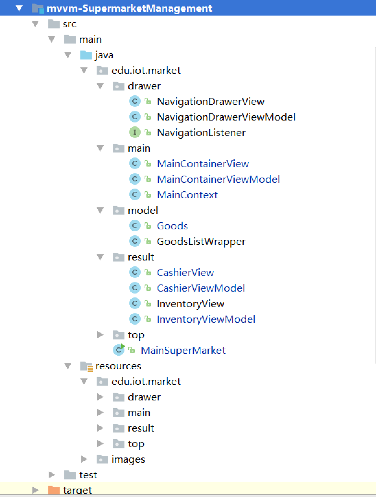
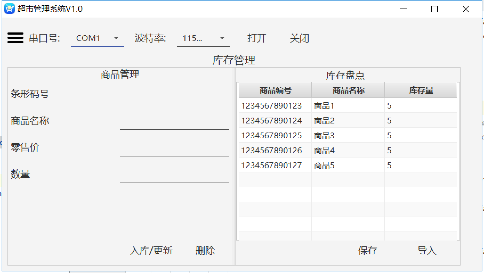
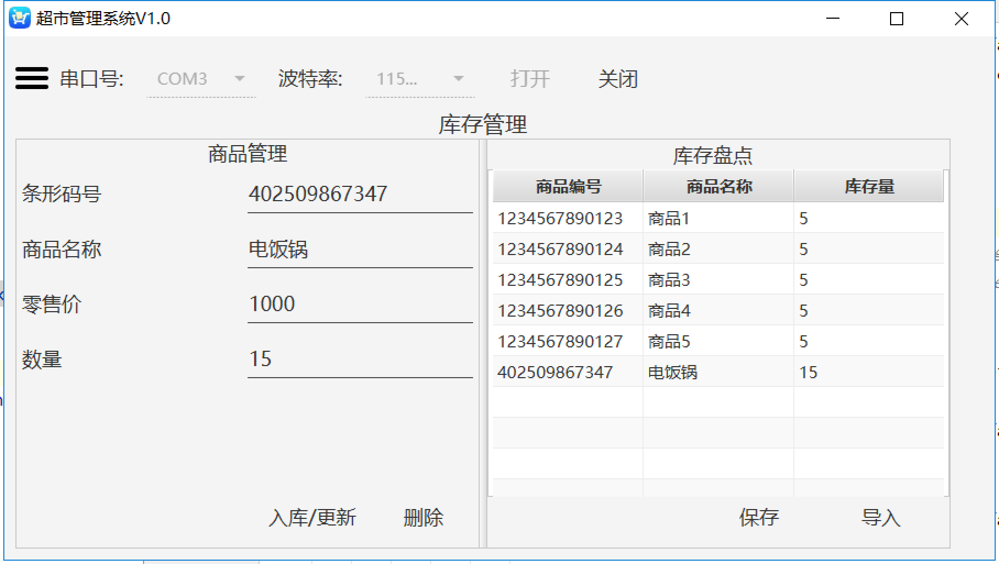
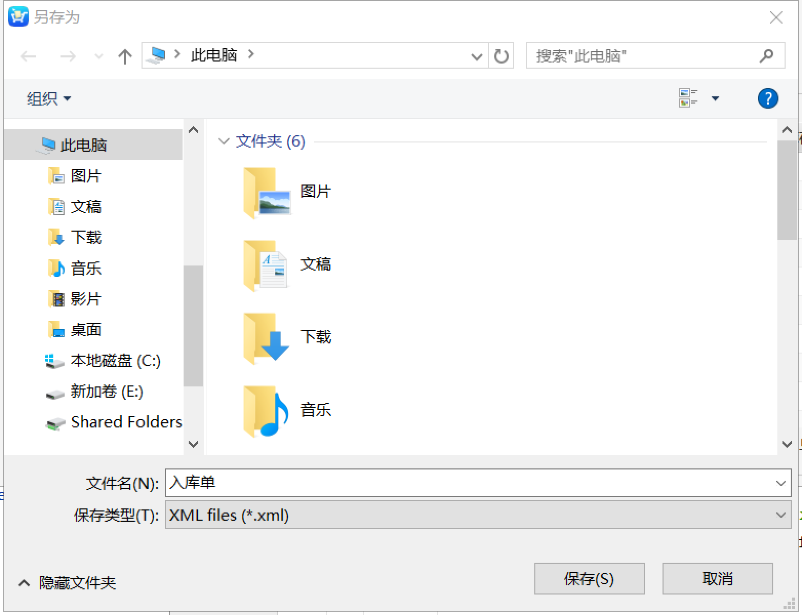
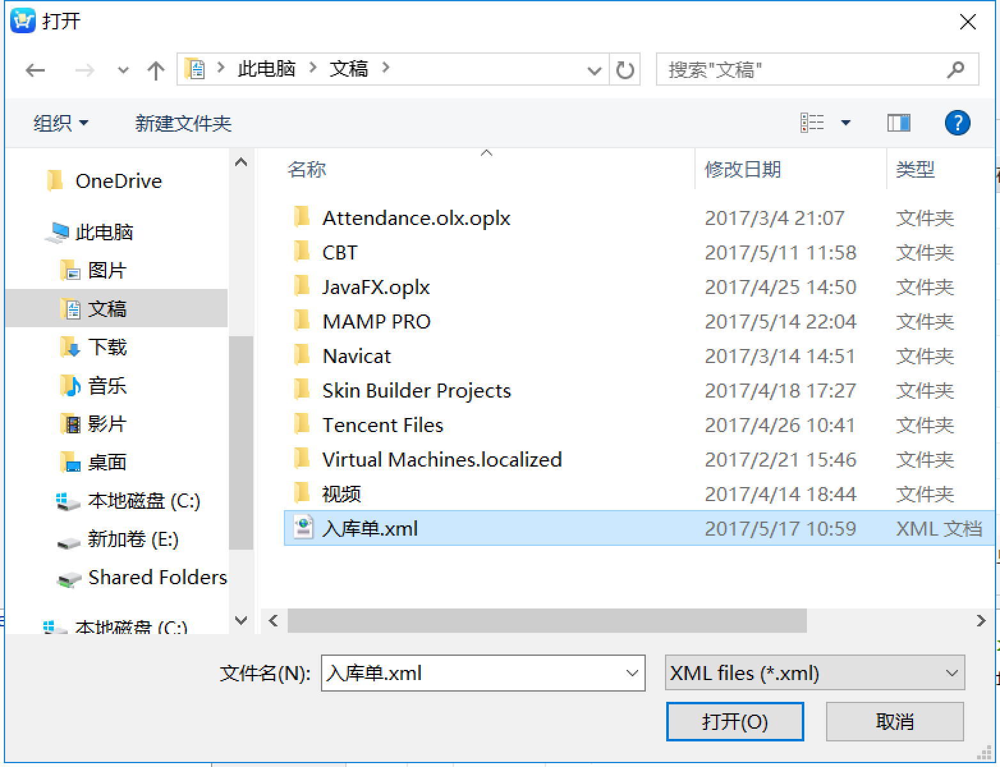
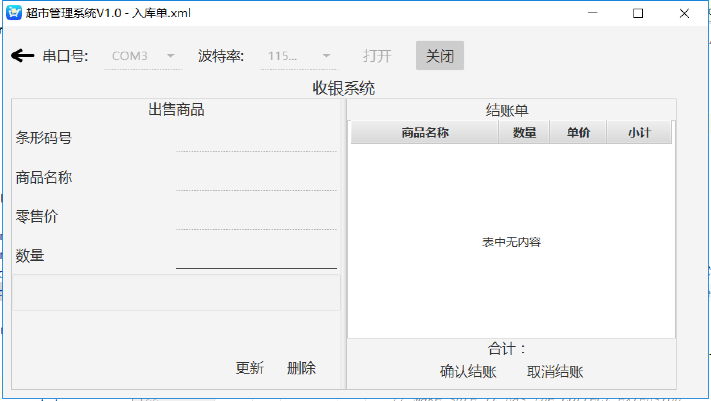
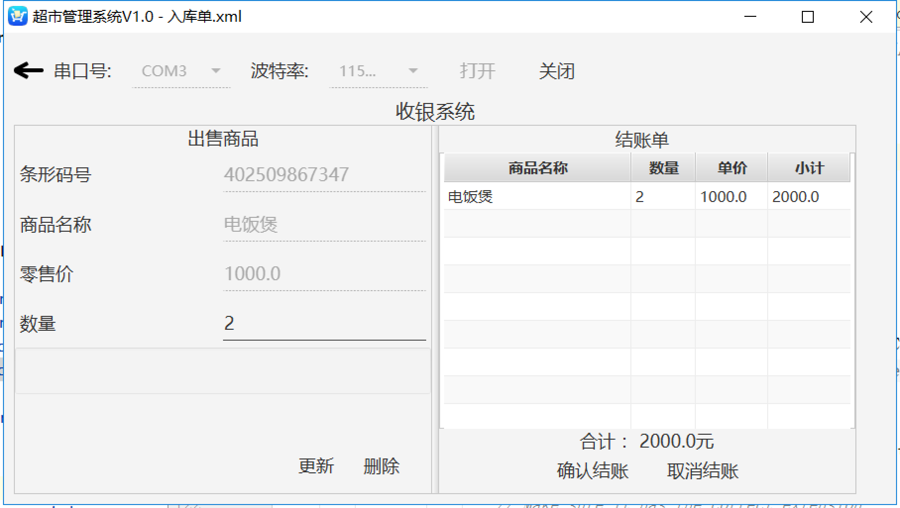

# 实验五. 基于MVVM架构的智能商超管理系统实验

----

## 实验目的
- 掌握JavaFX使用JAXB来存储数据的使用方法;
- 熟悉使用Java8 Stream来优化代码；
- 掌握MVVM框架设计思想;

## 实验环境
* 硬件：CBT-IOT-CTP实训台,PC机;
* 软件： IntelliJ IDEA，Scene Builder;

## 实验内容

- 通过MVVM框架编程实现基于条码扫描枪硬件的智能商超管理系统功能。


## 实验步骤

### MVVM框架工程搭建

#### 创建子模块maven工程mvvm-SupermarketManagement

- 创建项目包，框架如下：

```
├─src
│  ├─main
│  │  ├─java
│  │  │  └─edu
│  │  │      └─iot
│  │  │          └─market
│  │  │              ├─drawer
│  │  │              ├─main
│  │  │              ├─model
│  │  │              ├─result
│  │  │              └─top
│  │  └─resources
│  │      ├─edu
│  │      │  └─iot
│  │      │      └─market
│  │      │          ├─drawer
│  │      │          ├─main
│  │      │          ├─result
│  │      │          └─top
│  │      └─images
│  └─test
│      └─java
└─target

```
#### 配置pom.xml文件

添加本模块需要用到的依赖库

```xml
<?xml version="1.0" encoding="UTF-8"?>
<project xmlns="http://maven.apache.org/POM/4.0.0"
         xmlns:xsi="http://www.w3.org/2001/XMLSchema-instance"
         xsi:schemaLocation="http://maven.apache.org/POM/4.0.0 http://maven.apache.org/xsd/maven-4.0.0.xsd">
    <parent>
        <artifactId>iot-samples</artifactId>
        <groupId>edu.iot.cbt</groupId>
        <version>1.0.0</version>
    </parent>
    <modelVersion>4.0.0</modelVersion>

    <artifactId>mvvm-SupermarketManagement</artifactId>
    <dependencies>
        <dependency>
            <groupId>org.controlsfx</groupId>
            <artifactId>controlsfx</artifactId>
        </dependency>
        <dependency>
            <groupId>de.saxsys</groupId>
            <artifactId>mvvmfx</artifactId>
        </dependency>
        <dependency>
            <groupId>de.saxsys</groupId>
            <artifactId>mvvmfx-guice</artifactId>
        </dependency>
        <dependency>
            <groupId>org.scream3r</groupId>
            <artifactId>jssc</artifactId>
        </dependency>
        <dependency>
            <groupId>com.jfoenix</groupId>
            <artifactId>jfoenix</artifactId>
        </dependency>

    </dependencies>

</project>
```

#### 将全局串口库添加进本模块依赖中

- 点击菜单**File**->**Project Structrue...**；
#### 创建子模块maven工程mvvm-SupermarketManagement
#### 创建子模块maven工程mvvm-SupermarketManagement
- 选择**Modules**->**mvvm-WsnDemo**->**Dependencies**；
- 点击右侧➕，选择**2 Library...**，在弹出的选择窗口中选中**uart-model-1.0.0**,点击下方的**Add Selected**按钮；
- 点击**OK**完成串口库的添加。

#### 搭建MVVM框架

1. 在intelligentfarm包下编写主函数类`MainSuperMarket.java`。

```java
/**
 * Created by luffycheung on 2017/4/25.
 */
public class MainSuperMarket extends MvvmfxGuiceApplication {
    private Stage primaryStage;

    @Inject
    MainContext context;

    @Override
    public void startMvvmfx(Stage stage) throws Exception {
        this.primaryStage = stage;
        context.setPrimaryStage(stage);
        ViewTuple<MainContainerView,MainContainerViewModel> tuple = FluentViewLoader.fxmlView(MainContainerView.class).load();
        Scene scene = new Scene(tuple.getView());
        this.primaryStage.setScene(scene);
        primaryStage.setTitle("超市管理系统V1.0");
        // Set the application icon.
        this.primaryStage.getIcons().add(new Image("/images/icon_smartcart_32.png"));
        primaryStage.show();
    }
}
```

**代码说明：**

`context.setPrimaryStage(stage);`用来将程序主舞台设置进`context`全局上下文中，方便其他类调用。

2. 编写mvvm具体实现类及文件；



**类文件说明：**

- `MainContext`类：全局上下文，各ViewModel的桥梁类；
- `NavigationDrawerView`类：界面左侧抽屉视图类；
- `Goods`类：商品模型类；
- `GoodsListrapper`类：用于将商品数据存储为XML文件；
- `CashierView`类：收银子系统界面;
- `InventoryView`类：库存子系统界面;

#### 编程设计实现程序功能

##### 串口模块部分

直接**复用实验四智能农业实验中的相关文件**。

##### NavigationDrawer抽屉部分

直接**复用实验四智能农业实验中的相关文件**。

##### 库存管理部分

1. **InventoryView.fxml**

* 左侧显示已扫码货物详情，可进行入库／更新／删除等操作；
* 右侧以表格形式展示本超市整体库存信息。可保存库存数据至电脑本地，也可从电脑本地导入数据。

```xml
<?xml version="1.0" encoding="UTF-8"?>

<BorderPane maxHeight="-Infinity" minHeight="-Infinity" prefHeight="400.0" prefWidth="850.0" xmlns="http://javafx.com/javafx/8.0.121" xmlns:fx="http://javafx.com/fxml/1" fx:controller="edu.iot.market.result.InventoryView">
   <top>
       <Label accessibleText="库存管理" alignment="CENTER" prefHeight="27.0" prefWidth="850.0" text="库存管理" textAlignment="CENTER">
           <font>
               <Font size="20.0" />
           </font></Label>

   </top>
    <center>
        <SplitPane dividerPositions="0.5" prefWidth="850.0" AnchorPane.bottomAnchor="0.0" AnchorPane.leftAnchor="0.0" AnchorPane.rightAnchor="0.0" AnchorPane.topAnchor="5.0">
            <items>
                <BorderPane minHeight="0.0" minWidth="0.0" prefHeight="398.0" prefWidth="273.0" styleClass="background" AnchorPane.bottomAnchor="-2.0" AnchorPane.leftAnchor="0.0" AnchorPane.rightAnchor="0.0" AnchorPane.topAnchor="0.0">
                    <top>
                        <Label alignment="CENTER" layoutX="14.0" layoutY="14.0" prefHeight="17.0" prefWidth="420.0" styleClass="label-header" text="商品管理" textAlignment="CENTER" AnchorPane.leftAnchor="5.0" AnchorPane.topAnchor="5.0">
                            <font>
                                <Font size="18.0" />
                            </font></Label>
                    </top>
                    <center>
                        <GridPane layoutX="5.0" layoutY="60.0" maxHeight="-Infinity" minHeight="150.0" prefHeight="200.0" prefWidth="406.0" AnchorPane.leftAnchor="5.0" AnchorPane.rightAnchor="5.0" AnchorPane.topAnchor="60.0" BorderPane.alignment="TOP_LEFT">
                            <columnConstraints>
                                <ColumnConstraints hgrow="SOMETIMES" minWidth="10.0" prefWidth="100.0" />
                                <ColumnConstraints hgrow="SOMETIMES" minWidth="10.0" prefWidth="100.0" />
                            </columnConstraints>
                            <rowConstraints>
                                <RowConstraints minHeight="10.0" prefHeight="30.0" vgrow="SOMETIMES" />
                                <RowConstraints minHeight="10.0" prefHeight="30.0" vgrow="SOMETIMES" />
                                <RowConstraints minHeight="10.0" prefHeight="30.0" vgrow="SOMETIMES" />
                                <RowConstraints minHeight="10.0" prefHeight="30.0" vgrow="SOMETIMES" />
                            </rowConstraints>
                            <children>
                                <Label text="条形码号">
                                    <font>
                                        <Font size="18.0" />
                                    </font></Label>
                                <JFXTextField fx:id="barCodeText" text="1234567890123" GridPane.columnIndex="1">
                                    <font>
                                        <Font size="18.0" />
                                    </font></JFXTextField>
                                <Label text="商品名称" GridPane.rowIndex="1">
                                    <font>
                                        <Font size="18.0" />
                                    </font></Label>
                                <JFXTextField fx:id="productNameText" text="山楂片" GridPane.columnIndex="1" GridPane.rowIndex="1">
                                    <font>
                                        <Font size="18.0" />
                                    </font></JFXTextField>
                                <Label text="零售价" GridPane.rowIndex="2">
                                    <font>
                                        <Font size="18.0" />
                                    </font></Label>
                                <JFXTextField fx:id="retailPriceText" text="8.0" GridPane.columnIndex="1" GridPane.rowIndex="2">
                                    <font>
                                        <Font size="18.0" />
                                    </font></JFXTextField>
                                <Label text="数量" GridPane.rowIndex="3">
                                    <font>
                                        <Font size="18.0" />
                                    </font></Label>
                                <JFXTextField fx:id="amountText" text="20" GridPane.columnIndex="1" GridPane.rowIndex="3">
                                    <font>
                                        <Font size="18.0" />
                                    </font></JFXTextField>
                            </children>
                            <padding>
                                <Insets left="5.0" right="5.0" />
                            </padding>
                        </GridPane>

                    </center>
                    <bottom>
                        <HBox alignment="BOTTOM_RIGHT" layoutX="190.0" layoutY="236.0" spacing="6.0" AnchorPane.bottomAnchor="18.0" AnchorPane.rightAnchor="18.0">
                            <children>
                                <JFXButton fx:id="newButton" mnemonicParsing="false" onAction="#handleNeworUpdateProduct" prefHeight="30.0" prefWidth="130.0" ripplerFill="#58daa6" text="入库/更新">
                                    <font>
                                        <Font size="18.0" />
                                    </font></JFXButton>
                                <JFXButton fx:id="deleteButton" mnemonicParsing="false" onAction="#handleDeleteProduct" prefHeight="30.0" prefWidth="60.0" ripplerFill="#55d39f" text="删除">
                                    <font>
                                        <Font size="18.0" />
                                    </font></JFXButton>
                            </children>
                            <opaqueInsets>
                                <Insets />
                            </opaqueInsets>
                            <padding>
                                <Insets right="20.0" />
                            </padding>
                            <BorderPane.margin>
                                <Insets bottom="10.0" />
                            </BorderPane.margin>
                        </HBox>

                    </bottom>
                </BorderPane>
                <BorderPane minHeight="0.0" minWidth="0.0" prefHeight="398.0" prefWidth="385.0">
                    <top>
                        <Label alignment="CENTER" contentDisplay="CENTER" prefHeight="27.0" prefWidth="410.0" styleClass="label-header" text="库存盘点">
                            <font>
                                <Font size="18.0" />
                            </font></Label>

                    </top>
                    <center>
                        <TableView fx:id="productTable" maxHeight="-Infinity" minHeight="250.0" prefHeight="319.0" prefWidth="420.0" AnchorPane.bottomAnchor="67.0" AnchorPane.leftAnchor="0.0" AnchorPane.rightAnchor="0.0" AnchorPane.topAnchor="25.0" BorderPane.alignment="TOP_CENTER">
                            <columns>
                                <TableColumn fx:id="barCodeColumn" editable="false" prefWidth="147.0" text="商品编号" />
                                <TableColumn fx:id="productNameColumn" prefWidth="194.0" text="商品名称" />
                                <TableColumn fx:id="productCountColumn" prefWidth="79.0" text="库存量" />
                            </columns>
                            <columnResizePolicy>
                                <TableView fx:constant="CONSTRAINED_RESIZE_POLICY" />
                            </columnResizePolicy>

                            <padding>
                                <Insets left="5.0" right="5.0" />
                            </padding>
                        </TableView>

                    </center>
                    <bottom>
                        <HBox alignment="BOTTOM_RIGHT" layoutX="194.0" layoutY="359.0" spacing="6.0">
                            <children>
                                <JFXButton fx:id="saveasButton" mnemonicParsing="false" onAction="#handleSaveAs" prefHeight="35.0" prefWidth="105.0" ripplerFill="#5adda8" text="保存">
                                    <font>
                                        <Font size="18.0" />
                                    </font>
                                </JFXButton>
                                <JFXButton fx:id="importButton" mnemonicParsing="false" onAction="#handleImport" prefHeight="35.0" prefWidth="105.0" ripplerFill="#55d39f" text="导入">
                                    <font>
                                        <Font size="18.0" />
                                    </font>
                                </JFXButton>
                            </children>
                            <BorderPane.margin>
                                <Insets bottom="10.0" />
                            </BorderPane.margin>
                            <padding>
                                <Insets right="10.0" />
                            </padding>
                        </HBox>
                    </bottom>
                    <opaqueInsets>
                        <Insets />
                    </opaqueInsets>
                </BorderPane>
            </items>
        </SplitPane>
    </center>
</BorderPane>

```

2. **InventoryView.java**

* 完成fxml组件id变量声明及action事件方法初始化。
* 完成组件属性同ViewModel进行数据绑定。

```java
package edu.iot.market.result;

import com.jfoenix.controls.JFXButton;
import com.jfoenix.controls.JFXTextField;
import de.saxsys.mvvmfx.FxmlView;
import edu.iot.market.model.Goods;
import javafx.event.ActionEvent;
import javafx.fxml.FXML;
import javafx.fxml.Initializable;
import javafx.scene.control.TableColumn;
import javafx.scene.control.TableView;
import javafx.scene.control.cell.PropertyValueFactory;

import javax.inject.Inject;
import java.net.URL;
import java.util.ResourceBundle;

/**
 * Created by luffycheung on 2017/5/4.
 */
public class InventoryView implements FxmlView<InventoryViewModel>,Initializable {

    public JFXButton saveasButton;
    public JFXButton importButton;
    @FXML
    private JFXTextField barCodeText;
    @FXML
    private JFXTextField productNameText;
    @FXML
    private JFXTextField retailPriceText;
    @FXML
    private JFXTextField amountText;
    @FXML
    private JFXButton newButton;
    @FXML
    private JFXButton deleteButton;
    @FXML
    private TableView<Goods> productTable;
    @FXML
    private TableColumn<Goods, String> barCodeColumn;
    @FXML
    private TableColumn<Goods, String> productNameColumn;
    @FXML
    private TableColumn<Goods, String> productCountColumn;
    @Inject
    InventoryViewModel viewModel;

    @Override
    public void initialize(URL location, ResourceBundle resources) {
        barCodeText.textProperty().bindBidirectional(viewModel.itemGoodsNumProperty());
        productNameText.textProperty().bindBidirectional(viewModel.itemGoodsNameProperty());
        retailPriceText.textProperty().bindBidirectional(viewModel.itemRetailPriceProperty());
        amountText.textProperty().bindBidirectional(viewModel.itemAmountProperty());

        barCodeColumn.setCellValueFactory(new PropertyValueFactory<>("goodsNum"));
        productNameColumn.setCellValueFactory(new PropertyValueFactory<>("goodsName"));
        productCountColumn.setCellValueFactory(new PropertyValueFactory<>("goodsCount"));
        productTable.itemsProperty().bind(viewModel.itemsProperty());
        showGoodsDetails(null);
        productTable.getSelectionModel().selectedItemProperty().addListener(
                ((observable, oldValue, newValue) -> showGoodsDetails(newValue))
        );
    }


    private void showGoodsDetails(Goods goods) {
        if(goods != null){
            barCodeText.setText(goods.getGoodsNum());
            productNameText.setText(goods.getGoodsName());
            retailPriceText.setText(String.valueOf(goods.getGoodsPrice()));
            amountText.setText(String.valueOf(goods.getGoodsCount()));
        }else {
            barCodeText.setText("");
            productNameText.setText("");
            retailPriceText.setText("");
            amountText.setText("");
        }
    }

    @FXML
    void handleDeleteProduct(ActionEvent event) {
        viewModel.getDelProductCommand().execute();
    }
    @FXML
    void handleNeworUpdateProduct(ActionEvent event) {
        viewModel.getNewandupdateProductCommand().execute();
    }

    public void handleSaveAs(ActionEvent actionEvent) {
        viewModel.getSaveCommand().execute();
    }
    public void handleImport(ActionEvent actionEvent) {
        viewModel.getImportCommand().execute();
    }
}
```

3. **InventoryViewModel.java**

* 实现View类绑定的各个事件命令。

```java
/**
 * Created by luffycheung on 2017/5/4.
 */
public class InventoryViewModel implements ViewModel {
    @Inject
    MainContext context;
    private Property<String> itemGoodsName = new SimpleStringProperty();
    private Property<String> itemRetailPrice = new SimpleStringProperty();
    private Property<String> itemAmount = new SimpleStringProperty();

    private final Command newandupdateProductCommand;
    private final Command delProductCommand;
    private final Command saveCommand;
    private final Command importCommand;
    private final Command updateCommand;
    private final Command clearUI;

    @Inject
    InventoryViewModel(MainContext context) {
        this.context = context;
        this.context.setInventoryViewModel(this);

        context.inventoryItemsProperty().getValue().clear();
        context.inventoryItemsProperty().getValue().add(new Goods("1234567890123", "商品1"));
        context.inventoryItemsProperty().getValue().add(new Goods("1234567890124", "商品2"));
        context.inventoryItemsProperty().getValue().add(new Goods("1234567890125", "商品3"));
        context.inventoryItemsProperty().getValue().add(new Goods("1234567890126", "商品4"));
        context.inventoryItemsProperty().getValue().add(new Goods("1234567890127", "商品5"));
        newandupdateProductCommand = new DelegateCommand(() -> new Action() {
            @Override
            protected void action() throws Exception {
                if (context.goodsNumProperty().getValue().isEmpty()
                        || itemGoodsName.getValue().isEmpty()
                        || itemRetailPrice.getValue().isEmpty()
                        || itemAmount.getValue().isEmpty()) {
                    return; //若输入Text文本框中有为空的则不操作
                }
                Goods newGoods = new Goods(context.goodsNumProperty().getValue(), itemGoodsName.getValue(), itemRetailPrice.getValue(), itemAmount.getValue());
                Goods existGoods = context.inventoryItemsProperty().stream().filter(goods1 -> {
                    if (newGoods.getGoodsNum().equals(goods1.getGoodsNum())) {
                        return true;
                    }
                    return false;
                }).findAny().orElse(null);
                if (null == existGoods) {//若商品不存在则添加,否则更新
                    context.inventoryItemsProperty().getValue().add(newGoods);
                } else {
                    Collections.replaceAll(context.inventoryItemsProperty(), existGoods, newGoods);
                }


            }
        });
        delProductCommand = new DelegateCommand(() -> {
            return new Action() {

                @Override
                protected void action() throws Exception {
                    Consumer<Goods> println = (Goods g)-> System.out.println(g.getGoodsNum()+"|"+g.getGoodsName());
//                    System.out.println("---Before delete---");
//                    context.inventoryItemsProperty().forEach(println);
                /*    List<Goods> resultList =
                            context.inventoryItemsProperty().stream()
                                    .filter(goods -> !itemGoodsNum.getValue().equals(goods.getGoodsNum()))
                                    .collect(Collectors.toList());//根据编号删除item项
                    context.inventoryItemsProperty().clear();
                    context.inventoryItemsProperty().addAll(resultList);*/
                    //另一种方法
                    Predicate<Goods> goodsPredicate = goods -> context.goodsNumProperty().getValue().equals(goods.getGoodsNum());//相同商品断言
                    context.inventoryItemsProperty().removeIf(goodsPredicate);
//                    System.out.println("---After delete---");
//                    context.inventoryItemsProperty().forEach(println);
                }
            };
        });
        saveCommand = new DelegateCommand(()-> new Action() {
            @Override
            protected void action() throws Exception {
                File goodsFile = getGoodsFilePath();
                if(null != goodsFile){
                    saveGoodsDataToFile(goodsFile);
                }else {
                    FileChooser fileChooser = new FileChooser();
                    // Set extension filter
                    FileChooser.ExtensionFilter extFilter = new FileChooser.ExtensionFilter(
                            "XML files (*.xml)", "*.xml");
                    fileChooser.getExtensionFilters().add(extFilter);
                    // Show save file dialog
                    File file = fileChooser.showSaveDialog(context.getPrimaryStage());
                    if (file != null) {
                        // Make sure it has the correct extension
                        if (!file.getPath().endsWith(".xml")) {
                            file = new File(file.getPath() + ".xml");
                        }
                        saveGoodsDataToFile(file);
                    }
                }
            }
        });
        importCommand = new DelegateCommand(()-> new Action() {
            @Override
            protected void action() throws Exception {
                FileChooser fileChooser = new FileChooser();
                // Set extension filter
                FileChooser.ExtensionFilter extFilter = new FileChooser.ExtensionFilter(
                        "XML files (*.xml)", "*.xml");
                fileChooser.getExtensionFilters().add(extFilter);
                // Show save file dialog
                File file = fileChooser.showOpenDialog(context.getPrimaryStage());
                if (file != null) {
                    loadGoodsDataFromFile(file);
                }
            }
        });
        updateCommand = new DelegateCommand(()-> new Action() {
            @Override
            protected void action() throws Exception {
                Goods goods = context.inventoryItemsProperty().get()
                        .stream()
                        .filter(x -> context.getGoodsNum().equals(x.getGoodsNum()))
                        .findAny()
                        .orElse(null);
                if(null != goods){
                    itemGoodsName.setValue(goods.getGoodsName());
                    itemRetailPrice.setValue(String.valueOf(goods.getGoodsPrice()));
                    itemAmount.setValue(String.valueOf(goods.getGoodsCount()));
                }
            }
        });
        clearUI = new DelegateCommand(()-> new Action() {
            @Override
            protected void action() throws Exception {
                itemGoodsName.setValue("");
                itemRetailPrice.setValue("");
                itemAmount.setValue("");
            }
        });
    }

    private void loadGoodsDataFromFile(File file) {
        try {
            JAXBContext context = JAXBContext
                    .newInstance(GoodsListWrapper.class);
            Unmarshaller um = context.createUnmarshaller();
            // Reading XML from the file and unmarshalling.
            GoodsListWrapper wrapper = (GoodsListWrapper) um.unmarshal(file);
            this.context.inventoryItemsProperty().clear();
            this.context.inventoryItemsProperty().addAll(wrapper.getGoods());
            // Save the file path to the registry.
            setGoodsFilePath(file);

        } catch (Exception e) { // catches ANY exception
            ExceptionDialog dialog = new ExceptionDialog(e);
            dialog.setHeaderText("Error");
            dialog.setContentText("Could not save data to file:\n" + file.getPath());
            dialog.show();
        }
    }


    /**
     * Saves the current goods data to the specified file.
     *
     * @param file
     */
    public void saveGoodsDataToFile(File file) {
        try {
            JAXBContext context = JAXBContext
                    .newInstance(GoodsListWrapper.class);
            Marshaller m = context.createMarshaller();
            m.setProperty(Marshaller.JAXB_FORMATTED_OUTPUT, true);
            // Wrapping our goods data.
            GoodsListWrapper wrapper = new GoodsListWrapper();
            wrapper.setGoods(this.context.inventoryItemsProperty());
            // Marshalling and saving XML to the file.
            m.marshal(wrapper, file);
            // Save the file path to the registry.
            setGoodsFilePath(file);
        } catch (Exception e) { // catches ANY exception
        }
    }

    private void setGoodsFilePath(File file) {
        Preferences prefs = Preferences.userNodeForPackage(MainSuperMarket.class);
        if (file != null) {
            prefs.put("filePath", file.getPath());
            // Update the stage title.
            context.getPrimaryStage().setTitle("超市管理系统V1.0 - " + file.getName());
        } else {
            prefs.remove("filePath");
            // Update the stage title.
            context.getPrimaryStage().setTitle("超市管理系统V1.0");
        }
    }

    private File getGoodsFilePath() {
        Preferences prefs = Preferences.userNodeForPackage(MainSuperMarket.class);
        String filePath = prefs.get("filePath", null);
        if (filePath != null) {
            return new File(filePath);
        } else {
            return null;
        }
    }

    public Command getNewandupdateProductCommand() {
        return newandupdateProductCommand;
    }
    public Command getDelProductCommand() {
        return delProductCommand;
    }
    public Command getSaveCommand() {
        return saveCommand;
    }
    public Command getImportCommand() {
        return importCommand;
    }
    public ListProperty<Goods> itemsProperty() {
        return context.inventoryItemsProperty();
    }
    public Property<String> itemGoodsNumProperty() {
        return context.goodsNumProperty();
    }
    public Property<String> itemGoodsNameProperty() {
        return itemGoodsName;
    }
    public Property<String> itemRetailPriceProperty() {
        return itemRetailPrice;
    }
    public Property<String> itemAmountProperty() {
        return itemAmount;
    }
    public Command getUpdateCommand() {
        return updateCommand;
    }
    public Command clearUICommand() {
        return clearUI;
    }
}
```

##### 收银系统部分

1. **CashierView.fxml**

* 左侧显示已扫商品信息；
* 右侧表格显示待结账商品清单；

```xml
<?xml version="1.0" encoding="UTF-8"?>

<BorderPane maxHeight="-Infinity" minHeight="-Infinity" prefHeight="400.0" prefWidth="850.0" xmlns="http://javafx.com/javafx/8.0.121" xmlns:fx="http://javafx.com/fxml/1" fx:controller="edu.iot.market.result.CashierView">
    <top>
        <Label accessibleText="库存管理" alignment="CENTER" prefHeight="27.0" prefWidth="850.0" text="收银系统" textAlignment="CENTER">
            <font>
                <Font size="20.0" />
            </font>
        </Label>
    </top>
    <center>
        <SplitPane dividerPositions="0.5" prefHeight="300.0" prefWidth="600.0" AnchorPane.bottomAnchor="0.0" AnchorPane.leftAnchor="0.0" AnchorPane.rightAnchor="0.0" AnchorPane.topAnchor="39.0">
            <items>
                <BorderPane minHeight="0.0" minWidth="0.0" prefHeight="398.0" prefWidth="273.0" styleClass="background" AnchorPane.bottomAnchor="-2.0" AnchorPane.leftAnchor="0.0" AnchorPane.rightAnchor="0.0" AnchorPane.topAnchor="0.0">
                    <top>
                        <Label alignment="CENTER" layoutX="14.0" layoutY="14.0" prefHeight="17.0" prefWidth="420.0" styleClass="label-header" text="出售商品" textAlignment="CENTER" AnchorPane.leftAnchor="5.0" AnchorPane.topAnchor="5.0">
                            <font>
                                <Font size="18.0" />
                            </font>
                        </Label>
                    </top>
                    <center>
                        <VBox>
                            <GridPane layoutX="5.0" layoutY="60.0" maxHeight="-Infinity" minHeight="-Infinity" prefHeight="200.0" prefWidth="406.0" AnchorPane.leftAnchor="5.0" AnchorPane.rightAnchor="5.0" AnchorPane.topAnchor="60.0" BorderPane.alignment="TOP_LEFT">
                                <columnConstraints>
                                    <ColumnConstraints hgrow="SOMETIMES" minWidth="10.0" prefWidth="100.0" />
                                    <ColumnConstraints hgrow="SOMETIMES" minWidth="10.0" prefWidth="100.0" />
                                </columnConstraints>
                                <rowConstraints>
                                    <RowConstraints minHeight="10.0" prefHeight="30.0" vgrow="SOMETIMES" />
                                    <RowConstraints minHeight="10.0" prefHeight="30.0" vgrow="SOMETIMES" />
                                    <RowConstraints minHeight="10.0" prefHeight="30.0" vgrow="SOMETIMES" />
                                    <RowConstraints minHeight="10.0" prefHeight="30.0" vgrow="SOMETIMES" />
                                </rowConstraints>
                                <children>
                                    <Label text="条形码号">
                                        <font>
                                            <Font size="18.0" />
                                        </font>
                                    </Label>
                                    <JFXTextField fx:id="barCodeText" text="1234567890123" GridPane.columnIndex="1">
                                        <font>
                                            <Font size="18.0" />
                                        </font>
                                    </JFXTextField>
                                    <Label text="商品名称" GridPane.rowIndex="1">
                                        <font>
                                            <Font size="18.0" />
                                        </font>
                                    </Label>
                                    <JFXTextField fx:id="productNameText" text="山楂片" GridPane.columnIndex="1" GridPane.rowIndex="1">
                                        <font>
                                            <Font size="18.0" />
                                        </font>
                                    </JFXTextField>
                                    <Label text="零售价" GridPane.rowIndex="2">
                                        <font>
                                            <Font size="18.0" />
                                        </font>
                                    </Label>
                                    <JFXTextField fx:id="retailPriceText" text="8.0" GridPane.columnIndex="1" GridPane.rowIndex="2">
                                        <font>
                                            <Font size="18.0" />
                                        </font>
                                    </JFXTextField>
                                    <Label text="数量" GridPane.rowIndex="3">
                                        <font>
                                            <Font size="18.0" />
                                        </font>
                                    </Label>
                                    <JFXTextField fx:id="amountText" text="20" GridPane.columnIndex="1" GridPane.rowIndex="3">
                                        <font>
                                            <Font size="18.0" />
                                        </font>
                                    </JFXTextField>
                                </children>
                                <padding>
                                    <Insets left="5.0" right="5.0" />
                                </padding>
                            </GridPane>
                            <TextArea fx:id="tipsInfoText" prefHeight="37.0" prefWidth="418.0">

                            </TextArea>
                        </VBox>
                    </center>
                    <bottom>
                        <HBox alignment="BOTTOM_RIGHT" layoutX="190.0" layoutY="236.0" spacing="6.0" AnchorPane.bottomAnchor="18.0" AnchorPane.rightAnchor="18.0">
                            <children>
                                <JFXButton fx:id="updateButton" mnemonicParsing="false" onAction="#handleEditProduct" prefHeight="30.0" prefWidth="60.0" ripplerFill="#5adda8" text="更新">
                                    <font>
                                        <Font size="18.0" />
                                    </font>
                                </JFXButton>
                                <JFXButton fx:id="deleteButton" mnemonicParsing="false" onAction="#handleDeleteProduct" prefHeight="30.0" prefWidth="60.0" ripplerFill="#55d39f" text="删除">
                                    <font>
                                        <Font size="18.0" />
                                    </font>
                                </JFXButton>
                            </children>
                            <BorderPane.margin>
                                <Insets bottom="10.0" />
                            </BorderPane.margin>
                            <padding>
                                <Insets right="20.0" />
                            </padding>
                        </HBox>
                    </bottom>
                </BorderPane>
                <BorderPane minHeight="0.0" minWidth="0.0" prefHeight="398.0" prefWidth="385.0">
                    <top>
                        <Label alignment="CENTER" contentDisplay="CENTER" prefHeight="27.0" prefWidth="410.0" styleClass="label-header" text="结账单">
                            <font>
                                <Font size="18.0" />
                            </font>
                        </Label>
                    </top>
                    <center>
                        <TableView fx:id="productTable" maxHeight="-Infinity" minHeight="220.0" prefHeight="398.0" prefWidth="420.0" AnchorPane.bottomAnchor="136.0" AnchorPane.leftAnchor="0.0" AnchorPane.rightAnchor="0.0" AnchorPane.topAnchor="25.0" BorderPane.alignment="TOP_LEFT">
                            <columns>
                                <TableColumn fx:id="productNameColumn" editable="false" prefWidth="189.0" text="商品名称" />
                                <TableColumn fx:id="amountColumn" prefWidth="65.0" text="数量" />
                                <TableColumn fx:id="unitPriceColumn" prefWidth="73.0" text="单价" />
                                <TableColumn fx:id="totalPriceColumn" prefWidth="83.0" text="小计" />
                            </columns>
                            <columnResizePolicy>
                                <TableView fx:constant="CONSTRAINED_RESIZE_POLICY" />
                            </columnResizePolicy>
                            <padding>
                                <Insets left="5.0" right="5.0" />
                            </padding>
                        </TableView>
                    </center>
                    <bottom>
                        <VBox alignment="CENTER">
                            <HBox alignment="CENTER" layoutX="245.0" layoutY="463.0" spacing="6.0">
                                <children>
                                    <Label text="合计：">
                                        <font>
                                            <Font size="18.0" />
                                        </font>
                                    </Label>
                                    <Label fx:id="amountPriceLabel" text="47.0">
                                        <font>
                                            <Font size="18.0" />
                                        </font>
                                    </Label>
                                </children>
                            </HBox>
                            <HBox alignment="CENTER" layoutX="186.0" layoutY="502.0" spacing="6.0">
                                <children>
                                    <JFXButton fx:id="settlementButton" mnemonicParsing="false" onAction="#handleSettlement" prefHeight="35.0" prefWidth="105.0" ripplerFill="#5adda8" text="确认结账">
                                        <font>
                                            <Font size="18.0" />
                                        </font>
                                    </JFXButton>
                                    <JFXButton fx:id="cancelButton" mnemonicParsing="false" onAction="#handleCancelSettlement" prefHeight="35.0" prefWidth="105.0" ripplerFill="#55d39f" text="取消结账">
                                        <font>
                                            <Font size="18.0" />
                                        </font>
                                    </JFXButton>
                                </children>
                            </HBox>
                            <BorderPane.margin>
                                <Insets bottom="5.0" />
                            </BorderPane.margin>
                        </VBox>
                    </bottom>
                    <opaqueInsets>
                        <Insets />
                    </opaqueInsets>
                </BorderPane>

            </items>
        </SplitPane>

    </center>
</BorderPane>
```

2. **CashierView.java**

```java
package edu.iot.market.result;
/**
 * Created by luffycheung on 2017/5/4.
 */
public class CashierView implements FxmlView<CashierViewModel>,Initializable {

    public TextArea tipsInfoText;
    @FXML
    private JFXTextField barCodeText;
    @FXML
    private JFXTextField productNameText;
    @FXML
    private JFXTextField retailPriceText;
    @FXML
    private JFXTextField amountText;
    @FXML
    private JFXButton updateButton;
    @FXML
    private JFXButton deleteButton;
    @FXML
    private TableView<Goods> productTable;
    @FXML
    private TableColumn<Goods, String> productNameColumn;
    @FXML
    private TableColumn<Goods, String> amountColumn;
    @FXML
    private TableColumn<Goods, String> unitPriceColumn;
    @FXML
    private TableColumn<Goods, String> totalPriceColumn;
    @FXML
    private JFXButton settlementButton;
    @FXML
    private JFXButton cancelButton;
    @FXML
    private Label amountPriceLabel;

    @Inject
    CashierViewModel viewModel;

    @Override
    public void initialize(URL location, ResourceBundle resources) {
        barCodeText.textProperty().bindBidirectional(viewModel.itemGoodsNumProperty());
        productNameText.textProperty().bindBidirectional(viewModel.itemGoodsNameProperty());
        retailPriceText.textProperty().bindBidirectional(viewModel.itemRetailPriceProperty());
        amountText.textProperty().bindBidirectional(viewModel.itemAmountProperty());
        amountPriceLabel.textProperty().bindBidirectional(viewModel.amountPriceProperty());
        barCodeText.setDisable(true);
        productNameText.setDisable(true);
        retailPriceText.setDisable(true);
        tipsInfoText.textProperty().bindBidirectional(viewModel.tipsInfoProperty());
        tipsInfoText.setDisable(true);

        productNameColumn.setCellValueFactory(new PropertyValueFactory<>("goodsName"));
        amountColumn.setCellValueFactory(new PropertyValueFactory<>("goodsCount"));
        unitPriceColumn.setCellValueFactory(new PropertyValueFactory<>("goodsPrice"));
        totalPriceColumn.setCellValueFactory(new PropertyValueFactory<>("subtotalPrice"));
        productTable.itemsProperty().bind(viewModel.itemsProperty());
        showGoodsDetails(null);

        productTable.getSelectionModel().selectedItemProperty().addListener(
                ((observable, oldValue, newValue) -> showGoodsDetails(newValue))
        );

    }
    private void showGoodsDetails(Goods goods) {
        if(goods != null){
            barCodeText.setText(goods.getGoodsNum());
            productNameText.setText(goods.getGoodsName());
            retailPriceText.setText(String.valueOf(goods.getGoodsPrice()));
            amountText.setText(String.valueOf(goods.getGoodsCount()));
        }else {
            barCodeText.setText("");
            productNameText.setText("");
            retailPriceText.setText("");
            amountText.setText("");
        }
    }

    @FXML
    void handleCancelSettlement(ActionEvent event) {
    }
    @FXML
    void handleDeleteProduct(ActionEvent event) {
        viewModel.getDelProductCommand().execute();
    }
    @FXML
    void handleEditProduct(ActionEvent event) {
        viewModel.getNewandupdateProductCommand().execute();
    }
    @FXML
    void handleSettlement(ActionEvent event) {
        viewModel.getConfirmCommand().execute();
    }
}
```

##### 主界面MainContainerView部分

1. **MainContainerView.fxml**

* 使用`include`包含其他子界面

```xml
<?xml version="1.0" encoding="UTF-8"?>

<BorderPane fx:id="rootContent" maxHeight="-Infinity" minWidth="-Infinity" prefHeight="400.0" prefWidth="900.0" xmlns="http://javafx.com/javafx/8.0.121" xmlns:fx="http://javafx.com/fxml/1" fx:controller="edu.iot.market.main.MainContainerView">
    <top>
        <HBox fx:id="topContent">
            <JFXHamburger fx:id="hamburger" layoutX="745.0" layoutY="14.0" />
            <fx:include fx:id="topView" source="../top/UartView.fxml" />
        </HBox>
    </top>
    <center>
     
<AnchorPane id="centerContent" fx:id="centerContent" minWidth="-Infinity">
    <children>
      <JFXDrawer fx:id="drawer" defaultDrawerSize="200.0" layoutY="-6.0" prefWidth="108.0" />
        <StackPane id="stackPane" fx:id="stackPane">
            <children>
                <fx:include fx:id="inventoryView" source="../result/InventoryView.fxml" />
                <fx:include fx:id="cashierView" source="../result/CashierView.fxml" />
            </children>
        </StackPane>
    </children>
</AnchorPane>
    </center>
    <padding>
        <Insets bottom="10.0" left="10.0" right="10.0" top="10.0" />
    </padding>
    <bottom>
    </bottom>
</BorderPane>
```

2. **MainContainerView.java**

* 声明各组件及action事件监听方法。
* 完成第三方抽屉组件的初始化。
* 定义全局静态方法，实现抽屉的显示隐藏效果。

```java
package edu.iot.market.main;
/**
 * Created by luffycheung on 2017/4/27.
 */
public class MainContainerView implements FxmlView<MainContainerViewModel>,Initializable {

    public AnchorPane centerContent;
    public  BorderPane rootContent;
    public HBox topContent;
    @FXML
    private JFXDrawer drawer;
    @FXML
    private StackPane stackPane;
    @FXML
    private BorderPane inventoryView;
    @FXML
    private BorderPane cashierView;
    @FXML
    private JFXHamburger hamburger;
    public static JFXDrawer drawerStatic;
    @InjectViewModel
    MainContainerViewModel viewModel;
    @Override
    public void initialize(URL location, ResourceBundle resources) {
        inventoryView.visibleProperty().bindBidirectional(viewModel.inventoryVisibleProperty());
        cashierView.visibleProperty().bindBidirectional(viewModel.cashierVisibleProperty());
        ViewTuple<NavigationDrawerView, NavigationDrawerViewModel> tuple = FluentViewLoader.fxmlView(NavigationDrawerView.class).load();
        VBox box = (VBox) tuple.getView();
        drawer.setSidePane(box);
        drawerStatic = drawer;
        HamburgerBackArrowBasicTransition transition = new HamburgerBackArrowBasicTransition(hamburger);
        transition.setRate(-1);
        hamburger.addEventHandler(MouseEvent.MOUSE_PRESSED,(e)->{
            transition.setRate(transition.getRate()*-1);
            transition.play();
            stackPane.setVisible(true);
            drawerToggle();
            stackPane.setVisible(false);
        });

        drawer.setOnDrawerOpened((event)->{
            stackPane.setVisible(false);
        });
        drawer.setOnDrawerClosed(event -> {
            stackPane.setVisible(true);
        });

    }

    public static void drawerToggle() {
        if(drawerStatic.isShown())
        {
            drawerStatic.close();
        }else{
            drawerStatic.open();
        }
    }

}

```

3. **MainContainerViewModel.java**

* 实现抽屉导航接口，接收导航点击返回界面数据；
* 实现串口回调接口，接收商品条码扫描码，更新绑定数据并同步界面信息；

```java
package edu.iot.market.main;

import de.saxsys.mvvmfx.ViewModel;
import edu.iot.lib.model.sensor.SensorBean;
import edu.iot.lib.model.uart.UartConnector;
import edu.iot.lib.model.uart.UartConnectorDelegate;
import edu.iot.market.drawer.NavigationListener;
import edu.iot.market.model.Goods;
import javafx.beans.property.Property;
import javafx.beans.property.SimpleBooleanProperty;
import javafx.beans.property.SimpleStringProperty;
import javafx.beans.property.StringProperty;
import org.controlsfx.dialog.ExceptionDialog;

import javax.inject.Inject;
import java.util.List;

/**
 * Created by luffycheung on 2017/4/27.
 */
public class MainContainerViewModel implements ViewModel,NavigationListener,UartConnectorDelegate {
    private MainContext context;
    UartConnector uartConnector = UartConnector.getInstance();
    private Property<Boolean> cashierVisible = new SimpleBooleanProperty(false);
    private Property<Boolean> inventoryVisible = new SimpleBooleanProperty(true);
    @Inject
    public MainContainerViewModel(MainContext context){
        this.context = context;
        this.context.setMainContainerViewModel(this);
        context.setListener(this);
        uartConnector.setDelegate(this);
    }

    public Property<Boolean> cashierVisibleProperty() {
        return cashierVisible;
    }

    public Property<Boolean> inventoryVisibleProperty() {
        return inventoryVisible;
    }

    @Override
    public void NavigationTo(String dest) {
        System.out.println("Navigation callback:"+dest);
        context.goodsNumProperty().setValue("");
        switch (dest){
            case "库存管理":
                inventoryVisible.setValue(true);
                cashierVisible.setValue(false);
                context.getInventoryViewModel().clearUICommand().execute();
                break;
            case "收银系统":
                inventoryVisible.setValue(false);
                cashierVisible.setValue(true);
                context.getCashierViewModel().clearUICommand().execute();
                break;
        }
    }
    @Override
    public void OnCharStringMessageReceived(String message) {
        System.out.println("origin msg:"+message);
        context.setGoodsNum("");
        context.setGoodsNum(message);
        if(cashierVisible.getValue()) {
            context.getCashierViewModel().getUpdateCommand().execute();
        }
        if(inventoryVisible.getValue()){
            context.getInventoryViewModel().getUpdateCommand().execute();
        }
    }
    @Override
    public void OnHexStringMessageReceived(String message) {
    }
    @Override
    public void OnSensorFramePackage(SensorBean sensorBean) {
    }
    @Override
    public void OnErrorException(String s) {
    }
    @Override
    public void OnSensorListPackage(List<SensorBean> sensorBeanList) {
    }
}
```

#### 运行演示

- 实训台设备上电，使用香蕉线将RFID区的条码扫描模块串口于USB2UART模块相连。
  （TXD／RXD注意交叉相连；USB2UART模块拨码开关拨到Sensor方向）
- 使用miniUSB线将USB2UART模块和电脑相连。（安装好U转串驱动）
- 运行软件工程的主程序。
- 选择连接到电脑上的U转串模块串口，波特率选择115200，点击右侧打开按钮。

1. 软件启动后主界面会默认显示库存管理界面



2. 串口打开成功后，用扫码枪扫描商品条码，若未入库只显示条码号，入库的则显示改商品详细信息。

3. 之后登记未入库商品信息，点击下方**入库／更新**按钮进行入库操作。成功后会在右侧列表显示。



也可以对已入库商品信息进行更新操作。

点击右侧**保存**按钮，弹出文件保存对话框。选择电脑保存路径填写保存文件名后，点击保存即可。



4. 重新打开软件，可以点击**导入**按钮将之前已保存的数据导入进来。



5. 打开导航菜单，点击进入**收银系统**界面：



6. 条码枪扫描到待购买商品后显示改商品详细信息。填写要购买数量后，点击下方**更新**按钮将其加入右侧购物清单中。



7. 若想取消购买购物清单中的某件商品或更改购买数量，可点击右侧要更改的商品在左侧区域完成操作（更新／删除）。


所有商品均扫码后点击**确认结账**按钮完成购物。
